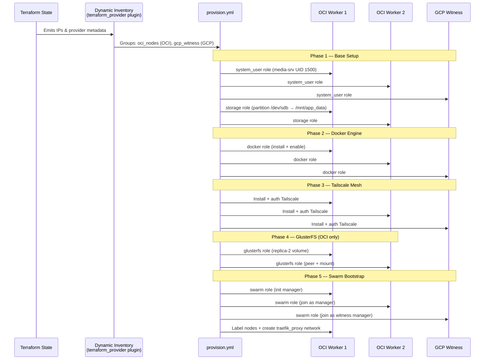

# Configuration Management: Ansible

This section covers the configuration management strategy, detailing every role, the dynamic inventory, SSH authentication, and the full 5-phase provisioning lifecycle.

## Architecture & Integration

Ansible bridges raw Terraform-provisioned infrastructure and the Docker Swarm workloads. It uses a dynamic inventory plugin to auto-discover nodes from Terraform state, then bootstraps them through a deterministic 5-phase sequence: system setup → Docker → Tailscale mesh → GlusterFS storage → Swarm cluster.



## Dynamic Inventory

The inventory uses the `cloud.terraform.terraform_provider` plugin to pull host information directly from Terraform state — no static IP lists to maintain.

**File:** `ansible/inventory/terraform.yml`

```yaml
plugin: cloud.terraform.terraform_provider
project_path: ../../terraform
```

| Group | Provider Match | Hosts | `ansible_user` |
|-------|---------------|-------|----------------|
| `oci_nodes` | `'oci' in provider` | 2× OCI A1.Flex workers | `ubuntu` |
| `gcp_witness` | `'google' in provider` | 1× GCP e2-micro witness | `debian` |

**Host resolution:** OCI nodes use `public_ip` (IPv4); the GCP witness falls back to `witness_ipv6` when `public_ip` is unavailable.

## SSH Certificate Authentication

Ansible connects using SSH certificate-based auth instead of password or key-pair authentication. This is configured in `ansible/ansible.cfg`:

```ini
[ssh_connection]
ssh_args = -o CertificateFile=~/.ssh/id_rsa-cert.pub -o IdentityFile=~/.ssh/id_rsa
```

**How it works:**
1. Terraform's OCI module injects the SSH CA public key into each instance via cloud-init (`TrustedUserCAKeys /etc/ssh/trusted-user-ca-keys.pem`)
2. The operator signs their SSH public key with the CA private key to generate `~/.ssh/id_rsa-cert.pub`
3. Ansible presents the certificate on connection — the remote sshd validates it against the trusted CA

This eliminates the need to distribute individual public keys to each node.

## Provisioning Lifecycle

The `ansible/playbooks/provision.yml` playbook runs all 5 phases sequentially. It starts by waiting for SSH connectivity (up to 300s with 10s delay), gathering facts, and verifying with a ping.

### Phase 1: Base System Setup

**Applies to:** All nodes (system_user), OCI nodes only (storage)

| Role | What It Does | Condition |
|------|-------------|-----------|
| `system_user` | Creates `media-srv` user and group with UID/GID `1500`, no home directory. All containers run file operations as this user for consistent ownership across GlusterFS. | All nodes |
| `storage` | Partitions `/dev/sdb` (OCI block volume), formats as ext4, mounts at `/mnt/app_data`, sets ownership to `media-srv:media-srv` with mode `0755`. | OCI nodes only (`oci_nodes` group) |

### Phase 2: Docker Engine

**Applies to:** All nodes

| Role | What It Does |
|------|-------------|
| `docker` | Checks if Docker is installed, installs via `get.docker.com` convenience script if missing, enables the `docker` systemd service, adds `media-srv` user to the `docker` group |

### Phase 3: Tailscale Mesh Networking

**Applies to:** All nodes (inline tasks, no role)

1. **Install Tailscale** — `curl -fsSL https://tailscale.com/install.sh | sh` (idempotent via `creates: /usr/bin/tailscale`)
2. **Authenticate** — `tailscale up --authkey=$TAILSCALE_AUTHKEY --ssh` (requires `TAILSCALE_AUTHKEY` environment variable set before running the playbook)
3. **Verify** — Asserts exit code 0; fails with descriptive message if auth key is invalid

After this phase, all 3 nodes (2 OCI + 1 GCP) can communicate over Tailscale's encrypted mesh using private IPs, regardless of cloud provider or network topology.

> **Important:** The `TAILSCALE_AUTHKEY` must be set as an environment variable before running the playbook. Generate a reusable auth key from the Tailscale admin console.

### Phase 4: GlusterFS Distributed Storage

**Applies to:** OCI nodes only

| Role | What It Does |
|------|-------------|
| `glusterfs` | Installs GlusterFS server and client, creates a **replica-2** volume `swarm_data` between both OCI nodes over Tailscale IPv4 addresses, mounts at `/mnt/swarm-shared`, and pre-creates the entire shared directory tree |

**Detailed flow:**
1. Install `glusterfs-server`, start `glusterd` service
2. Gather Tailscale IPv4 address (`tailscale ip -4`) on each OCI node
3. Create brick directory at `/mnt/app_data/gluster_brick`
4. **Peer probing** — Each node probes the other (bidirectional, idempotent)
5. **Volume creation** — From the first OCI node, creates `swarm_data` as `replica 2 transport tcp` using both nodes' Tailscale IPs as brick endpoints
6. **Start volume** and mount via `localhost:/swarm_data` with `glusterfs` fstype and `_netdev` option
7. **Pre-create shared directories** (from first OCI node) for all stacks:

```
/mnt/swarm-shared/
├── auth/authelia/config/
├── ai-interface/open-webui/
├── ai-interface/openclaw/config/
├── observability/{prometheus_data,loki_data,grafana_data,prometheus,loki,promtail}/
├── gateway/traefik_acme/
├── management/{homarr/appdata,portainer/data}/
├── network/{vaultwarden/data,vaultwarden-db,pihole/node{1,2}/{etc-pihole,etc-dnsmasq.d}}/
├── uptime-kuma/data/
└── cloud/filebrowser/database/
```

All directories are owned by `media-srv:media-srv` (UID/GID 1500) with mode `0755`.

> See [Network Architecture](network-architecture.md#glusterfs-replication) for replication strategy and split-brain considerations.

### Phase 5: Swarm Bootstrap

**Applies to:** All nodes

| Role | What It Does |
|------|-------------|
| `swarm` | Initializes a 3-manager Docker Swarm cluster over the Tailscale mesh, labels nodes, and creates the `traefik_proxy` overlay network |

**Detailed flow:**
1. Gather Tailscale IPv4 on every node
2. Check if already in a Swarm (`docker info --format '{{.Swarm.LocalNodeState}}'`)
3. **First OCI node** — `docker swarm init --advertise-addr <ts_ip> --listen-addr <ts_ip>:2377`
4. Retrieve manager join token
5. **Second OCI node** — `docker swarm join --token <token> --advertise-addr <ts_ip> <first_ts_ip>:2377`
6. **GCP witness** — Same join command (joins as a 3rd manager for Raft quorum)
7. **Label nodes:**
   - OCI nodes: `location=cloud`
   - GCP witness: `role=witness`
8. **Create overlay network:** `traefik_proxy` (attachable, overlay driver) — used by all stacks

> See [Network Architecture](network-architecture.md#docker-swarm-topology) for the 3-manager quorum rationale.

## Structure

```
ansible/
├── ansible.cfg                      # SSH cert auth, inventory path, remote_user=ubuntu
├── inventory/
│   └── terraform.yml                # Dynamic inventory from Terraform state
├── playbooks/
│   └── provision.yml                # 5-phase provisioning playbook
└── roles/
    ├── system_user/tasks/main.yml   # Create media-srv user/group (UID 1500)
    ├── storage/tasks/main.yml       # Partition + mount /dev/sdb → /mnt/app_data
    ├── docker/tasks/main.yml        # Install Docker, enable service
    ├── glusterfs/tasks/main.yml     # GlusterFS replica-2 volume + shared dirs
    └── swarm/tasks/main.yml         # 3-manager Swarm init + overlay network
```

## Running Ansible

```bash
# Set the Tailscale auth key (required for Phase 3)
export TAILSCALE_AUTHKEY="tskey-auth-..."

# Run the full provisioning playbook
ansible-playbook -i inventory/terraform.yml playbooks/provision.yml

# Run against specific groups
ansible-playbook -i inventory/terraform.yml playbooks/provision.yml --limit oci_nodes
ansible-playbook -i inventory/terraform.yml playbooks/provision.yml --limit gcp_witness
```

> **Prerequisites:** Terraform must have been applied first (the dynamic inventory reads from Terraform state). Ensure `~/.ssh/id_rsa-cert.pub` is a valid signed certificate.
