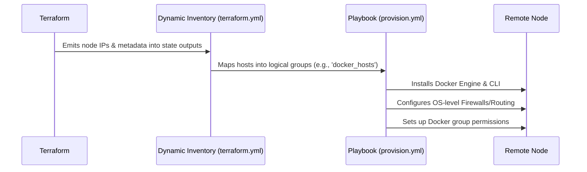

# Configuration Management: Ansible

This section covers the configuration management strategy used in the project, utilizing Ansible.

## Architecture & Integration

Ansible serves as the bridge between raw infrastructure provisioned by Terraform and the application workloads defined in Docker Compose. The architecture relies on dynamic inventory mapping to target the correctly provisioned nodes dynamically.



### The Provisioning Lifecycle
The `ansible/playbooks/provision.yml` playbook establishes the desired end-state for a given node:
1. **Host Preparation**: Basic packages, user group assignments (e.g., `system_user` role creates the `media-srv` user/group with UID 1500), node storage configuration (e.g., `storage` role formats and mounts block storage to `/mnt/app_data`), and firewall definitions.
2. **Container Runtime Setup**: Installs Docker and configures the daemon.
3. **Secret Injection Pre-requisites**: Tools required by Infisical for secure credential passing.

## Structure

The `ansible/` folder manages the provisioning and configuration sequence for instances created by Terraform.

- **`ansible.cfg`**: The core Ansible configuration setting module paths, remote users, or customized defaults.
- **`inventory/`**: The environment definitions, such as the `terraform.yml` that pulls node groupings.
- **`playbooks/`**: Includes top-level deployment blueprints like `provision.yml`.
- **`roles/`**: Standalone configurations divided logically by software components (e.g. docker runtime, routing).

## Running Ansible

Typically run using the standard runtime against the generated inventory:

```bash
ansible-playbook -i inventory/terraform.yml playbooks/provision.yml
```
