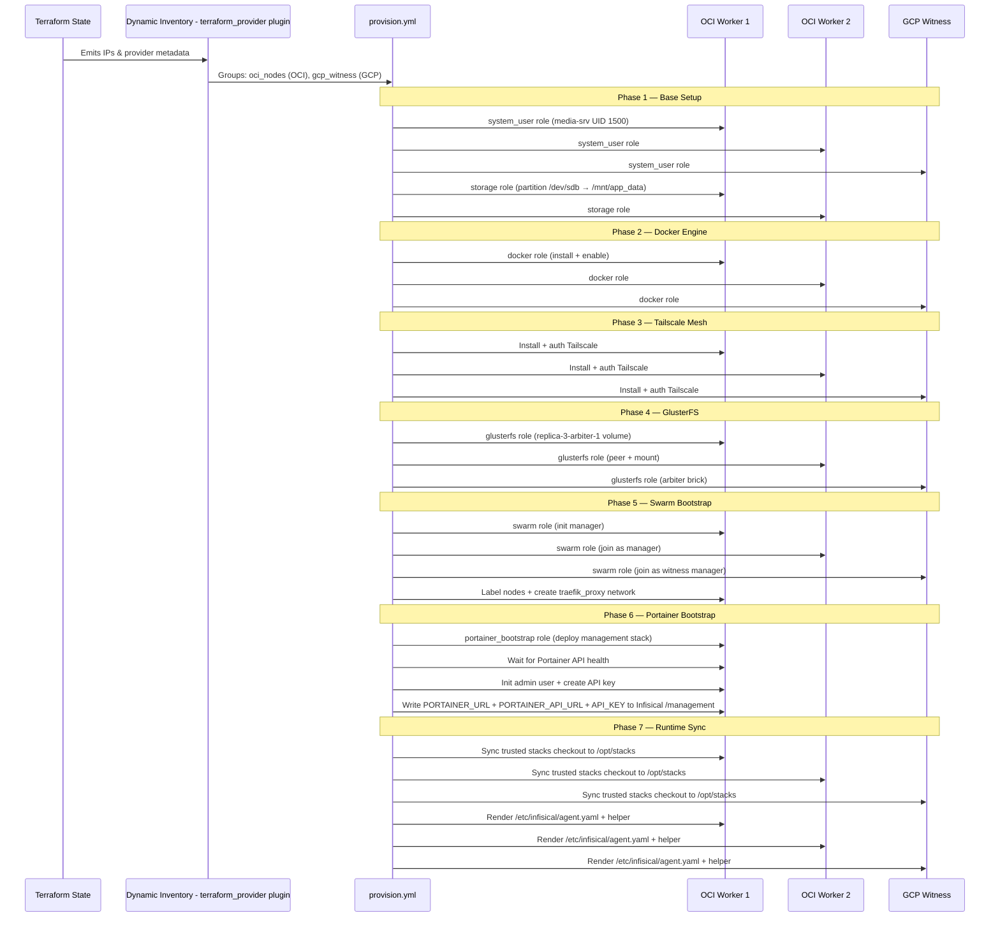

# Configuration Management: Ansible

This section covers the configuration management strategy, detailing every role, the inventory sources, SSH authentication, and the full 7-phase provisioning lifecycle.

## Architecture & Integration

Ansible bridges raw Terraform-provisioned infrastructure and the Docker Swarm workloads. Local runs use a dynamic inventory plugin to auto-discover nodes from Terraform state, while CI renders a deterministic `inventory-ci.yml` artifact from Terraform Cloud outputs (`oci_public_ips`, `gcp_witness_ipv6`) before executing Ansible.



## Dynamic Inventory

The local inventory uses the `cloud.terraform.terraform_provider` plugin to pull host information directly from Terraform state — no static IP lists to maintain.

**File:** `ansible/inventory/terraform.yml`

```yaml
plugin: cloud.terraform.terraform_provider
project_path: ../../terraform/infra
```

| Group | Provider Match | Hosts | `ansible_user` |
|-------|---------------|-------|----------------|
| `oci_nodes` | `'oci' in provider` | 2× OCI A1.Flex workers | `ubuntu` |
| `gcp_witness` | `'google' in provider` | 1× GCP e2-micro witness | `debian` |

**Host resolution:** OCI nodes use `public_ip` (IPv4); the GCP witness falls back to `witness_ipv6` when `public_ip` is unavailable.

## SSH Certificate Authentication

Ansible connects using SSH certificate-based auth instead of password or key-pair authentication. This is configured in `ansible/ansible.cfg`:

```ini
[ssh_connection]
ssh_args = -o CertificateFile=~/.ssh/id_ed25519-cert.pub -o IdentityFile=~/.ssh/id_ed25519
```

**How it works:**
1. Terraform's OCI module injects the SSH CA public key into each instance via cloud-init (`TrustedUserCAKeys /etc/ssh/trusted-user-ca-keys.pem`)
2. The operator signs their ed25519 SSH public key with the CA private key to generate `~/.ssh/id_ed25519-cert.pub`
3. Ansible presents the certificate on connection — the remote sshd validates it against the trusted CA

This eliminates the need to distribute individual public keys to each node.

## Provisioning Lifecycle

The `ansible/playbooks/provision.yml` playbook runs all 7 phases sequentially. It starts by waiting for SSH connectivity (up to 300s with 10s delay), gathering facts, and verifying with a ping.

Examples below assume you run commands from the repository root.

## Tags Matrix

| Phase | Tags | Includes | Example `--tags` | Example `--skip-tags` |
|------|------|----------|------------------|-----------------------|
| Phase 1: Base system | `phase1_base` | `system_user`, `storage` (OCI only) | `ansible-playbook -i ansible/inventory/terraform.yml ansible/playbooks/provision.yml --tags phase1_base` | `ansible-playbook -i ansible/inventory/terraform.yml ansible/playbooks/provision.yml --skip-tags phase1_base` |
| Phase 2: Docker | `phase2_docker` | `docker` role | `ansible-playbook -i ansible/inventory/terraform.yml ansible/playbooks/provision.yml --tags phase2_docker` | `ansible-playbook -i ansible/inventory/terraform.yml ansible/playbooks/provision.yml --skip-tags phase2_docker` |
| Phase 3: Tailscale | `phase3_tailscale` | Tailscale install/auth/verify tasks | `ansible-playbook -i ansible/inventory/terraform.yml ansible/playbooks/provision.yml --tags phase3_tailscale` | `ansible-playbook -i ansible/inventory/terraform.yml ansible/playbooks/provision.yml --skip-tags phase3_tailscale` |
| Phase 4: GlusterFS | `phase4_glusterfs` | `glusterfs` role + config sync include | `ansible-playbook -i ansible/inventory/terraform.yml ansible/playbooks/provision.yml --tags phase4_glusterfs` | `ansible-playbook -i ansible/inventory/terraform.yml ansible/playbooks/provision.yml --skip-tags phase4_glusterfs` |
| Phase 4b: Config sync only | `sync-configs` | `roles/glusterfs/tasks/sync-configs.yml` | `ansible-playbook -i ansible/inventory/terraform.yml ansible/playbooks/provision.yml --tags sync-configs` | `ansible-playbook -i ansible/inventory/terraform.yml ansible/playbooks/provision.yml --skip-tags sync-configs` |
| Phase 5: Swarm | `phase5_swarm` | `swarm` role | `ansible-playbook -i ansible/inventory/terraform.yml ansible/playbooks/provision.yml --tags phase5_swarm` | `ansible-playbook -i ansible/inventory/terraform.yml ansible/playbooks/provision.yml --skip-tags phase5_swarm` |
| Phase 6: Portainer bootstrap | `phase6_portainer` | `portainer_bootstrap` role (first OCI node only) | `ansible-playbook -i ansible/inventory/terraform.yml ansible/playbooks/provision.yml --tags phase6_portainer` | `ansible-playbook -i ansible/inventory/terraform.yml ansible/playbooks/provision.yml --skip-tags phase6_portainer` |
| Phase 7: Runtime sync | `phase7_runtime_sync` | `runtime_sync` role (`/opt/stacks`, agent config, helper, service) | `ansible-playbook -i ansible/inventory/terraform.yml ansible/playbooks/provision.yml --tags phase7_runtime_sync` | `ansible-playbook -i ansible/inventory/terraform.yml ansible/playbooks/provision.yml --skip-tags phase7_runtime_sync` |

## Runtime & Failure Expectations by Phase

Expected runtimes below are guidance ranges for healthy nodes and network conditions; they are not SLOs.

| Phase | Typical Runtime | Dominant Failure Points |
|------|-----------------|-------------------------|
| Phase 1 (`phase1_base`) | 2-8 min | Block device not present (`/dev/sdb` mapping mismatch), partition/format permissions, mount failures on OCI nodes |
| Phase 2 (`phase2_docker`) | 3-10 min | APT/GPG key fetch failures, Docker repository reachability, package lock contention |
| Phase 3 (`phase3_tailscale`) | 1-5 min | Missing/invalid `TAILSCALE_AUTH_KEY`, outbound connectivity to Tailscale package/auth endpoints, node already in inconsistent auth state |
| Phase 4 (`phase4_glusterfs`) | 5-20 min | Peer probe failure over Tailscale, Gluster volume create/start errors, witness connectivity issues, mount and brick path availability |
| Phase 4b (`sync-configs`) | <1-3 min | Missing source config files under `stacks/*/config`, GlusterFS mount/path permissions |
| Phase 5 (`phase5_swarm`) | 2-8 min | Manager join token retrieval/use issues, Tailscale IP discovery problems, pre-existing conflicting swarm state |
| Phase 6 (`phase6_portainer`) | 2-12 min | Portainer API health timeout, invalid bootstrap credentials/env vars, Infisical write/auth failures for `/management` and `/stacks/management` |
| Phase 7 (`phase7_runtime_sync`) | 2-10 min | Missing Universal Auth credentials, `/opt/stacks` sync drift, Infisical package install failures, systemd restart failures |

### Phase 1: Base System Setup

**Applies to:** All nodes (system_user), OCI nodes only (storage)

| Role | What It Does | Condition |
|------|-------------|-----------|
| `system_user` | Creates `media-srv` user and group with UID/GID `1500`, no home directory. All containers run file operations as this user for consistent ownership across GlusterFS. | All nodes |
| `storage` | Partitions `{{ block_device }}`, formats `{{ block_device_partition }}` as ext4, mounts at `{{ mount_point }}`, and sets ownership to `{{ service_user }}:{{ service_group }}` with mode `0755`. Defaults are `/dev/sdb`, `/dev/sdb1` (or `p1` for NVMe), `/mnt/app_data`. | OCI nodes only (`oci_nodes` group) |

### Phase 2: Docker Engine

**Applies to:** All nodes

| Role | What It Does |
|------|-------------|
| `docker` | Adds Docker's official APT repository (GPG key + apt source), installs `docker-ce`, `docker-ce-cli`, `containerd.io`, and `docker-compose-plugin`, enables the `docker` systemd service, adds `{{ service_user }}` to the `docker` group |

### Phase 3: Tailscale Mesh Networking

**Applies to:** All nodes (inline tasks, no role)

1. **Install Tailscale** — Adds the official Tailscale APT repository (GPG key + apt source), installs the `tailscale` package
2. **Authenticate** — Checks `tailscale status --json` for existing connection; only runs `tailscale up --authkey=$TAILSCALE_AUTH_KEY --ssh` if not already authenticated
3. **Verify** — Asserts exit code 0; fails with descriptive message if auth key is invalid

After this phase, all 3 nodes (2 OCI + 1 GCP) can communicate over Tailscale's encrypted mesh using private IPs, regardless of cloud provider or network topology.

> **Important:** The `TAILSCALE_AUTH_KEY` must be set as an environment variable before running the playbook. Generate an auth key from the Tailscale admin console.

### Phase 4: GlusterFS Distributed Storage

**Applies to:** OCI nodes + GCP witness (arbiter)

| Role | What It Does |
|------|-------------|
| `glusterfs` | Installs GlusterFS server and client, creates a **replica 3 arbiter 1** volume `swarm_data` across both OCI nodes (full bricks) and GCP witness (arbiter brick) over Tailscale IPv4, mounts at `/mnt/swarm-shared`, and pre-creates the entire shared directory tree |

**Detailed flow:**
1. Install `glusterfs-server`, start `glusterd` service
2. Gather Tailscale IPv4 address (`tailscale ip -4`) on each participating node
3. Create brick directory at `/mnt/app_data/gluster_brick`
4. **Peer probing** — Each node probes the other (bidirectional, idempotent)
5. **Volume creation** — From the first OCI node, creates `swarm_data` as `replica 3 arbiter 1 transport tcp` using both OCI nodes' Tailscale IPs as full brick endpoints and the GCP witness Tailscale IP as the arbiter brick
6. **Start volume** and mount via `localhost:/swarm_data` with `glusterfs` fstype and `_netdev` option
7. **Pre-create shared directories** (from first OCI node) for all stacks:

```
/mnt/swarm-shared/
├── auth/authelia/config/
├── ai-interface/open-webui/
├── ai-interface/openclaw/config/
├── observability/{prometheus_data,loki_data,grafana_data,prometheus,loki,promtail,alertmanager,alertmanager_data}/
├── gateway/traefik_acme/
├── management/{homarr/appdata,portainer/data}/
├── network/{vaultwarden/data,vaultwarden-db,pihole/node{1,2}/{etc-pihole,etc-dnsmasq.d}}/
├── uptime-kuma/data/
└── cloud/filebrowser/database/
```

All directories are owned by `media-srv:media-srv` (UID/GID 1500) with mode `0755`.

> See [Network Architecture](network-architecture.md#glusterfs-replication) for replication strategy and split-brain considerations.

### Phase 5: Swarm Bootstrap

**Applies to:** All nodes

| Role | What It Does |
|------|-------------|
| `swarm` | Initializes a 3-manager Docker Swarm cluster over the Tailscale mesh, labels nodes, and creates the `traefik_proxy` overlay network |

**Detailed flow:**
1. Gather Tailscale IPv4 on every node
2. Check if already in a Swarm (`docker info --format '{{.Swarm.LocalNodeState}}'`)
3. **First OCI node** — `docker swarm init --advertise-addr <ts_ip> --listen-addr <ts_ip>:2377`
4. Retrieve manager join token
5. **Second OCI node** — `docker swarm join --token <token> --advertise-addr <ts_ip> <first_ts_ip>:2377`
6. **GCP witness** — Same join command (joins as a 3rd manager for Raft quorum)
7. **Label nodes:**
   - OCI nodes: `location=cloud`
   - GCP witness: `role=witness`
8. **Create overlay network:** `traefik_proxy` (attachable, overlay driver) — used by all stacks

> See [Network Architecture](network-architecture.md#docker-swarm-topology) for the 3-manager quorum rationale.

### Phase 6: Portainer Bootstrap

**Applies to:** First OCI manager node only

| Role | What It Does |
|------|-------------|
| `portainer_bootstrap` | Deploys the management stack (Portainer server + agent + Homarr) via `docker stack deploy`, waits for the Portainer API to be healthy, generates a bcrypt hash of the admin password, writes `PORTAINER_ADMIN_PASSWORD_HASH` to Infisical `/stacks/management`, repairs/rotates the Terraform API key if needed, and writes `PORTAINER_URL` + `PORTAINER_API_URL` + `PORTAINER_API_KEY` to Infisical `/management` |

**Detailed flow:**
1. Generate a bcrypt hash of `PORTAINER_ADMIN_PASSWORD` (Ansible `password_hash('bcrypt')` filter)
2. Stage the trusted `stacks/management/docker-compose.yml` from the controller checkout onto the primary manager under `/opt/stacks/management/docker-compose.yml`
3. Deploy the management stack using `docker stack deploy -c /opt/stacks/management/docker-compose.yml management`, passing `PORTAINER_ADMIN_PASSWORD_HASH` as an environment variable
4. Wait for `http://localhost:9000/api/system/status` to return HTTP 200 (up to 120s)
5. Admin user is initialized automatically by Portainer via the `--admin-password` CLI flag (bcrypt hash) — no API call needed. This is idempotent and avoids transmitting the plaintext password over HTTP
6. Authenticate via `POST /api/auth` to get a JWT
7. Validate any existing `PORTAINER_API_KEY` from environment (`GET /api/system/status`); if missing/invalid, rotate `terraform-managed` token(s) and mint a new raw key
8. Write `PORTAINER_ADMIN_PASSWORD_HASH` to Infisical `/stacks/management`
9. Write `PORTAINER_URL`, `PORTAINER_API_URL`, and `PORTAINER_API_KEY` to Infisical `/management` via the Infisical CLI
10. Verify the API key works against the Portainer status endpoint

> Ownership note: `PORTAINER_ADMIN_PASSWORD_HASH`, `PORTAINER_URL`, `PORTAINER_API_URL`, and `PORTAINER_API_KEY` become automation-managed after bootstrap. See [Infisical Workflow](infisical-workflow.md#variable-ownership--mutability).

**Why Ansible and not Terraform?** Portainer is the control plane that Terraform's Portainer provider talks to. Terraform cannot create the thing it depends on to authenticate. Ansible bootstraps Portainer as infrastructure, then Terraform manages the application stacks through it.

> **Required environment variables:**
> - `PORTAINER_ADMIN_PASSWORD` — initial admin password (hashed to bcrypt at deploy time; plaintext is used only for JWT auth to create the API key)
> - `BASE_DOMAIN` — your domain (e.g., `example.com`)
> - `INFISICAL_PROJECT_ID` — Infisical project ID
> - `HOMARR_SECRET_KEY` — Homarr encryption key
>
> The workflow-backed bootstrap path writes Portainer secrets back to Infisical from the OIDC-authenticated controller session, so it no longer requires `INFISICAL_TOKEN` for this phase.

### Phase 7: Runtime Sync

**Applies to:** All nodes

| Role | What It Does |
|------|-------------|
| `runtime_sync` | Mirrors the trusted controller `stacks/` checkout to `/opt/stacks`, renders `/etc/infisical/agent.yaml`, installs the local Portainer webhook helper, and manages `infisical-agent.service` |

**Detailed flow:**
1. Install `infisical-core`, `rsync`, and `curl`
2. Mirror the verified controller checkout to `/opt/stacks` with deletion enabled while preserving rendered `.env` files
3. Render `/etc/infisical/runtime-sync.env` with the Universal Auth client id/client secret and project metadata
4. Render `/etc/infisical/agent.yaml` from `stacks/infisical-agent.yaml`
5. Install `/usr/local/bin/portainer-stack-webhook`
6. Install and enable `infisical-agent.service`
7. Start or restart the agent when package/config/helper changes land

> Ownership note: `/opt/stacks`, `/etc/infisical/agent.yaml`, `infisical-agent.service`, and the local webhook helper are automation-managed runtime assets. The normal path is `phase7_runtime_sync`, not manual cloning or hand-copying onto the host.

## Structure

```
ansible/
├── ansible.cfg                      # SSH cert auth (ed25519), inventory path, remote_user=ubuntu
├── requirements.yml                 # Galaxy collection dependencies
├── inventory/
│   └── terraform.yml                # Dynamic inventory from Terraform state
├── playbooks/
│   └── provision.yml                # 7-phase provisioning playbook (with tags)
└── roles/
    ├── system_user/
    │   ├── defaults/main.yml        # Parameterized user/group (service_user, service_uid)
    │   └── tasks/main.yml           # Create service user/group
    ├── storage/
    │   ├── defaults/main.yml        # Parameterized device/mount point
    │   └── tasks/main.yml           # Discover block device, partition + mount
    ├── docker/
    │   ├── defaults/main.yml        # Parameterized user
    │   └── tasks/main.yml           # APT repo install Docker, enable service
    ├── glusterfs/
    │   ├── defaults/main.yml        # service_user / service_group (defaults: media-srv)
    │   └── tasks/main.yml           # GlusterFS replica-3-arbiter-1 volume + shared dirs
    ├── swarm/
    │   └── tasks/main.yml           # 3-manager Swarm init + overlay network
    ├── portainer_bootstrap/
    │   ├── defaults/main.yml        # Portainer URL, admin creds, Infisical project ID
    │   └── tasks/main.yml           # Deploy management stack, init admin, create API key
    └── runtime_sync/
        ├── defaults/main.yml        # /opt/stacks + agent/helper paths and Infisical auth inputs
        ├── handlers/main.yml        # Restart infisical-agent on runtime changes
        ├── tasks/main.yml           # Mirror stacks checkout, render agent config, manage service
        └── templates/               # Agent config, helper, and systemd unit templates
```

## Running Ansible

```bash
# Set the Tailscale auth key (required for Phase 3)
export TAILSCALE_AUTH_KEY="..."

# Run the full provisioning playbook
ansible-playbook -i ansible/inventory/terraform.yml ansible/playbooks/provision.yml

# Run against specific groups
ansible-playbook -i ansible/inventory/terraform.yml ansible/playbooks/provision.yml --limit oci_nodes
ansible-playbook -i ansible/inventory/terraform.yml ansible/playbooks/provision.yml --limit gcp_witness
```

> **Prerequisites:** Terraform infra must be applied first. Local runs read from Terraform state (`ansible/inventory/terraform.yml`), while CI uses the rendered `inventory-ci.yml` artifact. Ensure your SSH certificate is valid.
