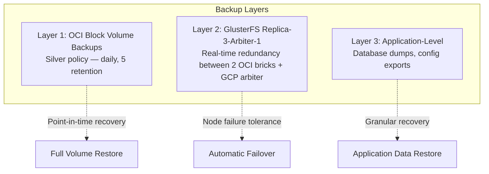

# Backup Strategy

This document covers data protection across all layers: OCI block volume backups, GlusterFS redundancy, application-level considerations, and recovery procedures.

## Overview



## Layer 1: OCI Block Volume Backups

### Configuration

Each OCI worker has a 50 GB block volume (`/dev/sdb`) that stores all application data (GlusterFS bricks). Terraform assigns OCI's **Silver backup policy** to both volumes:

```terraform
resource "oci_core_volume_backup_policy_assignment" "worker_volume_backup" {
  count     = 2
  asset_id  = oci_core_volume.worker_volume[count.index].id
  policy_id = data.oci_core_volume_backup_policies.silver.volume_backup_policies[0].id
}
```

### Silver Policy Details

| Property | Value |
|----------|-------|
| **Frequency** | Daily |
| **Retention** | 5 backups |
| **Type** | Incremental (after initial full) |
| **Scope** | Entire block volume (50 GB each) |
| **Schedule** | Managed by OCI — typically runs during off-peak hours |
| **Cost** | Included in OCI Always Free tier (within storage limits) |

### What's Backed Up

The block volumes contain `/mnt/app_data`, which holds the GlusterFS brick (`/mnt/app_data/gluster_brick`). This brick contains **all** application data:

```
/mnt/app_data/gluster_brick/
├── auth/authelia/config/
├── ai-interface/{open-webui,openclaw/config}/
├── observability/{prometheus_data,loki_data,grafana_data,prometheus,loki,promtail}/
├── gateway/traefik_acme/
├── management/{homarr/appdata,portainer/data}/
├── network/{vaultwarden/data,vaultwarden-db,pihole/node*/etc-*}/
├── uptime-kuma/data/
└── cloud/filebrowser/database/
```

Since GlusterFS replicates this data between both nodes, backing up either volume captures all stack data.

### Restoring from Block Volume Backup

1. **In the OCI Console:** Navigate to Block Storage → Block Volumes → Select the volume → Backups
2. **Create a new volume from backup:** Click the backup, select "Restore as New Block Volume"
3. **Attach the new volume** to the affected instance (or a recovery instance)
4. **Mount and copy data:**
   ```bash
   # Mount the restored volume
   mkdir /mnt/restore
   mount /dev/sdc1 /mnt/restore  # Device name may vary

   # Copy data back to the active GlusterFS brick
   rsync -av /mnt/restore/gluster_brick/ /mnt/app_data/gluster_brick/

   # Trigger GlusterFS heal to sync changes to the peer
   gluster volume heal swarm_data
   ```
5. **Detach and delete** the temporary restored volume

## Layer 2: GlusterFS Redundancy

> **Important:** Replica-3-arbiter-1 provides **real-time redundancy**, not **point-in-time backup**. If data is deleted or corrupted, the deletion/corruption replicates immediately. The GCP arbiter participates in quorum and prevents split-brain but does **not** store a full data copy.

### What It Provides

| Scenario | Protected? |
|----------|------------|
| Single OCI node failure | Yes — other OCI node has full copy, arbiter maintains quorum |
| Split-brain during network partition | Yes — arbiter provides tie-breaking vote |
| Accidental file deletion | **No** — deletion replicates to both OCI nodes immediately |
| Data corruption | **No** — corruption may replicate before detection |
| Ransomware / malicious modification | **No** — changes replicate immediately |

### GlusterFS Health Commands

```bash
# Check volume status
gluster volume status swarm_data

# Check replication status
gluster volume heal swarm_data info

# Check for split-brain files
gluster volume heal swarm_data info split-brain

# Trigger manual heal
gluster volume heal swarm_data

# Resolve split-brain (use with care)
gluster volume heal swarm_data split-brain bigger-file <path>
```

### Recovery After Node Failure

If one OCI node goes down and comes back:

1. GlusterFS automatically detects the returning peer
2. The `glusterd` service starts the heal process
3. Modified files are synced from the healthy node to the recovered one
4. Monitor with: `gluster volume heal swarm_data info`

If a node needs full replacement:

1. Provision a new instance via Terraform
2. Run Ansible provisioning against the new node
3. GlusterFS will perform a full resync from the surviving peer
4. Rejoin Docker Swarm from the new node

## Layer 3: Application-Level Backups

### Vaultwarden (PostgreSQL)

The most critical data. PostgreSQL runs in a container with data on GlusterFS.

**Export (pg_dump):**
```bash
# Find the running container
docker ps --filter "name=network_vaultwarden-db" --format "{{.ID}}"

# Dump the database
docker exec $(docker ps -q --filter "name=network_vaultwarden-db") \
  pg_dump -U vaultwarden vaultwarden > vaultwarden_backup_$(date +%Y%m%d).sql
```

**Restore:**
```bash
# Drop and recreate (DESTRUCTIVE)
docker exec -i $(docker ps -q --filter "name=network_vaultwarden-db") \
  psql -U vaultwarden -d vaultwarden < vaultwarden_backup_YYYYMMDD.sql
```

### Authelia (PostgreSQL)

Authelia uses PostgreSQL 16 for session and authentication data. Follows the same pattern as Vaultwarden.

**Export (pg_dump):**
```bash
# Find the running container
docker ps --filter "name=auth_authelia-db" --format "{{.ID}}"

# Dump the database
docker exec $(docker ps -q --filter "name=auth_authelia-db") \
  pg_dump -U authelia authelia > authelia_backup_$(date +%Y%m%d).sql
```

**Restore:**
```bash
# Drop and recreate (DESTRUCTIVE)
docker exec -i $(docker ps -q --filter "name=auth_authelia-db") \
  psql -U authelia -d authelia < authelia_backup_YYYYMMDD.sql
```

### Pi-hole Configuration

Pi-hole configs are stored on GlusterFS and synced between instances via Orbital Sync every 30 minutes.

**Export:**
```bash
# Pi-hole supports built-in Teleporter backup
# Access https://dns.example.com/admin → Settings → Teleporter → Export
```

**Restore:**
```bash
# Use the Teleporter import in the Pi-hole admin UI
# Orbital Sync will propagate changes to the secondary instance
```

### Grafana Dashboards

```bash
# Grafana data is in /mnt/swarm-shared/observability/grafana_data
# For dashboard-only backup, use the Grafana API:
curl -H "Authorization: Bearer <api-key>" \
  https://grafana.example.com/api/dashboards/home > dashboard_backup.json
```

### Traefik ACME Certificates

Let's Encrypt certificates are stored in the GlusterFS-backed `traefik_acme` volume at `/mnt/swarm-shared/gateway/traefik_acme`. This data is replicated across both OCI nodes. If lost, Traefik will automatically re-request certificates on the next start, but be aware of Let's Encrypt rate limits (50 certificates per domain per week).

### Authelia Configuration

Authelia's config directory is bind-mounted from GlusterFS (`/mnt/swarm-shared/auth/authelia/config`). Back up the `configuration.yml` and any user database files if modified.

## Backup Schedule Summary

| Layer | What | Frequency | Retention | Automated |
|-------|------|-----------|-----------|-----------|
| OCI Block Volume | Full disk (GlusterFS brick) | Daily | 5 days | Yes (OCI policy) |
| GlusterFS | Real-time replication | Continuous | N/A (not a backup) | Yes |
| Vaultwarden DB | PostgreSQL dump | Manual | — | No |
| Authelia DB | PostgreSQL dump | Manual | — | No |
| Pi-hole config | Teleporter export | Manual | — | No |
| Grafana dashboards | API export | Manual | — | No |

## Recommendations

1. **Automate Vaultwarden backups** — Add a cron job or script to run `pg_dump` daily and store dumps outside GlusterFS (e.g., upload to object storage)
2. **Test restores regularly** — Spin up a temporary volume from an OCI backup quarterly to verify data integrity
3. ~~Consider adding an arbiter~~ — **Done**: GCP witness now serves as the GlusterFS arbiter node, preventing split-brain without full replication overhead
4. **Monitor backup status** — Use the OCI Console or API to verify backup policy compliance; add an Uptime Kuma check for backup age if possible
