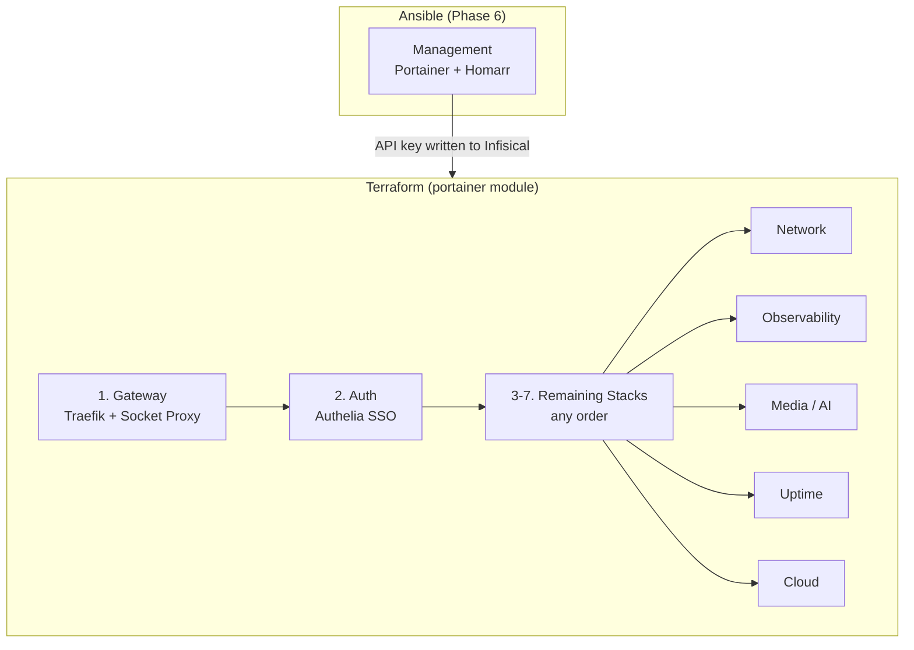

# Deployment Runbook

This document covers the end-to-end deployment procedure: prerequisites, stack ordering, deploy commands, verification, updates, and rollback.

Before using this runbook for first-time setup, complete the [Infrastructure Orchestrator Cutover Checklist](meta-pipeline-cutover-checklist.md). For variable ownership (manual vs automation-managed), see [Infisical Workflow](infisical-workflow.md#variable-ownership--mutability).

## Prerequisites

Before deploying any stack, verify that all infrastructure layers are operational:

| Prerequisite | How to Verify | Fix |
|-------------|---------------|-----|
| Cutover checklist complete | Review [Infrastructure Orchestrator Cutover Checklist](meta-pipeline-cutover-checklist.md) and confirm all required items | Complete missing GitHub/TFC/Infisical prerequisites before deploy |
| Automation-managed variables understood | Review [Variable Ownership & Mutability](infisical-workflow.md#variable-ownership--mutability) | Do not manually edit automation-managed variables outside their owning workflow |
| Terraform infra workspace applied | Terraform Cloud run for `goodoldme-infra` succeeds (or `terraform -chdir=terraform/infra output`) | Merge/push a change under `terraform/infra`, `terraform/oci`, or `terraform/gcp` to `main` so `orchestrator.yml` runs automatically, or use `terraform -chdir=terraform/infra apply` |
| Terraform Portainer workspace applied | Local CI apply for `terraform/portainer-root` succeeds against TFC remote state (`goodoldme-portainer`) (or `terraform -chdir=terraform/portainer-root output`) | Merge/push a change under `terraform/portainer` or `terraform/portainer-root` to `main` so `orchestrator.yml` runs automatically, or use `terraform -chdir=terraform/portainer-root apply` |
| Tailscale mesh active (CI) | `dagger-pipeline` job connects Tailscale via `tailscale/github-action@v3` — verify `TS_OAUTH_CLIENT_ID` + `TS_OAUTH_SECRET` are set | Set OAuth credentials in GitHub repo secrets |
| Ansible provisioning complete | SSH into nodes, verify Docker/Tailscale/GlusterFS/Portainer | Re-run `ansible-playbook` |
| Portainer running | `curl -s http://localhost:9000/api/system/status` returns HTTP 200 | Re-run Ansible `portainer_bootstrap` role |
| `PORTAINER_ADMIN_PASSWORD` set | `echo $PORTAINER_ADMIN_PASSWORD` is non-empty | `export PORTAINER_ADMIN_PASSWORD='...'` (bcrypt-hashed by Ansible and written to `/stacks/management` during bootstrap) |
| Tailscale mesh active | `tailscale status` on each node shows 3 peers | `tailscale up --authkey=...` |
| GlusterFS mounted | `df -h /mnt/swarm-shared` on OCI nodes | `mount -t glusterfs localhost:/swarm_data /mnt/swarm-shared` |
| Config files synced | `ls /mnt/swarm-shared/auth/authelia/config/configuration.yml` | `ansible-playbook -i ansible/inventory/terraform.yml ansible/playbooks/provision.yml --tags sync-configs` |
| Docker Swarm initialized | `docker node ls` shows 3 managers (2 Ready + 1 Ready) | Re-run Ansible `swarm` role |
| `traefik_proxy` network exists | `docker network ls \| grep traefik_proxy` | `docker network create --driver overlay --attachable traefik_proxy` |
| Infisical Agent running | `systemctl status infisical-agent` | See [Agent Installation](infisical-workflow.md#installing-the-agent) |
| `.env` files rendered | `ls /opt/stacks/*/.env` | Re-run `ansible-playbook -i ansible/inventory/terraform.yml ansible/playbooks/provision.yml --tags phase7_runtime_sync` |

## Deployment Order

Stacks have dependencies. The infrastructure orchestrator enforces this order with health gates:



**Why this order:**
1. **Management first (Ansible)** — Portainer is the control plane. Ansible bootstraps it during provisioning (Phase 6) because Terraform's Portainer provider needs the API to already exist.
2. **Gateway first (Portainer webhook)** — The pipeline triggers Gateway and waits for `https://gateway-health.<BASE_DOMAIN>/healthz` to return 200.
3. **Auth second (Portainer webhook)** — Auth is gated on Gateway health to prevent cascading redeploy failures.
4. **Everything else** — The pipeline follows manifest dependencies from `stacks/stacks.yaml`.

## Deploy Commands

Unless noted otherwise, direct CLI examples below assume you are on the primary manager and `phase7_runtime_sync` has already rendered `/opt/stacks/*/.env`.

### Step 0: Management Stack (Ansible)

The management stack (Portainer + Homarr) is deployed automatically by Ansible during Phase 6 of provisioning, with the trusted compose staged onto the primary manager before deploy. If you need to deploy it manually in break-glass mode, either rely on the rendered `/opt/stacks/management/.env` or pass every required variable explicitly:

```bash
# Deploy the management stack directly
BASE_DOMAIN=example.com HOMARR_SECRET_KEY="your-key" TZ=Etc/UTC \
  PORTAINER_ADMIN_PASSWORD_HASH='$2b$12$...' \
  docker stack deploy -c /opt/stacks/management/docker-compose.yml management
```

> **Note:** `PORTAINER_ADMIN_PASSWORD_HASH` must be a valid bcrypt hash. Generate one with:
> ```bash
> htpasswd -nbB '' 'your-password' | cut -d: -f2
> ```
> The Ansible playbook generates this automatically from `PORTAINER_ADMIN_PASSWORD`.

**Verify:**
```bash
docker stack services management
# Expected: portainer-server (1/1), portainer-agent (mode: global), homarr (1/1)

# Test Portainer API is responding
curl -s http://localhost:9000/api/system/status | jq .
```

### Step 1: Gateway

```bash
docker stack deploy -c /opt/stacks/gateway/docker-compose.yml gateway
```

**Verify:**
```bash
docker stack services gateway
# Expected: socket-proxy (1/1 on a manager), traefik (2/2 replicated on OCI workers)

# Test Traefik is responding
curl -I http://localhost:80
# Expected: HTTP 404 (no routes configured yet) or redirect to HTTPS
```

### Step 2: Auth

#### One-Time Setup (before first deploy)

Authelia requires config files and secrets to be prepared before the stack will start.

Use this responsibility split during bootstrap:

- **You do:** create the required secrets in Infisical and generate password/client-secret hashes. Run the tagged Ansible convergence commands only when doing targeted/manual convergence, or when changing the automation itself.
- **Automation does:** sync static config, render the runtime-managed users database from Infisical, copy it onto GlusterFS, and trigger the auth stack redeploy on the primary manager when that rendered file changes.
- **You do not need to:** edit `/mnt/swarm-shared/auth/authelia/config/users_database.yml` by hand, paste OIDC secrets into repo YAML files, or manually copy auth config files onto the nodes.

If you are running the normal full bootstrap path (`provision.yml` without phase tags, or the infra orchestrator full reconcile), both `sync-configs` and `phase7_runtime_sync` are already included. The tagged commands below are for targeted/manual convergence and break-glass workflows.

**1. Sync config files to GlusterFS:**

```bash
ansible-playbook -i ansible/inventory/terraform.yml ansible/playbooks/provision.yml --tags sync-configs
# This copies stacks/auth/config/configuration.yml to /mnt/swarm-shared/auth/authelia/config/
# seeds users_database.yml only if it is missing, syncs the static observability config files,
# and seeds alertmanager.yml only if the runtime-managed file is not there yet.
```

What you are doing:
- Running the one-time/static config sync for bind-mounted files when doing targeted/manual convergence.

What automation handles:
- `sync-configs` copies the static Authelia `configuration.yml`.
- `sync-configs` only seeds a placeholder `users_database.yml` if the runtime-managed file does not exist yet.
- `sync-configs` only seeds a placeholder `alertmanager.yml` if the runtime-managed file does not exist yet.

What you do not need to do:
- Manually SCP/copy files into GlusterFS.
- Re-run `sync-configs` for normal user-account changes.

**2. Create the Authelia users database secret in Infisical:**

```bash
# Generate an argon2id password hash
docker run --rm authelia/authelia:latest \
  authelia crypto hash generate argon2 --password 'your-strong-password'
```

Store the full users database as a multi-line secret under `/stacks/identity` as `AUTHELIA_USERS_DATABASE_YAML`.

Copy this as the secret value, then replace the placeholder names, emails, and password hashes:

```yaml
users:
  admin:
    disabled: false
    displayname: "Admin User"
    email: "admin@example.com"
    password: "$argon2id$v=19$m=65536,t=3,p=4$replace-with-generated-hash"
    groups:
      - "admins"

  yourname:
    disabled: false
    displayname: "Your Name"
    email: "you@example.com"
    password: "$argon2id$v=19$m=65536,t=3,p=4$replace-with-generated-hash"
    groups:
      - "users"
```

Each user goes directly under `users:`. Add or remove user entries as needed, but keep the YAML structure unchanged.

If you are **not** already using the normal full bootstrap/orchestrator path, and `phase7_runtime_sync` has not already been converged on this environment, or you changed the agent/helper/template implementation itself, run:

```bash
ansible-playbook -i ansible/inventory/terraform.yml ansible/playbooks/provision.yml --tags phase7_runtime_sync
```

After phase 7 is installed once, normal user-database updates do **not** require rerunning Ansible. Update `AUTHELIA_USERS_DATABASE_YAML` in Infisical and the existing Infisical Agent will:

- render the users database template
- copy it to `/mnt/swarm-shared/auth/authelia/config/users_database.yml`
- trigger the `auth` stack webhook automatically

What you are doing:
- Generating password hashes.
- Storing the full `AUTHELIA_USERS_DATABASE_YAML` document in Infisical.
- Running `phase7_runtime_sync` only for targeted/manual convergence if this runtime automation has not been installed yet, or after changing the agent/helper templates themselves.

What automation handles:
- The Infisical Agent renders `stacks/auth/config/users_database.yml.tmpl`.
- The primary manager copies the rendered file to GlusterFS.
- The primary manager triggers the `auth` stack webhook after the rendered users database changes.

What you do not need to do:
- Edit `stacks/auth/config/users_database.yml` for normal user updates.
- Re-run `phase7_runtime_sync` for routine Authelia user additions or password/group changes once phase 7 is already in place.
- Re-run `sync-configs` every time you add or change an Authelia user.

**3. Generate OIDC keys and hash the Grafana client secret:**

```bash
# Generate RSA private key for OIDC JWT signing
docker run --rm authelia/authelia:latest \
  authelia crypto certificate rsa generate --directory /tmp
# Copy the private key output — store as AUTHELIA_IDENTITY_PROVIDERS_OIDC_JWKS_0_KEY in Infisical

# Generate OIDC HMAC secret
openssl rand -hex 32
# Store as AUTHELIA_IDENTITY_PROVIDERS_OIDC_HMAC_SECRET in Infisical

# Hash the Grafana OIDC client secret (the plaintext is GF_OIDC_CLIENT_SECRET in Infisical)
docker run --rm authelia/authelia:latest \
  authelia crypto hash generate argon2 --password '<GF_OIDC_CLIENT_SECRET value>'
# Store the resulting hash in Infisical under /stacks/identity as:
#   AUTHELIA_IDENTITY_PROVIDERS_OIDC_CLIENTS_0_CLIENT_SECRET
# The auth stack renders it into Authelia's templated configuration at startup.
```

What you are doing:
- Generating the operator-managed secret material once and storing it in Infisical.

What automation handles:
- The auth stack reads these values from the rendered environment/template flow at deploy time.

What you do not need to do:
- Paste client secret hashes or environment-specific redirect URIs into `stacks/auth/config/configuration.yml`.

**4. Add operator-managed auth secrets to Infisical** (under `/stacks/identity`):

| Variable | Value |
|----------|-------|
| `AUTHELIA_STORAGE_ENCRYPTION_KEY` | Random secret, e.g. `openssl rand -base64 48` |
| `AUTHELIA_USERS_DATABASE_YAML` | Multi-line YAML `users:` document for Authelia's file backend, using argon2id password hashes |
| `AUTHELIA_NOTIFIER_SMTP_USERNAME` | Your Gmail address |
| `AUTHELIA_NOTIFIER_SMTP_PASSWORD` | Gmail App Password (Google Account → Security → App passwords) |
| `AUTHELIA_NOTIFIER_SMTP_SENDER` | `Authelia <noreply@yourdomain.com>` |
| `AUTHELIA_IDENTITY_PROVIDERS_OIDC_HMAC_SECRET` | (generated above) |
| `AUTHELIA_IDENTITY_PROVIDERS_OIDC_JWKS_0_KEY` | (RSA PEM generated above — paste full multi-line key) |
| `AUTHELIA_IDENTITY_PROVIDERS_OIDC_CLIENTS_0_CLIENT_SECRET` | (argon2 hash generated from `GF_OIDC_CLIENT_SECRET`) |

After these are set:
- Future user-account changes are made by updating `AUTHELIA_USERS_DATABASE_YAML` in Infisical.
- Future OIDC secret rotations are made by updating the relevant Infisical secrets.
- The repo files remain static templates and bootstrap placeholders; they are not the day-to-day control surface.

#### Deploy

```bash
# Auth requires the rendered /opt/stacks/auth/.env. If phase7 runtime sync has not
# completed yet, finish that first instead of trying to handcraft a partial .env.
docker stack deploy -c /opt/stacks/auth/docker-compose.yml auth
```

**Verify:**
```bash
docker stack services auth
# Expected: authelia (1/1), authelia-db (1/1)

# Check Authelia logs for startup errors
docker service logs auth_authelia --tail 50

# Test Authelia is reachable via Traefik
curl -I https://auth.example.com
# Expected: HTTP 200 (Authelia login page)

# Test OIDC discovery endpoint
curl -s https://auth.example.com/.well-known/openid-configuration | jq .
# Expected: JSON with issuer, authorization_endpoint, token_endpoint, etc.
```

### Step 3+: Remaining Stacks (Terraform-managed)

After Ansible has bootstrapped Portainer, **Terraform manages all application stacks** via the Portainer provider. Use the split workspace model:

1. `goodoldme-infra` (`terraform/infra`) provisions OCI/GCP and runs Ansible bootstrap.
2. `goodoldme-portainer` (`terraform/portainer-root`) creates Git-backed Portainer stacks with webhooks and writes `/deployments` secrets.

Runs execute with a split model:
- `goodoldme-infra`: Terraform Cloud managed workers (remote run/apply)
- `goodoldme-portainer`: local Terraform CLI inside the Dagger pipeline container (`portainer-apply` stage), backed by Terraform Cloud remote state (`operations=false`)

## Decision Gate: Normal vs Break-Glass

Use this decision gate before running local/manual fallback commands.

| Condition | Mode | Allowed actions | Controls required | Post-action reconciliation |
|-----------|------|-----------------|------------------|----------------------------|
| Terraform Cloud workspaces are reachable, metadata is healthy, and no urgent outage is active | Normal | `orchestrator.yml` execution, Terraform-managed apply paths, health-gated webhook redeploys | Follow cutover checklist prerequisites, run pipeline preflights, keep network policy sync enabled | Verify no drift via planned managed run and document execution reason/output |
| Terraform Cloud control plane unavailable or degraded but service-impacting change is required | Break-Glass | Local `terraform -chdir=... apply` and/or direct `docker stack deploy` fallback commands | Record incident ticket/change record, limit operator set, keep commands scoped to impacted stack(s) only | Re-run normal managed workflow ASAP, confirm drift is cleared, attach evidence to incident record |
| Portainer API allowlist propagation or webhook automation path is blocked during incident response | Break-Glass | Direct CLI stack deploy or targeted service update commands | Confirm operator SSH source is approved, capture exact commands and timestamps | Reconcile by rerunning managed redeploy and validating webhooks/allowlist behavior |
| Routine updates with no control-plane issues | Normal | GitOps webhook path and Terraform `portainer-root` managed apply only | Standard review + validation checks | Confirm expected job chain completed and archive logs/artifacts |

```bash
# Local fallback (if not using Terraform Cloud workspaces)
terraform -chdir=terraform/infra apply
terraform -chdir=terraform/portainer-root apply
```

For **manual deployment** (fallback), the Ansible-managed Infisical Agent handles deployment automatically via its `exec.command`. Or deploy directly:

```bash
# Network
docker stack deploy -c /opt/stacks/network/docker-compose.yml network

# Observability
docker stack deploy -c /opt/stacks/observability/docker-compose.yml observability

# Media / AI Interface
docker stack deploy -c /opt/stacks/media/ai-interface/docker-compose.yml ai-interface

# Uptime
docker stack deploy -c /opt/stacks/uptime/docker-compose.yml uptime

# Cloud
docker stack deploy -c /opt/stacks/cloud/docker-compose.yml cloud
```

Before the first redeploy that moves `vaultwarden-db` or Loki off GlusterFS, migrate their existing data onto the pinned node-local paths: `/mnt/app_data/local/network/vaultwarden-db` on `app-worker-2` and `/mnt/app_data/local/observability/loki_data` on `app-worker-1`. Stop the affected service first; for Vaultwarden PostgreSQL, prefer a logical backup/restore over copying a live `PGDATA` directory.

### Full Verification

```bash
# List all stacks
docker stack ls

# Check all services across all stacks
for stack in gateway auth management network observability ai-interface uptime cloud; do
  echo "=== $stack ==="
  docker stack services "$stack" 2>/dev/null || echo "  (not deployed)"
  echo
done

# Check for any failing services
docker service ls --filter "desired-state=running" --format "{{.Name}} {{.Replicas}}" | grep -v "1/1\|global"
```

## Updating a Stack

### Via Portainer GitOps Webhooks (preferred)

Every stack is linked to the `JoseStud/stacks` Git repository in Portainer with **Enable Webhook**. Trigger calls must come from a **private trusted source**, not public GitHub-hosted runners.

**Automatic (private automation):**

1. Push to `main` in the stacks repo triggers `stacks/.github/workflows/stacks-ci.yml` and `stacks/.github/workflows/stacks-dispatch-redeploy.yml`.
2. After `stacks-ci.yml` succeeds on `main`, the dispatch workflow emits one `stacks-redeploy-intent-v5` event with the minimal full-reconcile payload.
3. Infra `orchestrator.yml` treats every valid stacks dispatch as a full reconcile: it waits for trusted `stacks_sha` checks before preflight mutations, validates secrets, runs `phase7_runtime_sync`, runs `sync-configs`, runs `terraform/portainer-root apply` with the trusted `stacks_sha` selecting the fetched `stacks.yaml`, then redeploys every Portainer-managed stack from Portainer's configured `repository_reference`.
4. Health gates use manifest dependencies and manifest order: Gateway is checked first (`gateway-health.<BASE_DOMAIN>/healthz`), then Auth, then the remaining Portainer-managed stacks. The Ansible-managed `management` stack stays outside this webhook flow.

Trusted `stacks_sha` means:

- the commit is still on the stacks repo `main` lineage, and
- every observed GitHub CI signal on that commit is green.

The orchestrator observes both GitHub Checks and legacy commit statuses. A stacks repo that publishes only check runs, only legacy statuses, or both can pass; the gate fails only when no CI signal exists yet, a signal is still pending, or any observed signal fails.

**Manual (one-off):**

```bash
# Trigger a single stack's webhook
./scripts/portainer-webhook.sh http://<tailscale_ip>:9000/api/webhooks/<uuid>

# Trigger all stacks at once via env var
WEBHOOK_URLS="<url1>,<url2>,<url3>" ./scripts/portainer-webhook.sh
```

> No API key or `ENDPOINT_ID` needed — each webhook URL is natively bound to one specific stack in Portainer. Webhook traffic reaches Portainer over the Tailscale mesh (no public Traefik route).

### Via CLI (direct Swarm commands)

You can still deploy directly with the Docker CLI when needed:

```bash
# Re-deploy (idempotent — only updates changed services)
docker stack deploy -c /opt/stacks/<stack>/docker-compose.yml <stack>

# Or update a single service (e.g., to pull a newer image)
docker service update --image <new-image> <stack>_<service>

# Force a rolling update (re-pull image)
docker service update --force <stack>_<service>
```

### Setting Up Portainer GitOps for a New Stack (Terraform)

Stacks are now managed declaratively via the `portainer` Terraform module. To add a new stack:

1. Create the `docker-compose.yml` in the stacks repo under `<name>/`
2. Add a new entry to `stacks/stacks.yaml` with `compose_path`, `portainer_managed`, dependencies, and optional health check metadata
3. Run `terraform -chdir=terraform/portainer-root apply` (or merge the corresponding `terraform/portainer-root` / `terraform/portainer` change to `main` so `orchestrator.yml` applies it automatically) — the stack, webhook, and Infisical secret are all created automatically

The webhook URL is written to Infisical `/deployments` as `WEBHOOK_URL_<STACK_NAME>` and appended to the combined `PORTAINER_WEBHOOK_URLS` secret.

If `terraform/portainer-root apply` runs with `stacks_sha` set, Terraform uses that SHA to fetch `stacks.yaml` while Portainer still tracks its configured `repository_reference` (default `refs/heads/main`). On infra-repo push runs, the orchestrator resolves `HEAD:stacks`, mirrors that trusted checkout to `/opt/stacks`, and uses the same SHA to select the manifest consumed during the Portainer apply. Subsequent webhook redeploys follow Portainer's configured Git ref, not an immutable commit pin.

### Updating Secrets

1. Update the secret value in Infisical Cloud
2. For auto-injected stacks: restart the Infisical Agent — it will re-render `.env.tmpl` and re-deploy
3. For manual stacks: edit the `.env` file and trigger the stack's webhook or re-deploy with `docker stack deploy`

## Removing a Stack

```bash
# Remove all services in a stack
docker stack rm <stack>

# Verify removal
docker stack services <stack>
# Expected: "Nothing found in stack: <stack>"
```

> **Warning:** `docker stack rm` does not delete volumes or bind-mount data. Persistent data on GlusterFS and node-local block-volume mounts remains intact.

## Rollback

Docker Swarm maintains the previous service specification for automatic rollback:

```bash
# Rollback a specific service to its previous state
docker service rollback <stack>_<service>

# Example: rollback Vaultwarden after a bad update
docker service rollback network_vaultwarden
```

For a full stack rollback, you'll need to redeploy with the previous docker-compose.yml (use Git history):

```bash
# Checkout the previous version of the compose file in the trusted controller checkout
git -C stacks checkout HEAD~1 -- <stack>/docker-compose.yml

# Re-sync the host runtime copy, then re-deploy from /opt/stacks
ansible-playbook -i ansible/inventory/terraform.yml ansible/playbooks/provision.yml --tags phase7_runtime_sync
docker stack deploy -c /opt/stacks/<stack>/docker-compose.yml <stack>

# Don't forget to restore the current version after
git -C stacks checkout main -- <stack>/docker-compose.yml
ansible-playbook -i ansible/inventory/terraform.yml ansible/playbooks/provision.yml --tags phase7_runtime_sync
```

## Troubleshooting

### Service Won't Start

```bash
# Check service logs
docker service logs <stack>_<service> --tail 100

# Check why tasks are failing
docker service ps <stack>_<service> --no-trunc

# Common causes:
# - "no suitable node" → check placement constraints and node labels
# - "network not found" → traefik_proxy network missing, recreate it
# - missing .env → Infisical Agent hasn't rendered the template
```

### Traefik Not Routing

```bash
# Check Traefik is running
docker service ls | grep traefik

# Check Traefik can see services (via socket-proxy)
docker service logs gateway_traefik --tail 50 | grep -i "error\|router\|provider"

# Verify the target service is on traefik_proxy network
docker service inspect <stack>_<service> --format '{{.Spec.TaskTemplate.Networks}}'
```

### GlusterFS Issues

```bash
# Check volume status
gluster volume status swarm_data
gluster volume info swarm_data

# Check for split-brain
gluster volume heal swarm_data info

# Resolve split-brain (if detected)
gluster volume heal swarm_data split-brain bigger-file /path/to/file
```

### Swarm Quorum Loss

If the GCP witness goes down:

```bash
# Check cluster status
docker node ls
# If 2/3 managers are up, cluster is still operational

# If quorum is lost (only 1 manager reachable):
# Option 1: Bring the witness back online
# Option 2: Force a new cluster (LAST RESORT)
docker swarm init --force-new-cluster --advertise-addr <ts_ip>
```

### Pi-hole DNS Not Resolving

```bash
# Test DNS directly on the node
dig @127.0.0.1 google.com

# Check Pi-hole container is running
docker service ps network_pihole-1

# Verify host-mode port binding
ss -ulnp | grep :53
```

If `docker service ps network_pihole-1` shows tasks stuck in `Created` and `ss` shows `systemd-resolved` already listening on port `53`, free the port on the affected OCI worker:

```bash
sudoedit /etc/systemd/resolved.conf
# set: DNSStubListener=no

sudo ln -sf /run/systemd/resolve/resolv.conf /etc/resolv.conf
sudo systemctl restart systemd-resolved
```

The Ansible `phase2_docker` role now enforces this automatically on OCI Ubuntu workers, so rerunning that phase is the durable fix:

```bash
ansible-playbook -i ansible/inventory/terraform.yml ansible/playbooks/provision.yml --tags phase2_docker
```

### Loki Crash Loop After OOM or Hard Reboot

```bash
# Confirm Loki is failing before it ever becomes ready
docker service ps observability_loki --no-trunc

# Look for WAL replay or parse failures
docker service logs observability_loki --tail 200 | grep -i "wal\|parse\|replay"
```

If the logs show `failed to parse WAL`, clear the corrupted WAL and restart Loki. This discards only the unreplayed tail of recent logs:

```bash
# Stop Loki before removing WAL segments
docker service scale observability_loki=0

# Run on app-worker-1: Loki is pinned there and stores WAL locally
rm -rf /mnt/app_data/local/observability/loki_data/wal

# Bring Loki back
docker service scale observability_loki=1
```

If you are recovering from repeated `Exit 137` events, inspect both the service limit and the node's free memory before redeploying. The heavier services now carry explicit Swarm reservations, but a single node can still be pressured during failover or manual stack pinning.
