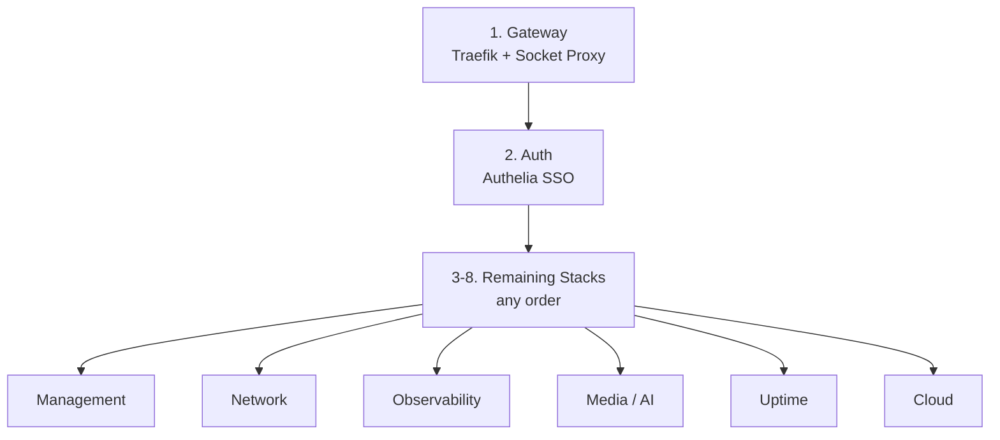

# Deployment Runbook

This document covers the end-to-end deployment procedure: prerequisites, stack ordering, deploy commands, verification, updates, and rollback.

## Prerequisites

Before deploying any stack, verify that all infrastructure layers are operational:

| Prerequisite | How to Verify | Fix |
|-------------|---------------|-----|
| Terraform applied | `terraform output` shows IPs | `terraform apply` |
| Ansible provisioning complete | SSH into nodes, verify Docker/Tailscale/GlusterFS | Re-run `ansible-playbook` |
| Tailscale mesh active | `tailscale status` on each node shows 3 peers | `tailscale up --authkey=...` |
| GlusterFS mounted | `df -h /mnt/swarm-shared` on OCI nodes | `mount -t glusterfs localhost:/swarm_data /mnt/swarm-shared` |
| Docker Swarm initialized | `docker node ls` shows 3 managers (2 Ready + 1 Ready) | Re-run Ansible `swarm` role |
| `traefik_proxy` network exists | `docker network ls \| grep traefik_proxy` | `docker network create --driver overlay --attachable traefik_proxy` |
| Infisical Agent running | `systemctl status infisical-agent` | Check agent config, restart service |
| `.env` files rendered | `ls /opt/stacks/*/env` or `cat stacks/<stack>/.env` | Restart Infisical Agent or create manually |

## Deployment Order

Stacks have dependencies — deploy in this order:



**Why this order:**
1. **Gateway first** — All stacks depend on `traefik_proxy` network and need Traefik running to route traffic
2. **Auth second** — Most stacks reference `authelia@docker` middleware; Traefik will return 500 errors if the middleware service doesn't exist
3. **Everything else** — No inter-dependencies among the remaining stacks

## Deploy Commands

### Step 1: Gateway

```bash
docker stack deploy -c stacks/gateway/docker-compose.yml gateway
```

**Verify:**
```bash
docker stack services gateway
# Expected: socket-proxy (1/1), traefik (mode: global, 3/3 on managers)

# Test Traefik is responding
curl -I http://localhost:80
# Expected: HTTP 404 (no routes configured yet) or redirect to HTTPS
```

### Step 2: Auth

```bash
# Ensure BASE_DOMAIN is set (no .env.tmpl — manual setup)
echo "BASE_DOMAIN=example.com" > stacks/auth/.env
docker stack deploy -c stacks/auth/docker-compose.yml auth
```

**Verify:**
```bash
docker stack services auth
# Expected: authelia (1/1)

# Test Authelia is reachable via Traefik
curl -I https://auth.example.com
# Expected: HTTP 200 (Authelia login page)
```

### Step 3+: Remaining Stacks

For **auto-injected stacks** (management, network, uptime, cloud), the Infisical Agent handles deployment automatically via its `exec.command`. If deploying manually:

```bash
# Management
docker stack deploy -c stacks/management/docker-compose.yml management

# Network
docker stack deploy -c stacks/network/docker-compose.yml network

# Observability (manual .env required)
cat > stacks/observability/.env << 'EOF'
BASE_DOMAIN=example.com
GF_OIDC_CLIENT_ID=grafana
GF_OIDC_CLIENT_SECRET=your-secure-secret
EOF
docker stack deploy -c stacks/observability/docker-compose.yml observability

# Media / AI Interface (manual .env required)
cp stacks/media/ai-interface/.env.example stacks/media/ai-interface/.env
# Edit .env to set ARCH_PC_IP and BASE_DOMAIN
docker stack deploy -c stacks/media/ai-interface/docker-compose.yml ai-interface

# Uptime
docker stack deploy -c stacks/uptime/docker-compose.yml uptime

# Cloud
docker stack deploy -c stacks/cloud/docker-compose.yml cloud
```

### Full Verification

```bash
# List all stacks
docker stack ls

# Check all services across all stacks
for stack in gateway auth management network observability ai-interface uptime cloud; do
  echo "=== $stack ==="
  docker stack services "$stack" 2>/dev/null || echo "  (not deployed)"
  echo
done

# Check for any failing services
docker service ls --filter "desired-state=running" --format "{{.Name}} {{.Replicas}}" | grep -v "1/1\|global"
```

## Updating a Stack

To update a stack after changing its docker-compose.yml or environment:

```bash
# Re-deploy (idempotent — only updates changed services)
docker stack deploy -c stacks/<stack>/docker-compose.yml <stack>

# Or update a single service (e.g., to pull a newer image)
docker service update --image <new-image> <stack>_<service>

# Force a rolling update (re-pull image)
docker service update --force <stack>_<service>
```

### Updating Secrets

1. Update the secret value in Infisical Cloud
2. For auto-injected stacks: restart the Infisical Agent — it will re-render `.env.tmpl` and re-deploy
3. For manual stacks: edit the `.env` file and re-deploy with `docker stack deploy`

## Removing a Stack

```bash
# Remove all services in a stack
docker stack rm <stack>

# Verify removal
docker stack services <stack>
# Expected: "Nothing found in stack: <stack>"
```

> **Warning:** `docker stack rm` does not delete volumes or bind-mount data. Persistent data on GlusterFS remains intact.

## Rollback

Docker Swarm maintains the previous service specification for automatic rollback:

```bash
# Rollback a specific service to its previous state
docker service rollback <stack>_<service>

# Example: rollback Vaultwarden after a bad update
docker service rollback network_vaultwarden
```

For a full stack rollback, you'll need to redeploy with the previous docker-compose.yml (use Git history):

```bash
# Checkout the previous version of the compose file
git -C stacks checkout HEAD~1 -- <stack>/docker-compose.yml

# Re-deploy
docker stack deploy -c stacks/<stack>/docker-compose.yml <stack>

# Don't forget to restore the current version after
git -C stacks checkout main -- <stack>/docker-compose.yml
```

## Troubleshooting

### Service Won't Start

```bash
# Check service logs
docker service logs <stack>_<service> --tail 100

# Check why tasks are failing
docker service ps <stack>_<service> --no-trunc

# Common causes:
# - "no suitable node" → check placement constraints and node labels
# - "network not found" → traefik_proxy network missing, recreate it
# - missing .env → Infisical Agent hasn't rendered the template
```

### Traefik Not Routing

```bash
# Check Traefik is running
docker service ls | grep traefik

# Check Traefik can see services (via socket-proxy)
docker service logs gateway_traefik --tail 50 | grep -i "error\|router\|provider"

# Verify the target service is on traefik_proxy network
docker service inspect <stack>_<service> --format '{{.Spec.TaskTemplate.Networks}}'
```

### GlusterFS Issues

```bash
# Check volume status
gluster volume status swarm_data
gluster volume info swarm_data

# Check for split-brain
gluster volume heal swarm_data info

# Resolve split-brain (if detected)
gluster volume heal swarm_data split-brain bigger-file /path/to/file
```

### Swarm Quorum Loss

If the GCP witness goes down:

```bash
# Check cluster status
docker node ls
# If 2/3 managers are up, cluster is still operational

# If quorum is lost (only 1 manager reachable):
# Option 1: Bring the witness back online
# Option 2: Force a new cluster (LAST RESORT)
docker swarm init --force-new-cluster --advertise-addr <ts_ip>
```

### Pi-hole DNS Not Resolving

```bash
# Test DNS directly on the node
dig @127.0.0.1 google.com

# Check Pi-hole container is running
docker service ps network_pihole-1

# Verify host-mode port binding
ss -ulnp | grep :53
```
