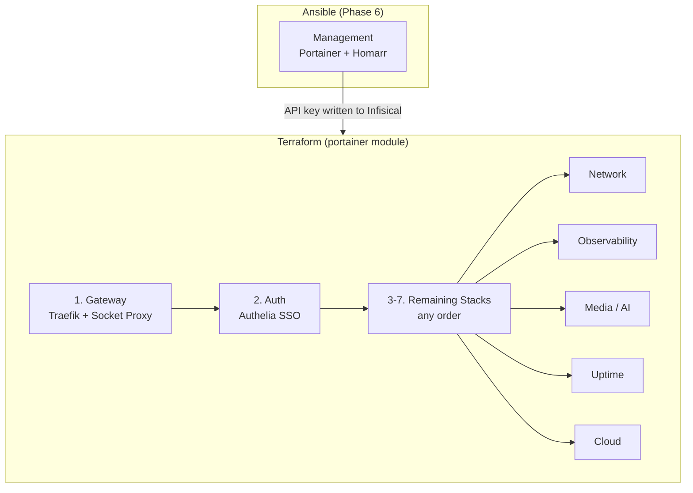

# Deployment Runbook

This document covers the end-to-end deployment procedure: prerequisites, stack ordering, deploy commands, verification, updates, and rollback.

Before using this runbook for first-time setup, complete the [Meta-Pipeline Cutover Checklist](meta-pipeline-cutover-checklist.md). For variable ownership (manual vs automation-managed), see [Infisical Workflow](infisical-workflow.md#variable-ownership--mutability).

## Prerequisites

Before deploying any stack, verify that all infrastructure layers are operational:

| Prerequisite | How to Verify | Fix |
|-------------|---------------|-----|
| Cutover checklist complete | Review [Meta-Pipeline Cutover Checklist](meta-pipeline-cutover-checklist.md) and confirm all required items | Complete missing GitHub/TFC/Infisical prerequisites before deploy |
| Automation-managed variables understood | Review [Variable Ownership & Mutability](infisical-workflow.md#variable-ownership--mutability) | Do not manually edit automation-managed variables outside their owning workflow |
| Terraform infra workspace applied | Terraform Cloud run for `goodoldme-infra` succeeds (or `terraform -chdir=terraform/infra output`) | Run `meta-pipeline.yml` with `run_infra_apply=true` or `terraform -chdir=terraform/infra apply` |
| Terraform Portainer workspace applied | Local CI apply for `terraform/portainer-root` succeeds against TFC remote state (`goodoldme-portainer`) (or `terraform -chdir=terraform/portainer-root output`) | Run `meta-pipeline.yml` with `run_portainer_apply=true` or `terraform -chdir=terraform/portainer-root apply` |
| Cloud static runner ready | `vars.CLOUD_STATIC_RUNNER_LABEL` is set and workflow logs show deterministic IPv4/IPv6 egress | Configure runner label and egress routing, then re-run |
| Ansible provisioning complete | SSH into nodes, verify Docker/Tailscale/GlusterFS/Portainer | Re-run `ansible-playbook` |
| Portainer running | `curl -s http://localhost:9000/api/system/status` returns HTTP 200 | Re-run Ansible `portainer_bootstrap` role |
| `PORTAINER_ADMIN_PASSWORD` set | `echo $PORTAINER_ADMIN_PASSWORD` is non-empty | `export PORTAINER_ADMIN_PASSWORD='...'` (bcrypt-hashed by Ansible and written to `/stacks/management` during bootstrap) |
| Tailscale mesh active | `tailscale status` on each node shows 3 peers | `tailscale up --authkey=...` |
| GlusterFS mounted | `df -h /mnt/swarm-shared` on OCI nodes | `mount -t glusterfs localhost:/swarm_data /mnt/swarm-shared` |
| Config files synced | `ls /mnt/swarm-shared/auth/authelia/config/configuration.yml` | `ansible-playbook playbooks/provision.yml --tags sync-configs` |
| Docker Swarm initialized | `docker node ls` shows 3 managers (2 Ready + 1 Ready) | Re-run Ansible `swarm` role |
| `traefik_proxy` network exists | `docker network ls \| grep traefik_proxy` | `docker network create --driver overlay --attachable traefik_proxy` |
| Infisical Agent running | `systemctl status infisical-agent` | See [Agent Installation](infisical-workflow.md#installing-the-agent) |
| `.env` files rendered | `ls /opt/stacks/*/.env` | Restart Infisical Agent or create manually |

## Deployment Order

Stacks have dependencies. The meta-pipeline enforces this order with health gates:



**Why this order:**
1. **Management first (Ansible)** — Portainer is the control plane. Ansible bootstraps it during provisioning (Phase 6) because Terraform's Portainer provider needs the API to already exist.
2. **Gateway first (Portainer webhook)** — The pipeline triggers Gateway and waits for `https://gateway-health.<BASE_DOMAIN>/healthz` to return 200.
3. **Auth second (Portainer webhook)** — Auth is gated on Gateway health to prevent cascading redeploy failures.
4. **Everything else** — The pipeline follows manifest dependencies from `stacks/stacks.yaml`.

## Deploy Commands

### Step 0: Management Stack (Ansible)

The management stack (Portainer + Homarr) is deployed automatically by Ansible during Phase 6 of provisioning. If you need to deploy it manually:

```bash
# Deploy the management stack directly
BASE_DOMAIN=example.com HOMARR_SECRET_KEY="your-key" TZ=Etc/UTC \
  PORTAINER_ADMIN_PASSWORD_HASH='$2b$12$...' \
  docker stack deploy -c stacks/management/docker-compose.yml management
```

> **Note:** `PORTAINER_ADMIN_PASSWORD_HASH` must be a valid bcrypt hash. Generate one with:
> ```bash
> htpasswd -nbB '' 'your-password' | cut -d: -f2
> ```
> The Ansible playbook generates this automatically from `PORTAINER_ADMIN_PASSWORD`.

**Verify:**
```bash
docker stack services management
# Expected: portainer-server (1/1), portainer-agent (mode: global), homarr (1/1)

# Test Portainer API is responding
curl -s http://localhost:9000/api/system/status | jq .
```

### Step 1: Gateway

```bash
docker stack deploy -c stacks/gateway/docker-compose.yml gateway
```

**Verify:**
```bash
docker stack services gateway
# Expected: socket-proxy (1/1), traefik (2/2 replicated on OCI workers)

# Test Traefik is responding
curl -I http://localhost:80
# Expected: HTTP 404 (no routes configured yet) or redirect to HTTPS
```

### Step 2: Auth

#### One-Time Setup (before first deploy)

Authelia requires config files and secrets to be prepared before the stack will start.

**1. Sync config files to GlusterFS:**

```bash
ansible-playbook playbooks/provision.yml --tags sync-configs
# This copies stacks/auth/config/* to /mnt/swarm-shared/auth/authelia/config/
# and stacks/observability/config/* to their respective GlusterFS paths
```

**2. Create a user in `users_database.yml`:**

```bash
# Generate an argon2id password hash
docker run --rm authelia/authelia:latest \
  authelia crypto hash generate argon2 --password 'your-strong-password'

# Edit the users database (on host or in repo, then re-sync)
vim stacks/auth/config/users_database.yml
# Add your user under the 'users:' key:
#   admin:
#     disabled: false
#     displayname: 'Admin User'
#     email: 'admin@example.com'
#     password: '<paste argon2id hash>'
#     groups:
#       - 'admins'

# Re-sync to GlusterFS
ansible-playbook playbooks/provision.yml --tags sync-configs
```

**3. Generate OIDC keys and hash the Grafana client secret:**

```bash
# Generate RSA private key for OIDC JWT signing
docker run --rm authelia/authelia:latest \
  authelia crypto certificate rsa generate --directory /tmp
# Copy the private key output — store as AUTHELIA_IDENTITY_PROVIDERS_OIDC_JWKS_0_KEY in Infisical

# Generate OIDC HMAC secret
openssl rand -hex 32
# Store as AUTHELIA_IDENTITY_PROVIDERS_OIDC_HMAC_SECRET in Infisical

# Hash the Grafana OIDC client secret (the plaintext is GF_OIDC_CLIENT_SECRET in Infisical)
docker run --rm authelia/authelia:latest \
  authelia crypto hash generate argon2 --password '<GF_OIDC_CLIENT_SECRET value>'
# Paste the resulting hash into stacks/auth/config/configuration.yml under:
#   identity_providers.oidc.clients[0].client_secret
# Then re-sync: ansible-playbook playbooks/provision.yml --tags sync-configs
```

**4. Add SMTP secrets to Infisical** (under `/stacks/identity`):

| Variable | Value |
|----------|-------|
| `AUTHELIA_NOTIFIER_SMTP_USERNAME` | Your Gmail address |
| `AUTHELIA_NOTIFIER_SMTP_PASSWORD` | Gmail App Password (Google Account → Security → App passwords) |
| `AUTHELIA_NOTIFIER_SMTP_SENDER` | `Authelia <noreply@yourdomain.com>` |
| `AUTHELIA_IDENTITY_PROVIDERS_OIDC_HMAC_SECRET` | (generated above) |
| `AUTHELIA_IDENTITY_PROVIDERS_OIDC_JWKS_0_KEY` | (RSA PEM generated above — paste full multi-line key) |

#### Deploy

```bash
# Auth .env is rendered by the Infisical Agent (stacks/auth/.env.tmpl)
# If deploying before the Agent is running, manually create the .env:
# echo "BASE_DOMAIN=example.com" > stacks/auth/.env
docker stack deploy -c stacks/auth/docker-compose.yml auth
```

**Verify:**
```bash
docker stack services auth
# Expected: authelia (1/1), authelia-db (1/1)

# Check Authelia logs for startup errors
docker service logs auth_authelia --tail 50

# Test Authelia is reachable via Traefik
curl -I https://auth.example.com
# Expected: HTTP 200 (Authelia login page)

# Test OIDC discovery endpoint
curl -s https://auth.example.com/.well-known/openid-configuration | jq .
# Expected: JSON with issuer, authorization_endpoint, token_endpoint, etc.
```

### Step 3+: Remaining Stacks (Terraform-managed)

After Ansible has bootstrapped Portainer, **Terraform manages all application stacks** via the Portainer provider. Use the split workspace model:

1. `goodoldme-infra` (`terraform/infra`) provisions OCI/GCP and runs Ansible bootstrap.
2. `goodoldme-portainer` (`terraform/portainer-root`) creates Git-backed Portainer stacks with webhooks and writes `/deployments` secrets.

Runs execute with a split model:
- `goodoldme-infra`: Terraform Cloud managed workers (remote run/apply)
- `goodoldme-portainer`: local Terraform CLI on the cloud static runner, backed by Terraform Cloud remote state (`operations=false`)

```bash
# Local fallback (if not using Terraform Cloud workspaces)
terraform -chdir=terraform/infra apply
terraform -chdir=terraform/portainer-root apply
```

For **manual deployment** (fallback), the Infisical Agent handles deployment automatically via its `exec.command`. Or deploy directly:

```bash
# Network
docker stack deploy -c stacks/network/docker-compose.yml network

# Observability (.env rendered by Infisical Agent — stacks/observability/.env.tmpl)
# If deploying before the Agent is running, manually create the .env:
# cat > stacks/observability/.env << 'EOF'
# BASE_DOMAIN=example.com
# GF_OIDC_CLIENT_ID=grafana
# GF_OIDC_CLIENT_SECRET=your-secure-secret
# EOF
docker stack deploy -c stacks/observability/docker-compose.yml observability

# Media / AI Interface (.env rendered by Infisical Agent — stacks/media/ai-interface/.env.tmpl)
# If deploying before the Agent is running:
# cp stacks/media/ai-interface/.env.example stacks/media/ai-interface/.env
# Edit .env to set ARCH_PC_IP and BASE_DOMAIN
docker stack deploy -c stacks/media/ai-interface/docker-compose.yml ai-interface

# Uptime
docker stack deploy -c stacks/uptime/docker-compose.yml uptime

# Cloud
docker stack deploy -c stacks/cloud/docker-compose.yml cloud
```

### Full Verification

```bash
# List all stacks
docker stack ls

# Check all services across all stacks
for stack in gateway auth management network observability ai-interface uptime cloud; do
  echo "=== $stack ==="
  docker stack services "$stack" 2>/dev/null || echo "  (not deployed)"
  echo
done

# Check for any failing services
docker service ls --filter "desired-state=running" --format "{{.Name}} {{.Replicas}}" | grep -v "1/1\|global"
```

## Updating a Stack

### Via Portainer GitOps Webhooks (preferred)

Every stack is linked to the `JoseStud/stacks` Git repository in Portainer with **Enable Webhook**. Trigger calls must come from a **private trusted source**, not public GitHub-hosted runners.

**Automatic (private automation):**

1. Push to `main` in the stacks repo triggers `stacks/.github/workflows/private-redeploy.yml` on the cloud static runner.
2. The workflow computes changed stacks from `stacks.yaml` and dispatches one event (`stacks-redeploy-requested`) to this infra repo.
3. Infra `meta-pipeline.yml` validates secrets, runs Portainer apply when `structural_change=true`, runs config sync when `config_stacks` is non-empty, then triggers health-gated webhooks.
4. Health gates use manifest dependencies: Gateway is checked first (`gateway-health.<BASE_DOMAIN>/healthz`) before Auth and downstream stacks.

**Manual (one-off):**

```bash
# Trigger a single stack's webhook
./scripts/portainer-webhook.sh https://portainer-api.example.com/api/webhooks/<uuid>

# Trigger all stacks at once via env var
WEBHOOK_URLS="<url1>,<url2>,<url3>" ./scripts/portainer-webhook.sh
```

> No API key or `ENDPOINT_ID` needed — each webhook URL is natively bound to one specific stack in Portainer. Access is restricted at Traefik by IP allowlist/rate-limit middleware on `portainer-api.<domain>`.

### Via CLI (direct Swarm commands)

You can still deploy directly with the Docker CLI when needed:

```bash
# Re-deploy (idempotent — only updates changed services)
docker stack deploy -c stacks/<stack>/docker-compose.yml <stack>

# Or update a single service (e.g., to pull a newer image)
docker service update --image <new-image> <stack>_<service>

# Force a rolling update (re-pull image)
docker service update --force <stack>_<service>
```

### Setting Up Portainer GitOps for a New Stack (Terraform)

Stacks are now managed declaratively via the `portainer` Terraform module. To add a new stack:

1. Create the `docker-compose.yml` in the stacks repo under `<name>/`
2. Add a new entry to `stacks/stacks.yaml` with `compose_path`, `portainer_managed`, dependencies, and optional health check metadata
3. Run `terraform -chdir=terraform/portainer-root apply` (or trigger `meta-pipeline.yml` with `run_portainer_apply=true`) — the stack, webhook, and Infisical secret are all created automatically

The webhook URL is written to Infisical `/deployments` as `WEBHOOK_URL_<STACK_NAME>` and appended to the combined `PORTAINER_WEBHOOK_URLS` secret.

### Updating Secrets

1. Update the secret value in Infisical Cloud
2. For auto-injected stacks: restart the Infisical Agent — it will re-render `.env.tmpl` and re-deploy
3. For manual stacks: edit the `.env` file and trigger the stack's webhook or re-deploy with `docker stack deploy`

## Removing a Stack

```bash
# Remove all services in a stack
docker stack rm <stack>

# Verify removal
docker stack services <stack>
# Expected: "Nothing found in stack: <stack>"
```

> **Warning:** `docker stack rm` does not delete volumes or bind-mount data. Persistent data on GlusterFS remains intact.

## Rollback

Docker Swarm maintains the previous service specification for automatic rollback:

```bash
# Rollback a specific service to its previous state
docker service rollback <stack>_<service>

# Example: rollback Vaultwarden after a bad update
docker service rollback network_vaultwarden
```

For a full stack rollback, you'll need to redeploy with the previous docker-compose.yml (use Git history):

```bash
# Checkout the previous version of the compose file
git -C stacks checkout HEAD~1 -- <stack>/docker-compose.yml

# Re-deploy
docker stack deploy -c stacks/<stack>/docker-compose.yml <stack>

# Don't forget to restore the current version after
git -C stacks checkout main -- <stack>/docker-compose.yml
```

## Troubleshooting

### Service Won't Start

```bash
# Check service logs
docker service logs <stack>_<service> --tail 100

# Check why tasks are failing
docker service ps <stack>_<service> --no-trunc

# Common causes:
# - "no suitable node" → check placement constraints and node labels
# - "network not found" → traefik_proxy network missing, recreate it
# - missing .env → Infisical Agent hasn't rendered the template
```

### Traefik Not Routing

```bash
# Check Traefik is running
docker service ls | grep traefik

# Check Traefik can see services (via socket-proxy)
docker service logs gateway_traefik --tail 50 | grep -i "error\|router\|provider"

# Verify the target service is on traefik_proxy network
docker service inspect <stack>_<service> --format '{{.Spec.TaskTemplate.Networks}}'
```

### GlusterFS Issues

```bash
# Check volume status
gluster volume status swarm_data
gluster volume info swarm_data

# Check for split-brain
gluster volume heal swarm_data info

# Resolve split-brain (if detected)
gluster volume heal swarm_data split-brain bigger-file /path/to/file
```

### Swarm Quorum Loss

If the GCP witness goes down:

```bash
# Check cluster status
docker node ls
# If 2/3 managers are up, cluster is still operational

# If quorum is lost (only 1 manager reachable):
# Option 1: Bring the witness back online
# Option 2: Force a new cluster (LAST RESORT)
docker swarm init --force-new-cluster --advertise-addr <ts_ip>
```

### Pi-hole DNS Not Resolving

```bash
# Test DNS directly on the node
dig @127.0.0.1 google.com

# Check Pi-hole container is running
docker service ps network_pihole-1

# Verify host-mode port binding
ss -ulnp | grep :53
```
