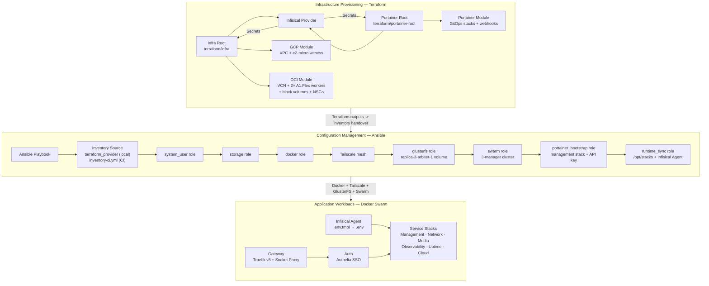

# GoodOldMeServer Documentation

Welcome to the centralized GoodOldMeServer documentation. This repository manages the infrastructure, configuration, and workloads for the GoodOldMeServer environment using a four-layer architecture approach:

1. **Infrastructure Provisioning** — Terraform provisions cloud resources across OCI (2× Ampere A1 workers) and GCP (1× e2-micro Swarm witness)
2. **Configuration Management** — Ansible bootstraps system users, storage, Docker, Tailscale, GlusterFS, a 3-manager Docker Swarm cluster, Portainer bootstrap, and host runtime sync
3. **Application Workloads** — Docker Swarm stacks with Infisical-managed secrets, routed through Traefik reverse proxy with Authelia SSO
4. **Infrastructure Orchestrator** — GitHub Actions orchestrates secret validation, Terraform apply, inventory handover, Ansible bootstrap, Portainer apply, and health-gated webhook redeploys

> **Note:** The `stacks/` directory is a [Git submodule](https://github.com/JoseStud/stacks) tracking the `main` branch. Submodule update PRs are managed by Dependabot (`gitsubmodule` ecosystem).
>
> **Trust boundary:** The infrastructure orchestrator consumes a `stacks_sha` only after `.github/scripts/stacks/verify_trusted_stacks_sha.sh` confirms that SHA is on the trusted `main` lineage and that every observed GitHub CI signal on the stacks repo commit is green. This boundary separates public stacks-repo CI evidence from the private runner stages that mutate Terraform Cloud, sync `/opt/stacks`, select the Portainer manifest input, and trigger redeploys.

## Start Here (Cutover + Ownership)

If you are bootstrapping or validating CI/CD for the first time, read these first:

1. [**Infrastructure Orchestrator Cutover Checklist**](meta-pipeline-cutover-checklist.md) — required GitHub variables/secrets, Terraform workspace settings, and first-run sequence.
2. [**Infisical Workflow**](infisical-workflow.md#variable-ownership--mutability) — which variables are operator-managed vs auto-managed by Ansible, Terraform, or the infrastructure orchestrator.
3. [**Deployment Runbook Prerequisites**](deployment-runbook.md#prerequisites) — operational readiness checks before deploy/apply actions.

## Quick Paths by Role

### Operator

1. [Infrastructure Orchestrator Cutover Checklist](meta-pipeline-cutover-checklist.md)
2. [Deployment Runbook](deployment-runbook.md#prerequisites)
3. [Stacks](stacks.md#health-checks-and-webhook-gate-behavior)
4. [Backup Strategy](backup-strategy.md#recovery-objectives-rporto)

### Platform

1. [Configuration Management (Ansible)](ansible.md#tags-matrix)
2. [Network Architecture](network-architecture.md#port-and-protocol-matrix)
3. [CI Orchestrator Execution Rules](ci-orchestrator-execution-rules.md)
4. [Scripts & Utilities](scripts.md)
5. [Terraform OCI](terraform/oci.md)

### Security

1. [Infisical Workflow](infisical-workflow.md#variable-ownership--mutability)
2. [Infrastructure Orchestrator Cutover Checklist](meta-pipeline-cutover-checklist.md#0-auto-managed-values-do-not-set-manually)
3. [Network Architecture](network-architecture.md#port-and-protocol-matrix)

## High-Level Architecture

## Table of Contents

### Core Documentation

- [**Configuration Management (Ansible)**](ansible.md) — Playbooks, roles, dynamic inventory, and the 7-phase provisioning lifecycle. Last reviewed: `2026-03-07`.
- [**Application Workloads (Stacks)**](stacks.md) — All Docker Swarm stack configurations: Gateway, Auth, Management, Network, Observability, Media/AI, Uptime, Cloud. Last reviewed: `2026-03-07`.
- [**Utilities (Scripts)**](scripts.md) — Helper scripts and manual execution wrappers. Last reviewed: `2026-03-07`.

### Infrastructure as Code (Terraform)

- [Infra Root](../terraform/infra/main.tf) — Providers, Infisical integration, OCI/GCP module orchestration
- [Portainer Root](../terraform/portainer-root/main.tf) — Portainer provider configuration and GitOps stack/webhook orchestration
- [GCP Resources](terraform/gcp.md) — VPC, IPv6 subnet, Swarm witness instance
- [OCI Resources](terraform/oci.md) — VCN, DMZ subnet, 2× A1.Flex workers, block volumes, NSGs

### Architecture & Operations

- [**Network Architecture**](network-architecture.md) — Tailscale mesh, 3-manager Swarm topology, GlusterFS replication, overlay networks, DNS & ingress flow. Last reviewed: `2026-03-07`.
- [**Infisical Secrets Workflow**](infisical-workflow.md) — Agent config, `.env.tmpl` templating, secret injection pipeline. Last reviewed: `2026-03-07`.
- [**CI Orchestrator Execution Rules**](ci-orchestrator-execution-rules.md) — Push and dispatch planning rules for the active infrastructure workflows. Last reviewed: `2026-03-07`.
- [**CI Plan Contract**](ci-plan-contract.md) — Canonical execution-context contract and workflow-consumption rules. Last reviewed: `2026-03-13`.
- [**GitHub Actions Workflows**](github-actions-workflows.md) — Public workflow entry points plus reusable stage workflow inputs, outputs, and artifacts. Last reviewed: `2026-03-07`.
- [**Workflow Lifecycle**](workflow-lifecycle.md) — Current workflow entry points and reusable stage workflows. Last reviewed: `2026-03-07`.
- [**Infrastructure Orchestrator Cutover Checklist**](meta-pipeline-cutover-checklist.md) — Minimal first-run checklist (GitHub vars/secrets + Terraform workspace vars). Last reviewed: `2026-03-07`.
- [**Deployment Runbook**](deployment-runbook.md) — Stack ordering, deploy commands, verification, rollback procedures. Last reviewed: `2026-03-07`.
- [**Backup Strategy**](backup-strategy.md) — OCI Silver backup policy, GlusterFS redundancy, application-level backups, recovery. Last reviewed: `2026-03-07`.

### Guides & External Setups

- [OCI Terraform Authentication](oci-tfc-oidc-setup.md) — Decision record: why OIDC/Workload Identity is not viable (provider limitation) and the API key auth setup used instead. Last reviewed: `2026-03-15`.
- [GCP Workload Identity Federation for Terraform Cloud](gcp-wif-tfc-setup.md) — Bootstrap guide for replacing `GOOGLE_CREDENTIALS` with TFC dynamic credentials via GCP WIF OIDC. Last reviewed: `2026-03-15`.
