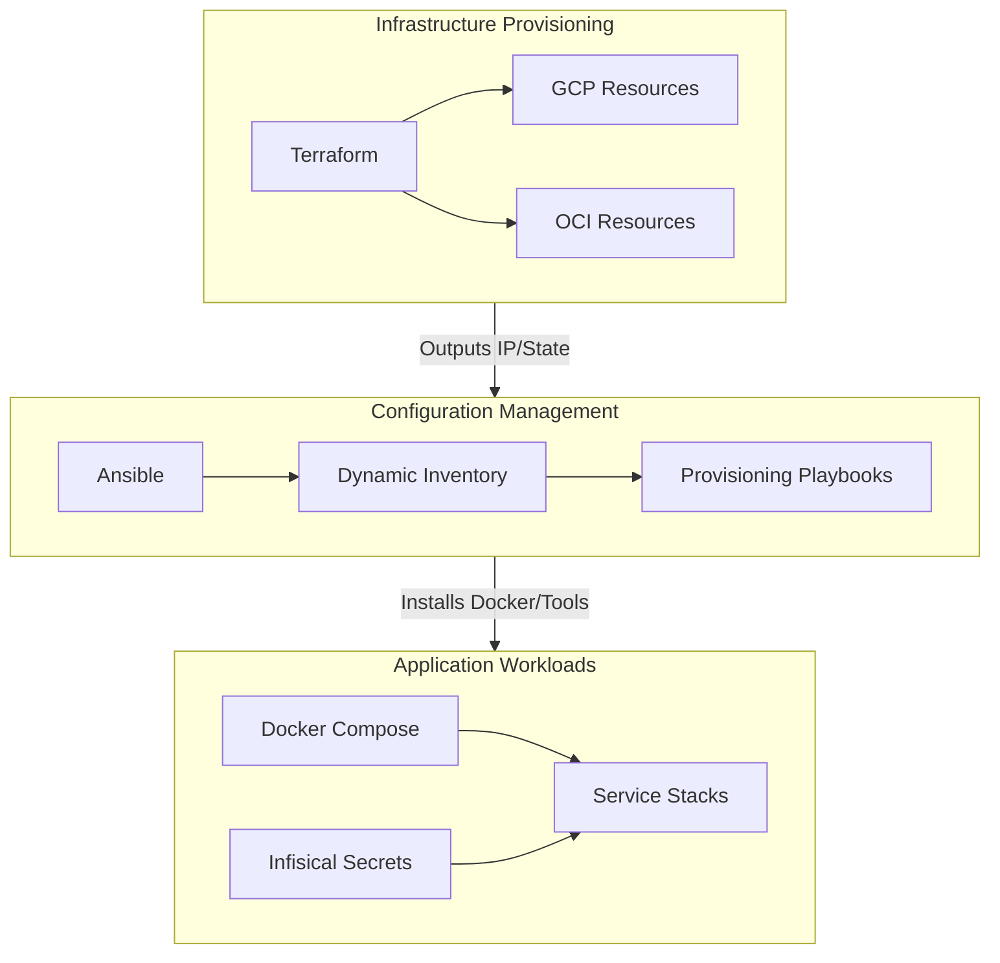

# GoodOldMeServer Documentation

Welcome to the centralized GoodOldMeServer documentation. This repository manages the infrastructure, configuration, and workloads for the GoodOldMeServer environment using a three-tier architecture approach:
1. **Infrastructure Provisioning**: Terraform (GCP/OCI)
2. **Configuration Management**: Ansible 
3. **Application Workloads**: Docker Compose with Infisical Secrets

## High-Level Architecture

## Table of Contents

- [**1. Configuration Management (Ansible)**](ansible.md)
  - Playbooks, Roles, Inventory, and Node Setup
- [**2. Application Workloads (Stacks)**](stacks.md)
  - Docker Compose configurations (Auth, Gateway, Media, and AI)
- [**3. Utilities (Scripts)**](scripts.md)
  - Helper scripts and manual execution wrappers

### Infrastructure as Code (Terraform)
*Auto-generated documentation from module contents.*
- [Root Infrastructure](terraform/root.md)
- [GCP Resources](terraform/gcp.md)
- [OCI Resources](terraform/oci.md)

### Guides & External Setups
- [OCI Terraform Cloud OIDC Setup](oci-tfc-oidc-setup.md)
