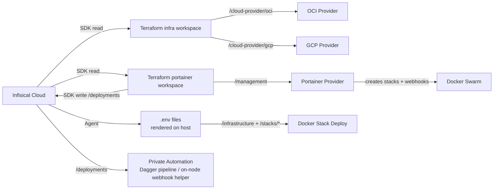

# Infisical Workflow

This document describes how secrets are managed and injected into the infrastructure using [Infisical](https://infisical.com).

## Overview

Infisical acts as the single source of truth for all secrets across Terraform, Ansible, and Docker Swarm stacks. Secrets are organized by path and injected at deploy time through either the Infisical SDK (Terraform) or the Infisical Agent (Docker Swarm).



## Secret Organization

| Path | Consumer | Secrets |
|------|----------|---------|
| `/infrastructure` | Terraform, Ansible, Scripts | `BASE_DOMAIN`, `CLOUDFLARE_API_TOKEN`, `TAILSCALE_AUTH_KEY`, `TZ`, `ZONE_ID` |
| `/management` | Terraform (Portainer provider), Operators | `PORTAINER_URL`, `PORTAINER_API_URL`, `PORTAINER_API_KEY`, `PORTAINER_LICENSE_KEY` |
| `/deployments` | Terraform (auto-written), Dagger pipeline health-gated-redeploy, on-node webhook helper | `PORTAINER_WEBHOOK_URLS`, `WEBHOOK_URL_*` |
| `/security` | Terraform (cloud-init), GitHub Actions (SSH) | `SSH_CA_PUBLIC_KEY`, `SSH_CA_PRIVATE_KEY`, `SSH_HOST_CA_PUBKEY` |
| `/stacks/gateway` | Traefik | `ACME_EMAIL`, `DOCKER_SOCKET_PROXY_URL` |
| `/stacks/identity` | Authelia SSO | `AUTHELIA_JWT_SECRET`, `AUTHELIA_SESSION_SECRET`, `POSTGRES_PASSWORD`, `AUTHELIA_STORAGE_ENCRYPTION_KEY`, `AUTHELIA_USERS_DATABASE_YAML`, `AUTHELIA_NOTIFIER_SMTP_USERNAME`, `AUTHELIA_NOTIFIER_SMTP_PASSWORD`, `AUTHELIA_NOTIFIER_SMTP_SENDER`, `AUTHELIA_IDENTITY_PROVIDERS_OIDC_HMAC_SECRET`, `AUTHELIA_IDENTITY_PROVIDERS_OIDC_JWKS_0_KEY`, `AUTHELIA_IDENTITY_PROVIDERS_OIDC_CLIENTS_0_CLIENT_SECRET` |
| `/stacks/management` | Homarr + Portainer | `HOMARR_SECRET_KEY`, `PORTAINER_ADMIN_PASSWORD`, `PORTAINER_ADMIN_PASSWORD_HASH` |
| `/stacks/network` | Vaultwarden, Pi-hole | `VW_DB_PASS`, `VW_ADMIN_TOKEN`, `PIHOLE_PASSWORD` |
| `/stacks/observability` | Grafana | `GF_OIDC_CLIENT_ID`, `GF_OIDC_CLIENT_SECRET`, `ALERTMANAGER_WEBHOOK_URL` |
| `/stacks/ai-interface` | Open WebUI | `ARCH_PC_IP` |
| `/cloud-provider/gcp` | Terraform (GCP provider) | `GCP_PROJECT_ID` |
| `/cloud-provider/oci` | Terraform (OCI provider) | `OCI_COMPARTMENT_OCID`, `OCI_IMAGE_OCID` *(read via Infisical data source)*; `OCI_TENANCY_OCID`, `OCI_USER_OCID`, `OCI_FINGERPRINT`, `OCI_PRIVATE_KEY` *(must be set as TFC workspace variables — cannot use data source in provider config)* |

> **Global injection:** `BASE_DOMAIN` is used in almost every `.env.tmpl` via a `{{- with secret "/infrastructure" }}` block, as Traefik requires it for routing labels. Other variables like `TZ` or `CLOUDFLARE_API_TOKEN` are only pulled into the specific stacks that need them.

---

## Complete Variable Reference

### Variable Ownership & Mutability

Use this as the source of truth for whether a value is operator-managed or automation-managed.

| Variable / Path | Owner | Mutability |
|-----------------|-------|------------|
| `/stacks/management/PORTAINER_ADMIN_PASSWORD_HASH` | Platform | Auto-generated/re-written by Ansible `portainer_bootstrap` on bootstrap runs. Do not set manually. |
| `/management/PORTAINER_URL`, `/management/PORTAINER_API_URL`, `/management/PORTAINER_API_KEY` | Platform | Auto-written by Ansible `portainer_bootstrap` after bootstrap (API key may be rotated). Do not set manually. |
| `/deployments/PORTAINER_WEBHOOK_URLS` + `/deployments/WEBHOOK_URL_*` | Platform | Auto-written by Terraform `portainer` module on Portainer workspace apply. Do not edit manually. |
| `TF_VAR_network_access_policy` (Terraform Cloud env var) | Security | Auto-created/updated by the `orchestrator.yml` `dagger-pipeline` preflight phase (`ci_pipeline/phases/preflight.py` / `network-policy-sync`). Do not set manually outside policy sync flow. |
| ~~`/stacks/management/PORTAINER_AUTOMATION_ALLOWED_CIDRS`~~ | ~~Security~~ | Removed — portainer-api Traefik route deleted; CI uses Tailscale IP directly, no IP allowlist. |

> For first-run setup and required GitHub/TFC inputs, see [Infrastructure Orchestrator Cutover Checklist](meta-pipeline-cutover-checklist.md).

### Required for First Deploy

| Path | Variables | Requirement | Owner | Notes |
|------|-----------|-------------|-------|-------|
| `/infrastructure` | `BASE_DOMAIN`, `TZ`, `CLOUDFLARE_API_TOKEN`, `ZONE_ID`, `TAILSCALE_AUTH_KEY` | Required | Operator | Baseline globals for stack rendering, DNS, and provisioning |
| `/cloud-provider/oci` | `OCI_COMPARTMENT_OCID`, `OCI_IMAGE_OCID` | Required | Platform | Required for infra workspace apply |
| `/cloud-provider/gcp` | `GCP_PROJECT_ID` | Required | Platform | Required for infra workspace apply |
| `/security` | `SSH_CA_PUBLIC_KEY`, `SSH_CA_PRIVATE_KEY` (and host CA key if used) | Required | Security | `SSH_CA_PUBLIC_KEY` for cloud-init trust bootstrap; `SSH_CA_PRIVATE_KEY` for CI ephemeral cert signing |
| `/stacks/management` | `HOMARR_SECRET_KEY`, `PORTAINER_ADMIN_PASSWORD` | Required | Operator | Needed before Phase 6 Portainer bootstrap |
| `/stacks/gateway` | `ACME_EMAIL`, `DOCKER_SOCKET_PROXY_URL` | Required | Operator | Required for gateway stack certificate/Docker provider wiring |
| `/stacks/identity` | `AUTHELIA_JWT_SECRET`, `AUTHELIA_SESSION_SECRET`, `POSTGRES_PASSWORD`, `AUTHELIA_USERS_DATABASE_YAML`, SMTP+OIDC secrets | Required | Security | Required for first auth deploy, initial login, and SSO readiness |
| `/stacks/network` | `VW_DB_PASS`, `VW_ADMIN_TOKEN`, `PIHOLE_PASSWORD` | Required | Operator | Required for network stack stateful services |
| `/stacks/observability` | `GF_OIDC_CLIENT_ID`, `GF_OIDC_CLIENT_SECRET`, `ALERTMANAGER_WEBHOOK_URL` | Required | Operator | Required for observability deploy and alert routing |
| `/stacks/ai-interface` | `ARCH_PC_IP` | Required | Operator | Required for Open WebUI upstream reachability |
| GitHub `vars.*`/`secrets.*` bootstrap set | `INFISICAL_MACHINE_IDENTITY_ID`, `INFISICAL_PROJECT_ID`, `TFC_*`, `TFC_TOKEN`, `INFISICAL_TOKEN` | Required | Platform | Required for pipeline execution; `INFISICAL_TOKEN` is needed anywhere `terraform/portainer-root` runs, including the orchestrator `portainer-apply` stage. `CLOUD_STATIC_RUNNER_LABEL` removed — no workflow uses a cloud static runner. |

### Steady-State / Optional

| Path | Variables | Requirement | Owner | Notes |
|------|-----------|-------------|-------|-------|
| `/management` | `PORTAINER_LICENSE_KEY` | Optional | Operator | Only needed for Portainer BE licensing |
| GitHub `vars.*` | Timeout/poll interval tunables (`TFC_PLAN_*`, `PORTAINER_ALLOWLIST_PROPAGATION_*`, etc.) | Optional | Operator | Operational tuning only; defaults exist |
| `/deployments` | `PORTAINER_WEBHOOK_URLS`, `WEBHOOK_URL_*` | Optional (manual use) | Platform | Auto-managed outputs from Terraform apply; consumed automatically by pipelines |
| ~~`/stacks/management/PORTAINER_AUTOMATION_ALLOWED_CIDRS`~~ | ~~Optional~~ | ~~Security~~ | Removed — portainer-api Traefik route deleted. | N/A |

### Detailed Path Reference

### `/infrastructure` — Global

| Variable | How to Get | Used By |
|----------|-----------|---------|
| `BASE_DOMAIN` | Your registered domain name (e.g. `example.com`) | All stack composes except gateway (Traefik routing labels), scripts |
| `TZ` | IANA timezone (e.g. `America/New_York`, `Etc/UTC`) | All stacks, Pi-hole |
| `CLOUDFLARE_API_TOKEN` | Cloudflare dashboard → My Profile → API Tokens → Create Token → Zone:DNS:Edit | Traefik (ACME DNS challenge), `cloudflare-dns.sh` |
| `ZONE_ID` | Cloudflare dashboard → select domain → Overview sidebar → Zone ID | `cloudflare-dns.sh` (also present in gateway `.env.tmpl` but not used by the compose) |
| `TAILSCALE_AUTH_KEY` | Tailscale admin → Settings → Keys → Generate auth key | Ansible provisioning (`tailscale up --authkey=...`) |

### `/management` — Portainer

| Variable | How to Get | Used By |
|----------|-----------|--------|
| `PORTAINER_URL` | Auto-written by Ansible `portainer_bootstrap` role (or manually set) | Human-facing Portainer URL (`https://portainer.<domain>`) behind Authelia |
| `PORTAINER_API_URL` | Auto-written by Ansible `portainer_bootstrap` role (or manually set) | Terraform Portainer provider `endpoint` — Tailscale IP (`http://<ts_ip>:9000/api`); accessed via Dagger pipeline SOCKS5 proxy over the WireGuard mesh |
| `PORTAINER_API_KEY` | Auto-written by Ansible `portainer_bootstrap` role (or manually via Portainer → Access Tokens) | Automation/API use outside Terraform; validated and repaired during bootstrap/post-bootstrap checks |
| `PORTAINER_LICENSE_KEY` | Portainer BE license key (optional — leave empty to skip automatic license installation). Obtain from [Portainer pricing](https://www.portainer.io/pricing) or your account portal | Terraform `portainer_licenses` resource |

> **Note:** These credentials are written automatically by the Ansible `portainer_bootstrap` role during Phase 6 provisioning. Terraform reads `PORTAINER_API_URL` from `/management` and `PORTAINER_ADMIN_PASSWORD` from `/stacks/management`, then lets the Portainer provider mint and use a JWT internally. The resulting webhook URLs are written automatically to `/deployments` by Terraform.

### `/deployments` — Webhook URLs *(Terraform-managed)*

These secrets are **created and updated automatically** by the `portainer` Terraform module. Do not edit them manually.

The management stack (Portainer + Homarr) is deployed by Ansible, not Terraform, so it does not have a webhook URL here.

| Variable | Source | Used By |
|----------|--------|--------|
| `PORTAINER_WEBHOOK_URLS` | Comma-separated list of all stack webhook URLs | Manual bulk webhook trigger fallback |
| `WEBHOOK_URL_GATEWAY` | Individual webhook URL for the gateway stack | Direct API calls |
| `WEBHOOK_URL_AUTH` | Individual webhook URL for the auth stack | Direct API calls |
| `WEBHOOK_URL_NETWORK` | Individual webhook URL for the network stack | Direct API calls |
| `WEBHOOK_URL_OBSERVABILITY` | Individual webhook URL for the observability stack | Direct API calls |
| `WEBHOOK_URL_AI_INTERFACE` | Individual webhook URL for the ai-interface stack | Direct API calls |
| `WEBHOOK_URL_UPTIME` | Individual webhook URL for the uptime stack | Direct API calls |
| `WEBHOOK_URL_CLOUD` | Individual webhook URL for the cloud stack | Direct API calls |

### `/stacks/gateway` — Traefik

| Variable | How to Get | Used By |
|----------|-----------|---------|
| `ACME_EMAIL` | Any valid email — Let's Encrypt sends expiry warnings here | Traefik cert resolver (`certificatesresolvers.letsencrypt.acme.email`) |
| `DOCKER_SOCKET_PROXY_URL` | Usually `tcp://socket-proxy:2375` (default in compose) — override only if using a remote socket proxy | Traefik `--providers.docker.endpoint` |

### `/stacks/identity` — Authelia

| Variable | How to Get | Used By |
|----------|-----------|---------|
| `AUTHELIA_JWT_SECRET` | Generate: `openssl rand -base64 48` | Authelia JWT token signing |
| `AUTHELIA_SESSION_SECRET` | Generate: `openssl rand -base64 48` | Authelia session encryption |
| `POSTGRES_PASSWORD` | Generate: `openssl rand -base64 32` | Authelia ↔ PostgreSQL storage backend |
| `AUTHELIA_STORAGE_ENCRYPTION_KEY` | Generate: `openssl rand -base64 48` | Authelia storage encryption for persisted sensitive data |
| `AUTHELIA_USERS_DATABASE_YAML` | Multi-line YAML for the full Authelia users database (generate argon2 hashes with `docker run --rm authelia/authelia:latest authelia crypto hash generate argon2 --password '<password>'`) | Rendered by the Infisical Agent into Authelia's file-based user database on GlusterFS |
| `AUTHELIA_NOTIFIER_SMTP_USERNAME` | Your Gmail address (e.g. `user@gmail.com`) | SMTP authentication for 2FA enrollment emails |
| `AUTHELIA_NOTIFIER_SMTP_PASSWORD` | Gmail App Password (Google Account → Security → App passwords) | SMTP authentication |
| `AUTHELIA_NOTIFIER_SMTP_SENDER` | Display sender (e.g. `Authelia <noreply@yourdomain.com>`) | From address on notification emails |
| `AUTHELIA_IDENTITY_PROVIDERS_OIDC_HMAC_SECRET` | Generate: `openssl rand -hex 32` | OIDC HMAC signing |
| `AUTHELIA_IDENTITY_PROVIDERS_OIDC_JWKS_0_KEY` | Generate RSA key: `docker run --rm authelia/authelia authelia crypto certificate rsa generate --directory /tmp && cat /tmp/private.pem` (multi-line PEM) | OIDC JWT signing key |
| `AUTHELIA_IDENTITY_PROVIDERS_OIDC_CLIENTS_0_CLIENT_SECRET` | Generate from `GF_OIDC_CLIENT_SECRET`: `docker run --rm authelia/authelia authelia crypto hash generate argon2 --password '<GF_OIDC_CLIENT_SECRET value>'` | Grafana OIDC client secret hash rendered into Authelia's templated client config |

### `/stacks/management` — Homarr + Portainer

| Variable | How to Get | Used By |
|----------|-----------|--------|
| `HOMARR_SECRET_KEY` | Generate: `openssl rand -hex 32` | Homarr `SECRET_ENCRYPTION_KEY` |
| `PORTAINER_ADMIN_PASSWORD` | Choose a strong password or generate: `openssl rand -base64 24` | Ansible `portainer_bootstrap` role — hashed to bcrypt at deploy time and passed to Portainer via `--admin-password`; plaintext used for bootstrap/post-bootstrap Portainer auth and by the Terraform Portainer provider as `api_password` |
| `PORTAINER_ADMIN_PASSWORD_HASH` | **Auto-generated and rewritten by Ansible on every bootstrap run** (`password_hash('bcrypt')`) and written to Infisical `/stacks/management` for Infisical Agent renders — do not set manually | Portainer `--admin-password` CLI flag (set in `docker-compose.yml`) |
| ~~`PORTAINER_AUTOMATION_ALLOWED_CIDRS`~~ | Removed — portainer-api Traefik route deleted; CI uses Tailscale IP. | N/A |

### `/stacks/network` — Vaultwarden + Pi-hole

| Variable | How to Get | Used By |
|----------|-----------|---------|
| `VW_DB_PASS` | Generate: `openssl rand -base64 32` | Vaultwarden + PostgreSQL (`DATABASE_URL`) |
| `VW_ADMIN_TOKEN` | Generate: `openssl rand -base64 48` — or use `vaultwarden` CLI to create an Argon2 hash | Vaultwarden `/admin` panel |
| `PIHOLE_PASSWORD` | Choose or generate: `openssl rand -base64 16` | Pi-hole web UI + Orbital Sync |

### `/stacks/observability` — Grafana + Alertmanager

| Variable | How to Get | Used By |
|----------|-----------|--------|
| `GF_OIDC_CLIENT_ID` | Choose a client ID (e.g., `grafana`) to define in Authelia's config | Grafana SSO setup |
| `GF_OIDC_CLIENT_SECRET` | Generate plaintext: `openssl rand -hex 32` (store the matching argon2 hash in `/stacks/identity` as `AUTHELIA_IDENTITY_PROVIDERS_OIDC_CLIENTS_0_CLIENT_SECRET`) | Grafana SSO setup |
| `ALERTMANAGER_WEBHOOK_URL` | Slack/Discord incoming webhook URL for alert notifications | Alertmanager webhook receiver |

### `/stacks/ai-interface` — Open WebUI

| Variable | How to Get | Used By |
|----------|-----------|---------|
| `ARCH_PC_IP` | Tailscale IP or LAN IP of your machine running Ollama | Open WebUI `OLLAMA_BASE_URL` |
| `OPENWEBUI_DB_PASS` | Generate: `openssl rand -base64 32` | Open WebUI PostgreSQL backend (`DATABASE_URL`) |

### `/cloud-provider/oci` — OCI Terraform

These variables fall into two categories:

- **Read via Infisical data source** (`data "infisical_secrets" "oci"` in `terraform/infra/main.tf`) — used for resource configuration after provider init.
- **Must be TFC workspace variables** (`TF_VAR_oci_*`) — used in `provider "oci"` configuration, which cannot read data sources. Store in Infisical and sync to TFC workspace as sensitive variables.

| Variable | How to Get | TFC injection | Used By |
|----------|-----------|---------------|---------|
| `OCI_COMPARTMENT_OCID` | OCI Console → Identity → Compartments → View Details → Copy OCID | Infisical data source | Resource grouping |
| `OCI_IMAGE_OCID` | OCI Console → Compute → Images → Custom/Canonical Image OCID | Infisical data source | Terraform compute module (`oci_image_ocid`) |
| `OCI_TENANCY_OCID` | OCI Console → Profile → Tenancy → Copy OCID | TFC var `TF_VAR_oci_tenancy_ocid` | `provider "oci"` `tenancy_ocid` |
| `OCI_USER_OCID` | OCI Console → Profile → User Settings → Copy OCID | TFC var `TF_VAR_oci_user_ocid` | `provider "oci"` `user_ocid` |
| `OCI_FINGERPRINT` | OCI Console → User Settings → API Keys → fingerprint shown after upload | TFC var `TF_VAR_oci_fingerprint` | `provider "oci"` `fingerprint` |
| `OCI_PRIVATE_KEY` | PEM content of the API key created in User Settings → API Keys (multi-line) | TFC var `TF_VAR_oci_private_key` (sensitive) | `provider "oci"` `private_key` |

### `/cloud-provider/gcp` — GCP Terraform

| Variable | How to Get | Used By |
|----------|-----------|---------|
| `GCP_PROJECT_ID` | GCP Console → Top Navigation (e.g., `goodoldmeserver-123`) | Terraform Google provider `project` |

### GitHub Actions Variables & Secrets

While Infisical manages infrastructure and application secrets, a few bootstrap values must be stored directly in GitHub (Settings → Security → Secrets and variables → Actions) for CI/CD pipelines.

Most workflow stage scripts authenticate to Infisical via **OIDC**. The Terraform-based `terraform/portainer-root` apply path still needs `INFISICAL_TOKEN` because the Terraform provider reads Infisical directly during local/runner-side execution.

The `dagger-pipeline` job injects both `INFISICAL_MACHINE_IDENTITY_ID` and `INFISICAL_PROJECT_ID` into the container environment for each phase that needs them (`ci_pipeline/phases/preflight.py`, `portainer.py`). The Ansible phase receives them as host subprocess env vars. This is required because the stage wrapper scripts call `setup_infisical` themselves and then use `infisical run --projectId=...` or `fetch_infisical_secret`, so the caller must provide the Infisical CLI and the stage wrappers own the actual OIDC login flow.

#### Variables (`vars.*`)

| Variable | How to Get | Used By |
|----------|-----------|---------|
| `INFISICAL_MACHINE_IDENTITY_ID` | Infisical → Access Control → Machine Identities → OIDC Auth → Identity ID | Reusable orchestrator stages that log into Infisical via OIDC |
| `INFISICAL_PROJECT_ID` | Infisical → Project Settings → Project ID | Terraform/Ansible workflows and webhook runner secret reads; exported alongside `INFISICAL_MACHINE_IDENTITY_ID` to Dagger pipeline phase containers and host subprocess env |
| `SSH_CERT_PRINCIPALS` | Comma-separated list of allowed SSH principals (e.g. `ubuntu,debian`) | Ansible/config-sync stages that sign ephemeral SSH certs via `ssh-keygen -s` |
| `TFC_ORGANIZATION` (or `TFC_ORG`) | Terraform Cloud organization slug | Infrastructure orchestrator + infrastructure validation Terraform Cloud API calls |
| ~~`CLOUD_STATIC_RUNNER_LABEL`~~ | Removed — `portainer-live-plan` job deleted; all CI runs on `ubuntu-latest` via Tailscale. | N/A |
| `TFC_WORKSPACE_INFRA` | Terraform Cloud → Workspace name (`goodoldme-infra`) | Infra workspace apply (`terraform/infra`) |
| `TFC_WORKSPACE_PORTAINER` | Terraform Cloud → Workspace name (`goodoldme-portainer`) | Portainer workspace apply (`terraform/portainer-root`) |
| `TFC_INFRA_APPLY_WAIT_TIMEOUT_SECONDS` *(optional)* | Integer seconds (default `7200`) | Infra manual-confirm wait loop in infrastructure orchestrator |
| `TFC_PLAN_WAIT_TIMEOUT_SECONDS` *(optional)* | Integer seconds (default `7200`) | IaC validation speculative-plan wait timeout |
| `TFC_PLAN_POLL_INTERVAL_SECONDS` *(optional)* | Integer seconds (default `10`) | IaC validation speculative-plan polling interval |
| `STACKS_SHA_TRUST_WAIT_TIMEOUT_SECONDS` *(optional)* | Integer seconds (default `900`) | Wait timeout for trusted stacks SHA CI check completion on dispatch |
| `STACKS_SHA_TRUST_POLL_INTERVAL_SECONDS` *(optional)* | Integer seconds (default `15`) | Poll interval for trusted stacks SHA CI check completion on dispatch |

#### Secrets (`secrets.*`)

| Variable | How to Get | Used By |
|----------|-----------|---------|
| `INFISICAL_TOKEN` (infra repo) | Infisical service token with project read/write scope for automation paths | Required by any local/runner-side `terraform/portainer-root` apply, including the `orchestrator.yml` `dagger-pipeline` portainer-apply stage (`ci_pipeline/phases/portainer.py`) |
| `STACKS_REPO_READ_TOKEN` (infra repo) | Fine-grained GitHub token on the stacks repo with `contents:read`, `checks:read`, and `statuses:read` | Trusted stacks SHA verification in `.github/scripts/stacks/verify_trusted_stacks_sha.sh` before preflight/network-policy/runtime-sync/Portainer stages consume `meta.stacks_sha` |
| `INFRA_REPO_DISPATCH_TOKEN` (stacks repo) | Fine-grained GitHub token with `contents:write` + repository dispatch access on this infra repo | `stacks/.github/workflows/stacks-dispatch-redeploy.yml` dispatches `stacks-redeploy-intent-v5` to this repo |
| `INFISICAL_AGENT_CLIENT_ID` (infra repo) | Universal Auth client id for the host-side Infisical Agent | Ansible `phase7_runtime_sync` and local Portainer webhook helper |
| `INFISICAL_AGENT_CLIENT_SECRET` (infra repo) | Universal Auth client secret for the host-side Infisical Agent | Ansible `phase7_runtime_sync` and local Portainer webhook helper |
| `TFC_TOKEN` (infra repo) | Terraform Cloud Team/API token with workspace run access | Orchestrator CI stages (Dagger pipeline phases + GHA jobs) for Terraform Cloud run/apply + state output inventory handover |

---

## Terraform Integration

Terraform is split into two workspaces/roots:

1. `goodoldme-infra` (`terraform/infra`) for OCI + GCP provisioning
2. `goodoldme-portainer` (`terraform/portainer-root`) for Portainer stack/webhook management

Both use the `infisical/infisical` provider with runtime-supplied authentication variables. In practice, that means Terraform Cloud workspace auth variables for `goodoldme-infra`, and `INFISICAL_TOKEN` for local or runner-side `goodoldme-portainer` applies.

### Infra Workspace (`terraform/infra`)

Reads:

- `/security` (`SSH_CA_PUBLIC_KEY`)
- `/cloud-provider/oci` (`OCI_COMPARTMENT_OCID`, `OCI_IMAGE_OCID`)
- `/cloud-provider/gcp` (`GCP_PROJECT_ID`)

Creates:

- OCI infrastructure via `terraform/oci`
- GCP witness infrastructure via `terraform/gcp`

Exports:

- `oci_public_ips`
- `gcp_witness_tailscale_hostname`

### Portainer Workspace (`terraform/portainer-root`)

Reads:

- `/management` (`PORTAINER_API_URL`, `PORTAINER_API_KEY`, optional `PORTAINER_LICENSE_KEY`)

Creates (through `terraform/portainer` module):

- `portainer_stack` resources for application stacks
- Per-stack GitOps webhook URLs
- `/deployments/WEBHOOK_URL_*` + `/deployments/PORTAINER_WEBHOOK_URLS`

The default Git source for Portainer stacks is:

```hcl
repository_url = "https://github.com/JoseStud/stacks.git"
```

## Terraform → Portainer Integration

The `portainer` module reads stack definitions from `stacks/stacks.yaml` (fetched via `stacks_manifest_url`). When `stacks_sha` is set, the module derives an immutable raw GitHub URL for `stacks.yaml`, while Portainer itself continues to track `repository_reference` (default `refs/heads/main`). Compose file paths remain **relative to the stacks repo root** (not `stacks/...` prefixed paths in this infra repo).

> **Boundary:** Ansible deploys the management stack (Portainer + Homarr) and writes `/management` credentials first. The `goodoldme-portainer` workspace depends on those credentials.

### Managed Stacks

The management stack is **not** in this list.

| Stack | Compose Path in stacks repo |
|-------|-----------------------------|
| gateway | `gateway/docker-compose.yml` |
| auth | `auth/docker-compose.yml` |
| network | `network/docker-compose.yml` |
| observability | `observability/docker-compose.yml` |
| ai-interface | `media/ai-interface/docker-compose.yml` |
| uptime | `uptime/docker-compose.yml` |
| cloud | `cloud/docker-compose.yml` |

### Adding a New Stack

1. Create the compose file in `github.com/JoseStud/stacks`
2. Add a new entry in `stacks/stacks.yaml` (`compose_path`, `portainer_managed`, `depends_on`, optional health checks)
3. Run `terraform -chdir=terraform/portainer-root apply` (or merge the corresponding `terraform/portainer-root` / `terraform/portainer` change to `main` so `orchestrator.yml` applies it automatically)

## Private Webhook Automation

Webhook triggers run from stacks-repo workflows:

- `stacks/.github/workflows/stacks-ci.yml` (compose + manifest validation)
- `stacks/.github/workflows/stacks-dispatch-redeploy.yml` (payload planning + infra dispatch)

Flow:

1. Push to `main` in stacks repo
2. `stacks-ci.yml` completes successfully with repo-level validation
3. The dispatch workflow emits exactly one `stacks-redeploy-intent-v5` event with the minimal `v5` payload
4. Infra `orchestrator.yml` runs the fixed full-reconcile path via `dagger-pipeline`: preflight (stacks-sha-trust, secret-validation, network-policy-sync) → inventory-handover → ansible host subprocess (`phase7_runtime_sync`) → portainer phase (`sync-configs` config-sync, manifest-selected Portainer apply, health-gated webhook redeploy).

### Workflow timeout variables

Several optional workflow tunables are referenced by orchestrator stages and redeploy scripts. Two common tunables operators may set via repository `vars.*` or workflow `env`:

- `REDEPLOY_TIMEOUT_SECONDS` — Integer seconds the Portainer redeploy health-gate will wait before timing out when performing health-gated redeploys (used by Portainer redeploy wrappers and health checks).
- `ANSIBLE_TIMEOUT` — Integer seconds used by Ansible-run wrapper steps to bound long-running bootstrap runs; set this when runs require longer execution time on cloud-runner jobs.

### `stacks-redeploy-intent-v5` Dispatch Contract

- Event type: `stacks-redeploy-intent-v5`
- Required `client_payload.schema_version`: `v5`
- Required `client_payload.stacks_sha`: commit SHA from stacks repo
- Required `client_payload.source_sha`: commit SHA from stacks repo workflow source
- Required `client_payload.reason`: `full-reconcile`
- Required `client_payload.source_repo`: source repository (`owner/repo`)
- Required `client_payload.source_run_id`: source workflow run id

Manual stacks reconciliation is no longer supported from `orchestrator.yml`; manual workflow use remains for infra/bootstrap/Portainer operations only.

## Infisical Agent (Docker Swarm)

The Infisical Agent runs on each Swarm node as a **systemd service**. It renders host-side `.env` files and selected config files from templates.

For Portainer-managed stacks, the live stack environment is injected into Portainer by Terraform (`terraform/portainer-root`) via `portainer_stack.env`. The agent-rendered `/opt/stacks/<stack>/.env` files remain useful for break-glass direct `docker stack deploy` workflows, but Portainer does not consume them during normal GitOps redeploys.

### Installing the Agent

The normal path is **Ansible phase 7 (`phase7_runtime_sync`)**. That role installs the `infisical` package, mirrors the trusted controller checkout to `/opt/stacks`, renders `/etc/infisical/agent.yaml`, installs the local webhook helper, and manages `infisical-agent.service`.

Required bootstrap inputs:

- `INFISICAL_AGENT_CLIENT_ID`
- `INFISICAL_AGENT_CLIENT_SECRET`
- `INFISICAL_PROJECT_ID`

Generate the Universal Auth credentials in Infisical under **Access Control → Machine Identities → Create Identity → Universal Auth** and grant that identity read access to the project.

Run the managed convergence path with:

```bash
ansible-playbook -i ansible/inventory/terraform.yml ansible/playbooks/provision.yml --tags phase7_runtime_sync
```

Verify the managed runtime state with:

```bash
systemctl status infisical-agent
ls -la /opt/stacks/*/.env
journalctl -u infisical-agent --no-pager -n 50
```

### Stacks Directory on Host

`/opt/stacks` is an Ansible-managed mirror of the trusted `stacks/` checkout for the selected `STACKS_SHA`. Do not treat a manual symlink or host-side git clone as the normal setup path. Use manual copy/clone only as break-glass recovery before rerunning `phase7_runtime_sync`.

### Template Pattern

Every template pulls globals from `/infrastructure`, then stack-specific secrets from its own path:

```
# stacks/auth/.env.tmpl
{{- with secret "/infrastructure" }}
BASE_DOMAIN={{ .BASE_DOMAIN }}
TZ={{ .TZ }}
{{- end }}

{{- with secret "/stacks/identity" }}
AUTHELIA_JWT_SECRET={{ .AUTHELIA_JWT_SECRET }}
AUTHELIA_SESSION_SECRET={{ .AUTHELIA_SESSION_SECRET }}
POSTGRES_PASSWORD={{ .POSTGRES_PASSWORD }}
{{- end }}
```

Stacks that only need globals (uptime, cloud) have a single `/infrastructure` block.

> **Gateway exception:** The gateway `.env.tmpl` pulls `BASE_DOMAIN` and `ZONE_ID` from `/infrastructure` for completeness, but the gateway `docker-compose.yml` does not reference either variable. `CLOUDFLARE_API_TOKEN`, `ACME_EMAIL`, and `DOCKER_SOCKET_PROXY_URL` are the only variables the gateway compose actually substitutes.

### Template Inventory

| Stack | Template | Sources |
|-------|----------|---------|
| gateway | `stacks/gateway/.env.tmpl` | `/infrastructure` + `/stacks/gateway` |
| auth | `stacks/auth/.env.tmpl` | `/infrastructure` + `/stacks/identity` |
| auth | `stacks/auth/config/users_database.yml.tmpl` | `/stacks/identity` |
| management | `stacks/management/.env.tmpl` | `/infrastructure` + `/stacks/management` |
| network | `stacks/network/.env.tmpl` | `/infrastructure` + `/stacks/network` |
| observability | `stacks/observability/.env.tmpl` | `/infrastructure` + `/stacks/observability` |
| observability | `stacks/observability/config/alertmanager.yml.tmpl` | `/stacks/observability` |
| ai-interface | `stacks/media/ai-interface/.env.tmpl` | `/infrastructure` + `/stacks/ai-interface` |
| uptime | `stacks/uptime/.env.tmpl` | `/infrastructure` |
| cloud | `stacks/cloud/.env.tmpl` | `/infrastructure` |

### Agent Configuration

The agent config lives at `/etc/infisical/agent.yaml` and is rendered by Ansible from `stacks/infisical-agent.yaml`. It contains template entries for stack env files and selected config files, each with:
- `source-path` → the template file on disk
- `destination-path` → the rendered output path
- `polling-interval: 60s` → how often to check for changes
- `config.execute.command` → optional follow-up command for templates that must apply local changes immediately (for example management stack deploy or rendered config sync helpers)

The agent authenticates with Universal Auth using credential files rendered by Ansible under `/etc/infisical/client-id` and `/etc/infisical/client-secret`.

### Workflow

1. Operator adds/updates a secret in the Infisical dashboard
2. The agent detects the change on its next polling interval (60s default)
3. Agent re-renders the target `.env` or config file with the new value
4. For templates with `config.execute`, the agent runs the follow-up command on the primary manager

For Portainer-managed stack environment changes, re-run the normal Terraform/Portainer apply path so Portainer's stored stack env is updated from Infisical. The host-rendered `.env` mirror alone does not change Portainer's stack environment.

## infisical.json

The root `infisical.json` file stores the workspace ID for the Infisical CLI (used for local development/debugging):

```json
{
  "workspaceId": "<your-workspace-id>"
}
```

This file is intentionally kept in the repo (without secrets) so that ad hoc local `infisical` CLI debugging can work without passing `--projectId` every time. Committed workflow scripts and helper automation still pass `--projectId` explicitly and must not rely on ambient CLI state.

## Adding a New Secret

1. **Create the secret** in the Infisical dashboard under the appropriate path
2. **Reference it in the template** — add a `{{- with secret "/path" }}` block to the stack's `.env.tmpl` or runtime-managed config template
3. **Use it at runtime** — reference it via `${SECRET_NAME}` in the stack's `docker-compose.yml` or render it directly into the managed config file
4. **Register the template** — add a new entry in `stacks/infisical-agent.yaml`
5. **The agent picks it up** — on the next poll, the target file is re-rendered and the primary manager performs the direct deploy, runtime copy, or webhook call

## Security Considerations

- Infisical Agent authenticates via Universal Auth (client ID + client secret) — these bootstrap credentials are the only secrets stored outside Infisical
- `.env` files are rendered on each node's filesystem — ensure `/opt/stacks/` has restricted permissions (`0750`)
- The `infisical.json` in the repo contains **only** the workspace ID (not sensitive)
- Terraform state contains decrypted secret values — use remote backends with encryption at rest
