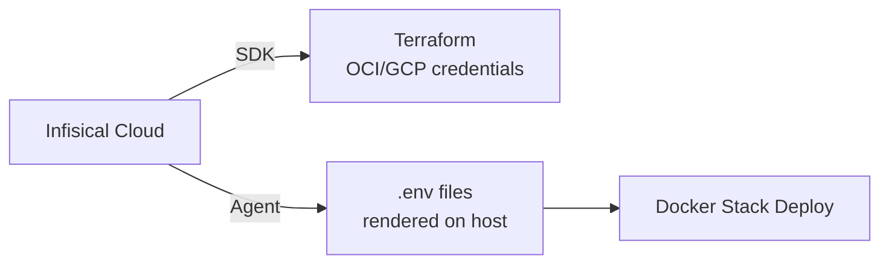

# Infisical Workflow

This document describes how secrets are managed and injected into the infrastructure using [Infisical](https://infisical.com).

## Overview

Infisical acts as the single source of truth for all secrets across Terraform, Ansible, and Docker Swarm stacks. Secrets are organized by path and injected at deploy time through either the Infisical SDK (Terraform) or the Infisical Agent (Docker Swarm).



## Secret Organization

Secrets are stored in the Infisical project under environment-specific paths:

| Path | Consumer | Secrets |
|------|----------|---------|
| `/infrastructure` | Terraform | OCI tenancy/compartment IDs, GCP project ID, Tailscale auth key, SSH CA key |
| `/infrastructure` | Scripts | `CLOUDFLARE_ZONE_ID`, `CLOUDFLARE_API_TOKEN`, `BASE_DOMAIN` |
| `/stacks/gateway` | Traefik | `ACME_EMAIL`, `BASE_DOMAIN` |
| `/stacks/auth` | Authelia | `BASE_DOMAIN`, Authelia JWT/session/storage secrets |
| `/stacks/network` | Vaultwarden, Pi-hole | DB credentials, `BASE_DOMAIN` |
| `/stacks/management` | Portainer, Homarr | `BASE_DOMAIN` |
| `/stacks/observability` | Grafana, Prometheus | `GF_ADMIN_PASSWORD`, `BASE_DOMAIN` |
| `/stacks/media` | Open WebUI, OpenClaw | `ARCH_PC_IP`, `BASE_DOMAIN` |
| `/stacks/uptime` | Uptime Kuma | `BASE_DOMAIN` |
| `/stacks/cloud` | FileBrowser | `BASE_DOMAIN` |

## Terraform Integration

The root Terraform module uses the `infisical/infisical` provider to fetch secrets at plan/apply time:

```hcl
provider "infisical" {
  client_id     = var.infisical_client_id
  client_secret = var.infisical_client_secret
}

data "infisical_secrets" "infra" {
  env_slug    = "prod"
  folder_path = "/infrastructure"
  workspace_id = var.infisical_workspace_id
}
```

Secrets are accessed via a `locals` mapping for type safety:

```hcl
locals {
  secrets = {
    oci_tenancy_ocid     = data.infisical_secrets.infra.secrets["OCI_TENANCY_OCID"].value
    oci_compartment_ocid = data.infisical_secrets.infra.secrets["OCI_COMPARTMENT_OCID"].value
    # ...
  }
}
```

## Infisical Agent (Docker Swarm)

The Infisical Agent runs as a Docker stack (`stacks/infisical-agent.yaml`) on each Swarm node. It renders `.env` files from templates and optionally triggers stack redeploys.

### Template Rendering

Each stack has an `.env.tmpl` file. The agent watches for secret changes and renders them:

```
# Template: /opt/stacks/network/.env.tmpl
BASE_DOMAIN={{ .BASE_DOMAIN }}
POSTGRES_PASSWORD={{ .VAULTWARDEN_DB_PASSWORD }}

# Rendered: /opt/stacks/network/.env
BASE_DOMAIN=example.com
POSTGRES_PASSWORD=supersecret
```

### Agent Configuration

The agent config lives at `/etc/infisical/agent.yaml` (deployed via the `infisical-agent.yaml` stack):

```yaml
infisical:
  address: https://app.infisical.com
auth:
  type: universal-auth
  config:
    client-id: <from-env>
    client-secret: <from-env>
sinks: []
templates:
  - source-path: /opt/stacks/network/.env.tmpl
    destination-path: /opt/stacks/network/.env
    config:
      polling-interval: 60s
    exec:
      command: docker stack deploy -c /opt/stacks/network/docker-compose.yml network
      timeout: 60
```

### Workflow

1. Operator adds/updates a secret in the Infisical dashboard
2. The agent detects the change on its next polling interval (60s default)
3. Agent re-renders the `.env` file with the new value
4. Agent runs the `exec.command` to redeploy the stack with updated env vars

## infisical.json

The root `infisical.json` file stores the workspace ID for the Infisical CLI (used for local development/debugging):

```json
{
  "workspaceId": "<your-workspace-id>"
}
```

This file is intentionally kept in the repo (without secrets) so that `infisical` CLI commands work without passing `--projectId` every time.

## Adding a New Secret

1. **Create the secret** in the Infisical dashboard under the appropriate path
2. **Reference it in the template** — add `{{ .SECRET_NAME }}` to the relevant `.env.tmpl`
3. **Use it in the compose file** — reference via `${SECRET_NAME}` in the stack's `docker-compose.yml`
4. **The agent picks it up** — on the next poll, the `.env` is re-rendered and the stack redeployed

## Security Considerations

- Infisical Agent authenticates via Universal Auth (client ID + client secret) — these bootstrap credentials are the only secrets stored outside Infisical
- `.env` files are rendered on each node's filesystem — ensure `/opt/stacks/` has restricted permissions (`0750`)
- The `infisical.json` in the repo contains **only** the workspace ID (not sensitive)
- Terraform state contains decrypted secret values — use remote backends with encryption at rest
