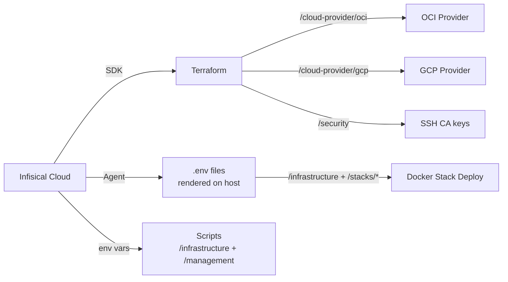

# Infisical Workflow

This document describes how secrets are managed and injected into the infrastructure using [Infisical](https://infisical.com).

## Overview

Infisical acts as the single source of truth for all secrets across Terraform, Ansible, and Docker Swarm stacks. Secrets are organized by path and injected at deploy time through either the Infisical SDK (Terraform) or the Infisical Agent (Docker Swarm).



## Secret Organization

| Path | Consumer | Secrets |
|------|----------|---------|
| `/infrastructure` | Terraform, Ansible, Scripts, **all stacks** (global) | `BASE_DOMAIN`, `CLOUDFLARE_API_TOKEN`, `TAILSCALE_AUTHKEY`, `TZ`, `ZONE_ID`, `ACME_EMAIL` |
| `/management` | Portainer deploy script | `ENDPOINT_ID`, `PORTAINER_TOKEN`, `PORTAINER_URL` |
| `/security` | Terraform (cloud-init), Ansible (SSH CA) | `SSH_CA_PRIVATE_KEY`, `SSH_CA_PUBLIC_KEY`, `SSH_HOST_CA_PUBKEY` |
| `/stacks/gateway` | Traefik | `DOCKER_SOCKET_PROXY_URL` |
| `/stacks/identity` | Authelia SSO | `AUTHELIA_JWT_SECRET`, `AUTHELIA_SESSION_SECRET`, `POSTGRES_PASSWORD` |
| `/stacks/management` | Homarr | `HOMARR_SECRET_KEY` |
| `/stacks/network` | Vaultwarden, Pi-hole | `VW_DB_PASS`, `VW_ADMIN_TOKEN`, `PIHOLE_PASSWORD` |
| `/stacks/observability` | Grafana | `GF_ADMIN_PASSWORD` |
| `/stacks/ai-interface` | Open WebUI, OpenClaw | *(none yet — add `ARCH_PC_IP` when ready)* |
| `/cloud-provider/gcp` | Terraform (GCP provider) | `GCP_SERVICE_ACCOUNT_KEY` |
| `/cloud-provider/oci` | Terraform (OCI provider) | `OCI_FINGERPRINT`, `OCI_PRIVATE_KEY`, `OCI_TENANCY_OCID`, `OCI_USER_OCID` |

> **Global injection:** Every `.env.tmpl` pulls `BASE_DOMAIN` and `TZ` from `/infrastructure` via a `{{- with secret "/infrastructure" }}` block — no need to duplicate these in each stack's Infisical path.

---

## Complete Variable Reference

### `/infrastructure` — Global

| Variable | How to Get | Used By |
|----------|-----------|---------|
| `BASE_DOMAIN` | Your registered domain name (e.g. `example.com`) | Every stack (Traefik labels), scripts |
| `TZ` | IANA timezone (e.g. `America/New_York`, `Etc/UTC`) | All stacks, Pi-hole |
| `CLOUDFLARE_API_TOKEN` | Cloudflare dashboard → My Profile → API Tokens → Create Token → Zone:DNS:Edit | Traefik (ACME DNS challenge), `cloudflare-dns.sh` |
| `ZONE_ID` | Cloudflare dashboard → select domain → Overview sidebar → Zone ID | `cloudflare-dns.sh` |
| `TAILSCALE_AUTHKEY` | Tailscale admin → Settings → Keys → Generate auth key (reusable, ephemeral) | Ansible provisioning (`tailscale up --authkey=...`) |
| `ACME_EMAIL` | Any valid email — Let's Encrypt sends expiry warnings here | Traefik cert resolver |

### `/management` — Portainer Deploy Script

| Variable | How to Get | Used By |
|----------|-----------|---------|
| `PORTAINER_URL` | Full URL of your Portainer instance (e.g. `https://portainer.example.com`) | `portainer-deploy.sh` |
| `PORTAINER_TOKEN` | Portainer UI → My Account → Access Tokens → Add access token | `portainer-deploy.sh` |
| `ENDPOINT_ID` | Portainer UI → Environments → click your env → ID in URL (usually `1`) | `portainer-deploy.sh` |

### `/security` — SSH Certificate Authority

| Variable | How to Get | Used By |
|----------|-----------|---------|
| `SSH_CA_PUBLIC_KEY` | `ssh-keygen -t ed25519 -f ssh_ca` → contents of `ssh_ca.pub` | Terraform cloud-init (OCI instances), Ansible |
| `SSH_CA_PRIVATE_KEY` | Contents of the generated `ssh_ca` private key file | Ansible (signing host/user certs) |
| `SSH_HOST_CA_PUBKEY` | Same CA or a separate host CA — public key for host cert verification | SSH client `known_hosts` (`@cert-authority *`) |

### `/stacks/gateway` — Traefik

| Variable | How to Get | Used By |
|----------|-----------|---------|
| `DOCKER_SOCKET_PROXY_URL` | Usually `tcp://socket-proxy:2375` (default in compose) — override only if using a remote socket proxy | Traefik `--providers.docker.endpoint` |

### `/stacks/identity` — Authelia

| Variable | How to Get | Used By |
|----------|-----------|---------|
| `AUTHELIA_JWT_SECRET` | Generate: `openssl rand -base64 48` | Authelia JWT token signing |
| `AUTHELIA_SESSION_SECRET` | Generate: `openssl rand -base64 48` | Authelia session encryption |
| `POSTGRES_PASSWORD` | Generate: `openssl rand -base64 32` | Authelia ↔ PostgreSQL storage backend |

### `/stacks/management` — Homarr

| Variable | How to Get | Used By |
|----------|-----------|---------|
| `HOMARR_SECRET_KEY` | Generate: `openssl rand -hex 32` | Homarr `SECRET_ENCRYPTION_KEY` |

### `/stacks/network` — Vaultwarden + Pi-hole

| Variable | How to Get | Used By |
|----------|-----------|---------|
| `VW_DB_PASS` | Generate: `openssl rand -base64 32` | Vaultwarden + PostgreSQL (`DATABASE_URL`) |
| `VW_ADMIN_TOKEN` | Generate: `openssl rand -base64 48` — or use `vaultwarden` CLI to create an Argon2 hash | Vaultwarden `/admin` panel |
| `PIHOLE_PASSWORD` | Choose or generate: `openssl rand -base64 16` | Pi-hole web UI + Orbital Sync |

### `/stacks/observability` — Grafana

| Variable | How to Get | Used By |
|----------|-----------|---------|
| `GF_ADMIN_PASSWORD` | Choose or generate: `openssl rand -base64 24` | Grafana `admin` user initial password |

### `/stacks/ai-interface` — Open WebUI *(future)*

| Variable | How to Get | Used By |
|----------|-----------|---------|
| `ARCH_PC_IP` | Tailscale IP or LAN IP of your machine running Ollama | Open WebUI `OLLAMA_BASE_URL` |

### `/cloud-provider/oci` — OCI Terraform

| Variable | How to Get | Used By |
|----------|-----------|---------|
| `OCI_TENANCY_OCID` | OCI Console → Profile → Tenancy → OCID | Terraform OCI provider |
| `OCI_USER_OCID` | OCI Console → Profile → My Profile → OCID | Terraform OCI provider |
| `OCI_FINGERPRINT` | OCI Console → Profile → API Keys → fingerprint column | Terraform OCI provider |
| `OCI_PRIVATE_KEY` | The PEM private key you uploaded to OCI API Keys | Terraform OCI provider |

### `/cloud-provider/gcp` — GCP Terraform

| Variable | How to Get | Used By |
|----------|-----------|---------|
| `GCP_SERVICE_ACCOUNT_KEY` | GCP Console → IAM → Service Accounts → Keys → Create Key (JSON) — paste full JSON | Terraform Google provider `credentials` |

---

## Terraform Integration

The root Terraform module uses the `infisical/infisical` provider to fetch secrets at plan/apply time:

```hcl
provider "infisical" {
  client_id     = var.infisical_client_id
  client_secret = var.infisical_client_secret
}

data "infisical_secrets" "infra" {
  env_slug    = "prod"
  folder_path = "/infrastructure"
  workspace_id = var.infisical_workspace_id
}

data "infisical_secrets" "security" {
  env_slug    = "prod"
  folder_path = "/security"
  workspace_id = var.infisical_workspace_id
}

data "infisical_secrets" "oci" {
  env_slug    = "prod"
  folder_path = "/cloud-provider/oci"
  workspace_id = var.infisical_workspace_id
}

data "infisical_secrets" "gcp" {
  env_slug    = "prod"
  folder_path = "/cloud-provider/gcp"
  workspace_id = var.infisical_workspace_id
}
```

Secrets are accessed via a `locals` mapping for type safety:

```hcl
locals {
  secrets = {
    # /infrastructure
    base_domain = data.infisical_secrets.infra.secrets["BASE_DOMAIN"].value

    # /security
    ssh_ca_public_key = data.infisical_secrets.security.secrets["SSH_CA_PUBLIC_KEY"].value

    # /cloud-provider/oci
    oci_tenancy_ocid = data.infisical_secrets.oci.secrets["OCI_TENANCY_OCID"].value
    oci_user_ocid    = data.infisical_secrets.oci.secrets["OCI_USER_OCID"].value

    # /cloud-provider/gcp
    gcp_service_account_key = data.infisical_secrets.gcp.secrets["GCP_SERVICE_ACCOUNT_KEY"].value
    # ...
  }
}
```

## Infisical Agent (Docker Swarm)

The Infisical Agent runs on each Swarm node. It renders `.env` files from `.env.tmpl` templates and triggers stack redeploys on secret changes.

### Template Pattern

Every template pulls globals from `/infrastructure`, then stack-specific secrets from its own path:

```
# stacks/auth/.env.tmpl
{{- with secret "/infrastructure" }}
BASE_DOMAIN={{ .BASE_DOMAIN }}
TZ={{ .TZ }}
{{- end }}

{{- with secret "/stacks/identity" }}
AUTHELIA_JWT_SECRET={{ .AUTHELIA_JWT_SECRET }}
AUTHELIA_SESSION_SECRET={{ .AUTHELIA_SESSION_SECRET }}
POSTGRES_PASSWORD={{ .POSTGRES_PASSWORD }}
{{- end }}
```

Stacks that only need globals (uptime, cloud) have a single `/infrastructure` block.

### Template Inventory

| Stack | Template | Sources |
|-------|----------|---------|
| gateway | `stacks/gateway/.env.tmpl` | `/infrastructure` + `/stacks/gateway` |
| auth | `stacks/auth/.env.tmpl` | `/infrastructure` + `/stacks/identity` |
| management | `stacks/management/.env.tmpl` | `/infrastructure` + `/stacks/management` |
| network | `stacks/network/.env.tmpl` | `/infrastructure` + `/stacks/network` |
| observability | `stacks/observability/.env.tmpl` | `/infrastructure` + `/stacks/observability` |
| ai-interface | `stacks/media/ai-interface/.env.tmpl` | `/infrastructure` (+ `/stacks/ai-interface` when needed) |
| uptime | `stacks/uptime/.env.tmpl` | `/infrastructure` |
| cloud | `stacks/cloud/.env.tmpl` | `/infrastructure` |

### Agent Configuration

The agent config lives at `/etc/infisical/agent.yaml` (see `stacks/infisical-agent.yaml`). It contains one template entry per stack, each with:
- `source-path` → the `.env.tmpl` on disk
- `destination-path` → the rendered `.env`
- `polling-interval: 60s` → how often to check for changes
- `exec.command` → `docker stack deploy ...` to apply changes

### Workflow

1. Operator adds/updates a secret in the Infisical dashboard
2. The agent detects the change on its next polling interval (60s default)
3. Agent re-renders the `.env` file with the new value
4. Agent runs the `exec.command` to redeploy the stack with updated env vars

## infisical.json

The root `infisical.json` file stores the workspace ID for the Infisical CLI (used for local development/debugging):

```json
{
  "workspaceId": "<your-workspace-id>"
}
```

This file is intentionally kept in the repo (without secrets) so that `infisical` CLI commands work without passing `--projectId` every time.

## Adding a New Secret

1. **Create the secret** in the Infisical dashboard under the appropriate path
2. **Reference it in the template** — add a `{{- with secret "/path" }}` block to the stack's `.env.tmpl`
3. **Use it in the compose file** — reference via `${SECRET_NAME}` in the stack's `docker-compose.yml`
4. **Register the template** — add a new entry in `stacks/infisical-agent.yaml`
5. **The agent picks it up** — on the next poll, the `.env` is re-rendered and the stack redeployed

## Security Considerations

- Infisical Agent authenticates via Universal Auth (client ID + client secret) — these bootstrap credentials are the only secrets stored outside Infisical
- `.env` files are rendered on each node's filesystem — ensure `/opt/stacks/` has restricted permissions (`0750`)
- The `infisical.json` in the repo contains **only** the workspace ID (not sensitive)
- Terraform state contains decrypted secret values — use remote backends with encryption at rest
