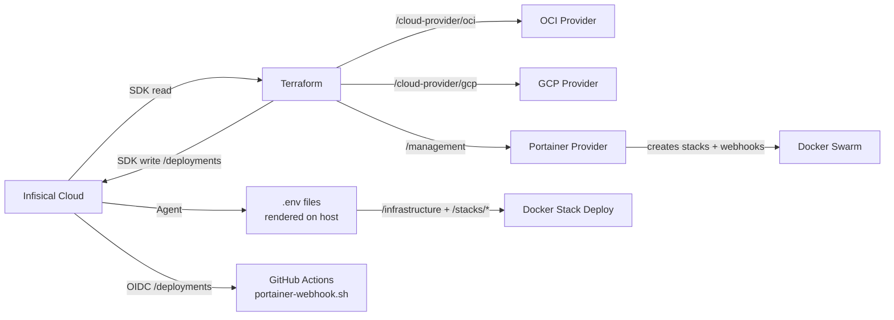

# Infisical Workflow

This document describes how secrets are managed and injected into the infrastructure using [Infisical](https://infisical.com).

## Overview

Infisical acts as the single source of truth for all secrets across Terraform, Ansible, and Docker Swarm stacks. Secrets are organized by path and injected at deploy time through either the Infisical SDK (Terraform) or the Infisical Agent (Docker Swarm).



## Secret Organization

| Path | Consumer | Secrets |
|------|----------|---------|
| `/infrastructure` | Terraform, Ansible, Scripts | `BASE_DOMAIN`, `CLOUDFLARE_API_TOKEN`, `TAILSCALE_OAUTH_CLIENT_ID`, `TZ`, `ZONE_ID` |
| `/management` | Terraform (Portainer provider) | `PORTAINER_URL`, `PORTAINER_API_KEY` |
| `/deployments` | GitHub Actions, Terraform (auto-written) | `PORTAINER_WEBHOOK_URLS`, `WEBHOOK_URL_*` |
| `/security` | Terraform (cloud-init), GitHub Actions (SSH) | `SSH_CA_PUBLIC_KEY`, `SSH_HOST_CA_PUBKEY` |
| `/stacks/gateway` | Traefik | `ACME_EMAIL`, `DOCKER_SOCKET_PROXY_URL` |
| `/stacks/identity` | Authelia SSO | `AUTHELIA_JWT_SECRET`, `AUTHELIA_SESSION_SECRET`, `POSTGRES_PASSWORD` |
| `/stacks/management` | Homarr + Portainer | `HOMARR_SECRET_KEY`, `PORTAINER_ADMIN_PASSWORD`, `PORTAINER_ADMIN_PASSWORD_HASH` |
| `/stacks/network` | Vaultwarden, Pi-hole | `VW_DB_PASS`, `VW_ADMIN_TOKEN`, `PIHOLE_PASSWORD` |
| `/stacks/observability` | Grafana | `GF_OIDC_CLIENT_ID`, `GF_OIDC_CLIENT_SECRET` |
| `/stacks/ai-interface` | Open WebUI | `ARCH_PC_IP` |
| `/cloud-provider/gcp` | Terraform (GCP provider) | `GCP_PROJECT_ID` |
| `/cloud-provider/oci` | Terraform (OCI provider) | `OCI_COMPARTMENT_OCID`, `OCI_IMAGE_OCID` |

> **Global injection:** `BASE_DOMAIN` is used in almost every `.env.tmpl` via a `{{- with secret "/infrastructure" }}` block, as Traefik requires it for routing labels. Other variables like `TZ` or `CLOUDFLARE_API_TOKEN` are only pulled into the specific stacks that need them.

---

## Complete Variable Reference

### `/infrastructure` — Global

| Variable | How to Get | Used By |
|----------|-----------|---------|
| `BASE_DOMAIN` | Your registered domain name (e.g. `example.com`) | All stack composes except gateway (Traefik routing labels), scripts |
| `TZ` | IANA timezone (e.g. `America/New_York`, `Etc/UTC`) | All stacks, Pi-hole |
| `CLOUDFLARE_API_TOKEN` | Cloudflare dashboard → My Profile → API Tokens → Create Token → Zone:DNS:Edit | Traefik (ACME DNS challenge), `cloudflare-dns.sh` |
| `ZONE_ID` | Cloudflare dashboard → select domain → Overview sidebar → Zone ID | `cloudflare-dns.sh` (also present in gateway `.env.tmpl` but not used by the compose) |
| `TAILSCALE_OAUTH_CLIENT_ID` | Tailscale admin → Settings → OAuth clients → Generate client | Ansible provisioning (`tailscale up --authkey=...`) |

### `/management` — Portainer

| Variable | How to Get | Used By |
|----------|-----------|--------|
| `PORTAINER_URL` | Auto-written by Ansible `portainer_bootstrap` role (or manually set) | Terraform Portainer provider `endpoint` |
| `PORTAINER_API_KEY` | Auto-written by Ansible `portainer_bootstrap` role (or manually via Portainer → Access Tokens) | Terraform Portainer provider `api_key` |

> **Note:** These credentials are written automatically by the Ansible `portainer_bootstrap` role during Phase 6 provisioning. Terraform reads them to authenticate against the Portainer API. The resulting webhook URLs are written automatically to `/deployments` by Terraform.

### `/deployments` — Webhook URLs *(Terraform-managed)*

These secrets are **created and updated automatically** by the `portainer` Terraform module. Do not edit them manually.

The management stack (Portainer + Homarr) is deployed by Ansible, not Terraform, so it does not have a webhook URL here.

| Variable | Source | Used By |
|----------|--------|--------|
| `PORTAINER_WEBHOOK_URLS` | Comma-separated list of all stack webhook URLs | `deploy.yml` → `portainer-webhook.sh` |
| `WEBHOOK_URL_GATEWAY` | Individual webhook URL for the gateway stack | Direct API calls |
| `WEBHOOK_URL_AUTH` | Individual webhook URL for the auth stack | Direct API calls |
| `WEBHOOK_URL_NETWORK` | Individual webhook URL for the network stack | Direct API calls |
| `WEBHOOK_URL_OBSERVABILITY` | Individual webhook URL for the observability stack | Direct API calls |
| `WEBHOOK_URL_AI_INTERFACE` | Individual webhook URL for the ai-interface stack | Direct API calls |
| `WEBHOOK_URL_UPTIME` | Individual webhook URL for the uptime stack | Direct API calls |
| `WEBHOOK_URL_CLOUD` | Individual webhook URL for the cloud stack | Direct API calls |

### `/stacks/gateway` — Traefik

| Variable | How to Get | Used By |
|----------|-----------|---------|
| `ACME_EMAIL` | Any valid email — Let's Encrypt sends expiry warnings here | Traefik cert resolver (`certificatesresolvers.letsencrypt.acme.email`) |
| `DOCKER_SOCKET_PROXY_URL` | Usually `tcp://socket-proxy:2375` (default in compose) — override only if using a remote socket proxy | Traefik `--providers.docker.endpoint` |

### `/stacks/identity` — Authelia

| Variable | How to Get | Used By |
|----------|-----------|---------|
| `AUTHELIA_JWT_SECRET` | Generate: `openssl rand -base64 48` | Authelia JWT token signing |
| `AUTHELIA_SESSION_SECRET` | Generate: `openssl rand -base64 48` | Authelia session encryption |
| `POSTGRES_PASSWORD` | Generate: `openssl rand -base64 32` | Authelia ↔ PostgreSQL storage backend |

### `/stacks/management` — Homarr + Portainer

| Variable | How to Get | Used By |
|----------|-----------|--------|
| `HOMARR_SECRET_KEY` | Generate: `openssl rand -hex 32` | Homarr `SECRET_ENCRYPTION_KEY` |
| `PORTAINER_ADMIN_PASSWORD` | Choose a strong password or generate: `openssl rand -base64 24` | Ansible `portainer_bootstrap` role — hashed to bcrypt at deploy time and passed to Portainer via `--admin-password`; plaintext used only for JWT auth to create API key |
| `PORTAINER_ADMIN_PASSWORD_HASH` | **Auto-generated** by Ansible (`password_hash('bcrypt')`) at initial deploy; Ansible should write the hash to Infisical `/stacks/management` so the Infisical Agent can render it on subsequent redeploys — do not set manually | Portainer `--admin-password` CLI flag (set in `docker-compose.yml`) |

### `/stacks/network` — Vaultwarden + Pi-hole

| Variable | How to Get | Used By |
|----------|-----------|---------|
| `VW_DB_PASS` | Generate: `openssl rand -base64 32` | Vaultwarden + PostgreSQL (`DATABASE_URL`) |
| `VW_ADMIN_TOKEN` | Generate: `openssl rand -base64 48` — or use `vaultwarden` CLI to create an Argon2 hash | Vaultwarden `/admin` panel |
| `PIHOLE_PASSWORD` | Choose or generate: `openssl rand -base64 16` | Pi-hole web UI + Orbital Sync |

### `/stacks/observability` — Grafana

| Variable | How to Get | Used By |
|----------|-----------|---------|
| `GF_OIDC_CLIENT_ID` | Choose a client ID (e.g., `grafana`) to define in Authelia's config | Grafana SSO setup |
| `GF_OIDC_CLIENT_SECRET` | Generate plaintext: `openssl rand -hex 32` (Must be hashed using `authelia crypto hash` for Authelia's config) | Grafana SSO setup |

### `/stacks/ai-interface` — Open WebUI

| Variable | How to Get | Used By |
|----------|-----------|---------|
| `ARCH_PC_IP` | Tailscale IP or LAN IP of your machine running Ollama | Open WebUI `OLLAMA_BASE_URL` |

### `/cloud-provider/oci` — OCI Terraform

| Variable | How to Get | Used By |
|----------|-----------|---------|
| `OCI_COMPARTMENT_OCID` | Compartments → View Details → Copy OCID | Resources grouping |
| `OCI_IMAGE_OCID` | Compute → Images → Custom/Canonical Image OCID | Terraform compute module |

### `/cloud-provider/gcp` — GCP Terraform

| Variable | How to Get | Used By |
|----------|-----------|---------|
| `GCP_PROJECT_ID` | GCP Console → Top Navigation (e.g., `goodoldmeserver-123`) | Terraform Google provider `project` |

### GitHub Actions Variables & Secrets

While Infisical manages infrastructure and application secrets, a few bootstrap values must be stored directly in GitHub (Settings → Security → Secrets and variables → Actions) for CI/CD pipelines.

The workflow authenticates to Infisical via **OIDC** (not Universal Auth), so no client ID/secret pair is needed.

#### Variables (`vars.*`)

| Variable | How to Get | Used By |
|----------|-----------|---------|
| `INFISICAL_MACHINE_IDENTITY_ID` | Infisical → Access Control → Machine Identities → OIDC Auth → Identity ID | `deploy.yml` OIDC login (`infisical login --method=oidc`) |
| `INFISICAL_PROJECT_ID` | Infisical → Project Settings → Project ID | `deploy.yml` PKI signing, secret fetching |
| `INFISICAL_SSH_CA_ID` | Infisical → SSH Management → SSH CA details | `deploy.yml` ephemeral key signing |
| `TFC_WORKSPACE` | Terraform Cloud → Workspaces → workspace name | `deploy.yml` Terraform apply step |

#### Secrets (`secrets.*`)

| Variable | How to Get | Used By |
|----------|-----------|---------|
| `PORTAINER_WEBHOOK_URLS` | *(Now managed by Terraform → Infisical `/deployments`)* — see [Portainer Integration](#terraform--portainer-integration) | `deploy.yml` → `portainer-webhook.sh` |

---

## Terraform Integration

The root Terraform module uses the `infisical/infisical` provider to fetch secrets at plan/apply time. Authentication is handled via environment variables injected by Terraform Cloud (OIDC workload identity), so the provider block needs only the host:

```hcl
provider "infisical" {
  host = "https://app.infisical.com"
}

data "infisical_secrets" "infra" {
  env_slug     = "prod"
  folder_path  = "/infrastructure"
  workspace_id = var.infisical_project_id
}

data "infisical_secrets" "security" {
  env_slug     = "prod"
  folder_path  = "/security"
  workspace_id = var.infisical_project_id
}

data "infisical_secrets" "oci" {
  env_slug     = "prod"
  folder_path  = "/cloud-provider/oci"
  workspace_id = var.infisical_project_id
}

data "infisical_secrets" "gcp" {
  env_slug     = "prod"
  folder_path  = "/cloud-provider/gcp"
  workspace_id = var.infisical_project_id
}
```

Secrets are accessed via a `locals` mapping for type safety:

```hcl
locals {
  secrets = {
    # /infrastructure
    base_domain = data.infisical_secrets.infra.secrets["BASE_DOMAIN"].value

    # /security
    ssh_ca_public_key = data.infisical_secrets.security.secrets["SSH_CA_PUBLIC_KEY"].value

    # /cloud-provider/oci
    oci_compartment_id = data.infisical_secrets.oci.secrets["OCI_COMPARTMENT_OCID"].value
    oci_image_ocid     = data.infisical_secrets.oci.secrets["OCI_IMAGE_OCID"].value

    # /cloud-provider/gcp
    gcp_project_id = data.infisical_secrets.gcp.secrets["GCP_PROJECT_ID"].value

    # /management (Portainer)
    portainer_url     = data.infisical_secrets.management.secrets["PORTAINER_URL"].value
    portainer_api_key = data.infisical_secrets.management.secrets["PORTAINER_API_KEY"].value
  }
}
```

## Terraform → Portainer Integration

The `portainer` Terraform module (`terraform/portainer/`) uses the [portainer/portainer](https://registry.terraform.io/providers/portainer/portainer) provider to declaratively manage the **application stacks** and their GitOps webhooks. Webhook URLs are written back to Infisical automatically, making it the single source of truth for deployment credentials.

> **Boundary:** Ansible deploys the management stack (Portainer + Homarr) during Phase 6 and writes the API credentials to Infisical `/management`. Terraform then reads those credentials to manage everything else through the Portainer API.

### How It Works

1. **Ansible bootstraps** Portainer (Phase 6) → writes `PORTAINER_URL` + `PORTAINER_API_KEY` to Infisical `/management`
2. **Terraform reads** `/management` from Infisical to authenticate the Portainer provider
3. **Terraform creates** each application stack in Portainer via the API (`portainer_stack` with `deployment_type = "swarm"`, `method = "repository"`)
4. **Portainer returns** a webhook URL per stack (enabled via `stack_webhook = true`)
5. **Terraform writes** each webhook URL to Infisical under `/deployments` using `infisical_secret`
6. **GitHub Actions** pulls `PORTAINER_WEBHOOK_URLS` from Infisical at runtime (via OIDC) — no more plaintext secrets in repo settings

### Managed Stacks

The management stack is **not** in this list — it is deployed by Ansible.

| Stack | Compose Path in Repo |
|-------|---------------------|
| gateway | `stacks/gateway/docker-compose.yml` |
| auth | `stacks/auth/docker-compose.yml` |
| network | `stacks/network/docker-compose.yml` |
| observability | `stacks/observability/docker-compose.yml` |
| ai-interface | `stacks/media/ai-interface/docker-compose.yml` |
| uptime | `stacks/uptime/docker-compose.yml` |
| cloud | `stacks/cloud/docker-compose.yml` |

### Adding a New Stack

1. Create the `docker-compose.yml` under `stacks/<name>/`
2. Add an entry to the `local.stacks` map in `terraform/portainer/main.tf`
3. Run `terraform apply` — the stack, webhook, and Infisical secret are all created automatically

## Infisical Agent (Docker Swarm)

The Infisical Agent runs on each Swarm node as a **systemd service**. It renders `.env` files from `.env.tmpl` templates and triggers stack redeploys on secret changes.

### Installing the Agent

1. **Download the Infisical CLI/Agent binary** (includes the agent mode):

```bash
# Install via the official install script
curl -1sLf 'https://dl.cloudsmith.io/public/infisical/infisical-cli/setup.deb.sh' | sudo bash
sudo apt-get install -y infisical
```

2. **Place the agent configuration** at `/etc/infisical/agent.yaml`. The reference config is maintained in this repo at `stacks/infisical-agent.yaml`:

```bash
sudo mkdir -p /etc/infisical
sudo cp stacks/infisical-agent.yaml /etc/infisical/agent.yaml
```

3. **Bootstrap Universal Auth credentials** — these are the only secrets stored outside Infisical. Edit the agent config to set `client-id` and `client-secret`:

```bash
sudo nano /etc/infisical/agent.yaml
# Set auth.config.client-id and auth.config.client-secret
```

> Generate these credentials in Infisical: **Access Control → Machine Identities → Create Identity → Universal Auth**. Grant the identity read access to the project.

4. **Create the systemd unit file** at `/etc/systemd/system/infisical-agent.service`:

```ini
[Unit]
Description=Infisical Agent
After=network-online.target docker.service
Wants=network-online.target

[Service]
Type=simple
ExecStart=/usr/bin/infisical agent --config /etc/infisical/agent.yaml
Restart=always
RestartSec=10
User=root

[Install]
WantedBy=multi-user.target
```

5. **Enable and start the service:**

```bash
sudo systemctl daemon-reload
sudo systemctl enable --now infisical-agent
```

6. **Verify the agent is running and templates are rendered:**

```bash
# Check service status
systemctl status infisical-agent

# Verify .env files have been created
ls -la /opt/stacks/*/.env

# Check agent logs for errors
journalctl -u infisical-agent --no-pager -n 50
```

### Stacks Directory on Host

The agent expects all stacks at `/opt/stacks/` on the host. This is typically a symlink or clone of the `stacks/` directory from this repository:

```bash
sudo ln -s /path/to/GoodOldMeServer/stacks /opt/stacks
# Or clone the stacks submodule directly:
sudo git clone https://github.com/JoseStud/stacks.git /opt/stacks
```

### Template Pattern

Every template pulls globals from `/infrastructure`, then stack-specific secrets from its own path:

```
# stacks/auth/.env.tmpl
{{- with secret "/infrastructure" }}
BASE_DOMAIN={{ .BASE_DOMAIN }}
TZ={{ .TZ }}
{{- end }}

{{- with secret "/stacks/identity" }}
AUTHELIA_JWT_SECRET={{ .AUTHELIA_JWT_SECRET }}
AUTHELIA_SESSION_SECRET={{ .AUTHELIA_SESSION_SECRET }}
POSTGRES_PASSWORD={{ .POSTGRES_PASSWORD }}
{{- end }}
```

Stacks that only need globals (uptime, cloud) have a single `/infrastructure` block.

> **Gateway exception:** The gateway `.env.tmpl` pulls `BASE_DOMAIN` and `ZONE_ID` from `/infrastructure` for completeness, but the gateway `docker-compose.yml` does not reference either variable. `CLOUDFLARE_API_TOKEN`, `ACME_EMAIL`, and `DOCKER_SOCKET_PROXY_URL` are the only variables the gateway compose actually substitutes.

### Template Inventory

| Stack | Template | Sources |
|-------|----------|---------|
| gateway | `stacks/gateway/.env.tmpl` | `/infrastructure` + `/stacks/gateway` |
| auth | `stacks/auth/.env.tmpl` | `/infrastructure` + `/stacks/identity` |
| management | `stacks/management/.env.tmpl` | `/infrastructure` + `/stacks/management` |
| network | `stacks/network/.env.tmpl` | `/infrastructure` + `/stacks/network` |
| observability | `stacks/observability/.env.tmpl` | `/infrastructure` + `/stacks/observability` |
| ai-interface | `stacks/media/ai-interface/.env.tmpl` | `/infrastructure` + `/stacks/ai-interface` |
| uptime | `stacks/uptime/.env.tmpl` | `/infrastructure` |
| cloud | `stacks/cloud/.env.tmpl` | `/infrastructure` |

### Agent Configuration

The agent config lives at `/etc/infisical/agent.yaml` (see `stacks/infisical-agent.yaml`). It contains one template entry per stack, each with:
- `source-path` → the `.env.tmpl` on disk
- `destination-path` → the rendered `.env`
- `polling-interval: 60s` → how often to check for changes
- `exec.command` → `docker stack deploy ...` to apply changes

### Workflow

1. Operator adds/updates a secret in the Infisical dashboard
2. The agent detects the change on its next polling interval (60s default)
3. Agent re-renders the `.env` file with the new value
4. Agent runs the `exec.command` to redeploy the stack with updated env vars

## infisical.json

The root `infisical.json` file stores the workspace ID for the Infisical CLI (used for local development/debugging):

```json
{
  "workspaceId": "<your-workspace-id>"
}
```

This file is intentionally kept in the repo (without secrets) so that `infisical` CLI commands work without passing `--projectId` every time.

## Adding a New Secret

1. **Create the secret** in the Infisical dashboard under the appropriate path
2. **Reference it in the template** — add a `{{- with secret "/path" }}` block to the stack's `.env.tmpl`
3. **Use it in the compose file** — reference via `${SECRET_NAME}` in the stack's `docker-compose.yml`
4. **Register the template** — add a new entry in `stacks/infisical-agent.yaml`
5. **The agent picks it up** — on the next poll, the `.env` is re-rendered and the stack redeployed

## Security Considerations

- Infisical Agent authenticates via Universal Auth (client ID + client secret) — these bootstrap credentials are the only secrets stored outside Infisical
- `.env` files are rendered on each node's filesystem — ensure `/opt/stacks/` has restricted permissions (`0750`)
- The `infisical.json` in the repo contains **only** the workspace ID (not sensitive)
- Terraform state contains decrypted secret values — use remote backends with encryption at rest
