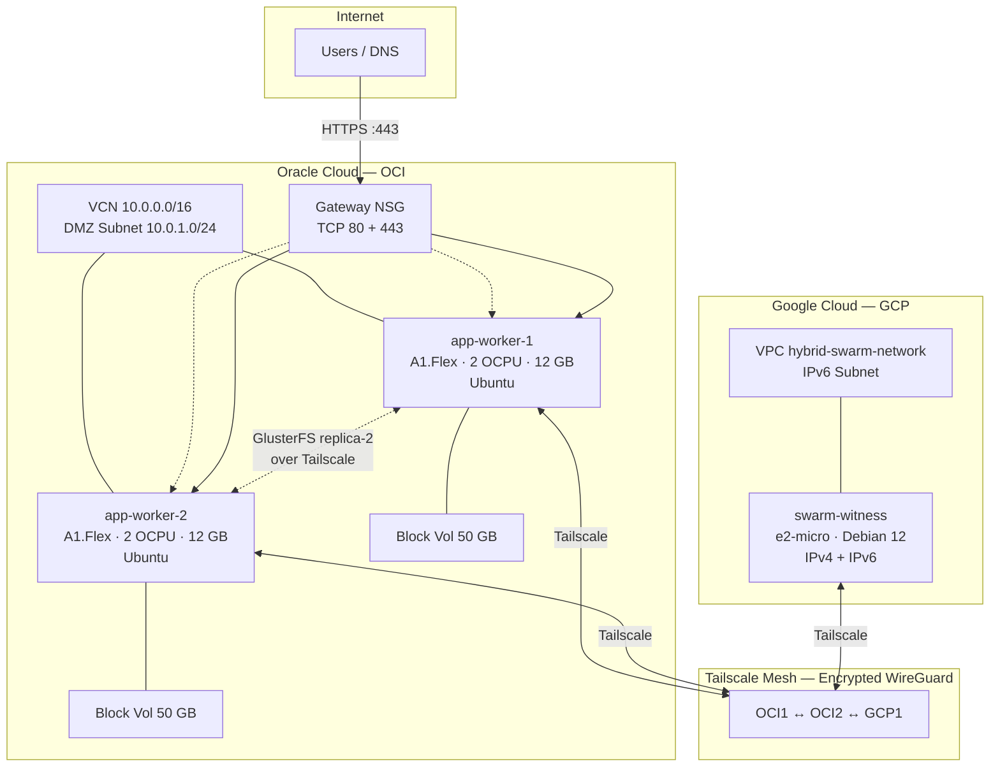
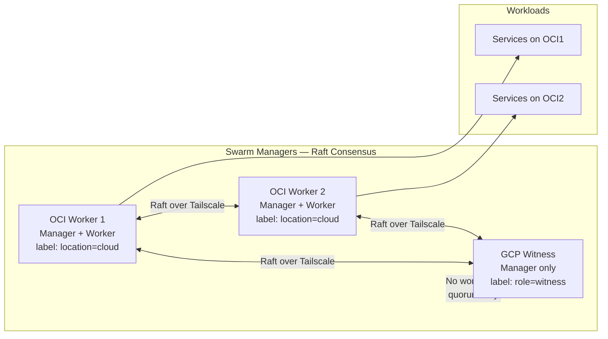
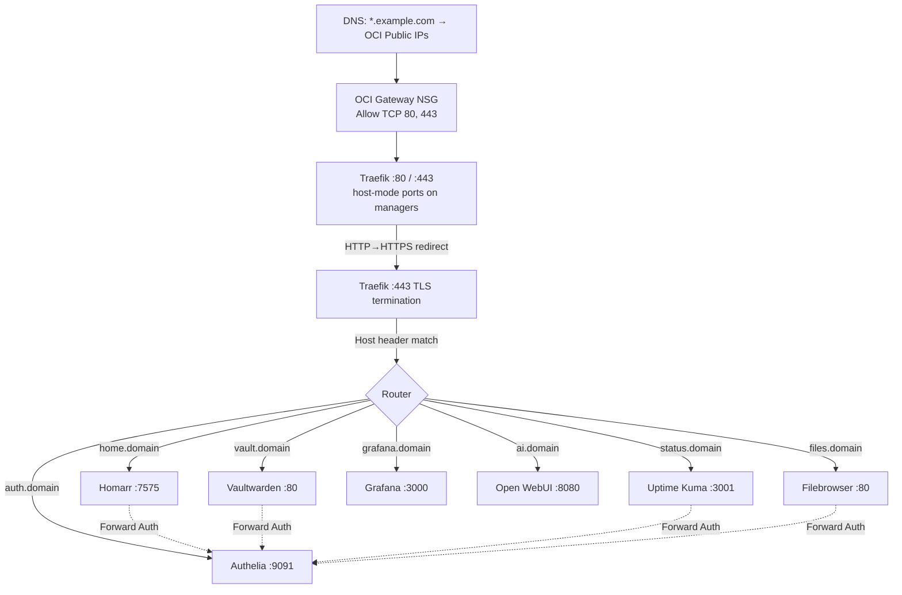

# Network Architecture

This document describes the networking layer underpinning the GoodOldMeServer environment: how nodes communicate across cloud providers, how the Docker Swarm cluster is structured, how storage replicates, and how traffic reaches services.

## Overview



## Tailscale Mesh Networking

All 3 nodes (2 OCI workers + 1 GCP witness) are connected via a [Tailscale](https://tailscale.com/) mesh network built on WireGuard. This provides:

- **Encrypted point-to-point tunnels** between every node pair, regardless of cloud provider or network topology
- **Stable private IPs** (`100.x.x.x` range) that don't change when public IPs rotate
- **SSH over Tailscale** (`--ssh` flag) for secure node access

### How It's Provisioned

1. Ansible Phase 3 installs Tailscale on every node via the official install script
2. Each node authenticates with `tailscale up --authkey=$TAILSCALE_AUTHKEY --ssh`
3. After authentication, nodes discover each other through Tailscale's coordination server
4. Direct WireGuard tunnels are established (or relayed through Tailscale DERP if direct connectivity isn't possible)

### What Uses Tailscale IPs

| Component | Why Tailscale IPs |
|-----------|-------------------|
| **Docker Swarm** | `swarm init` and `swarm join` use `--advertise-addr <tailscale_ip>` so all Raft and gossip traffic flows over encrypted tunnels |
| **GlusterFS** | Brick endpoints use Tailscale IPv4 addresses — replication traffic is encrypted without needing separate TLS configuration |
| **Ansible (GCP)** | The GCP witness has no public IPv4 — Ansible reaches it via its Tailscale IPv6 address |

## Docker Swarm Topology

The cluster runs a **3-manager Docker Swarm** — an odd number is required for Raft consensus (fault tolerance for 1 node failure).



### Why 3 Managers?

- Docker Swarm uses [Raft consensus](https://raft.github.io/) which requires a majority (quorum) of managers to be available
- With 2 managers, losing 1 = loss of quorum = cluster becomes read-only
- With 3 managers, losing 1 = still have 2/3 quorum = cluster remains fully operational
- The GCP witness is a lightweight `e2-micro` instance — it only participates in Raft voting, never runs application containers

### Node Labels

Labels are applied by the Ansible `swarm` role and used in `deploy.placement.constraints`:

| Label | Value | Applied To | Purpose |
|-------|-------|-----------|---------|
| `location` | `cloud` | OCI workers | Identifies workload-eligible nodes |
| `role` | `witness` | GCP instance | Identifies quorum-only node |
| *(built-in)* | `node.role == manager` | All 3 nodes | Traefik, socket-proxy, Portainer server |
| *(built-in)* | `node.role == worker` | OCI workers | All application stacks |
| *(built-in)* | `node.hostname` | Per-instance | Pi-hole pinning (`app-worker-1`, `app-worker-2`) |

### Overlay Networks

Docker overlay networks span all Swarm nodes and provide encrypted service-to-service communication.

| Network | Created By | Scope | Attachable | Used By |
|---------|-----------|-------|------------|---------|
| `traefik_proxy` | Ansible `swarm` role | Global | Yes | All stacks — the primary mesh for Traefik to discover and route to services |
| `socket-proxy` | Gateway stack | Stack | No | Traefik ↔ docker-socket-proxy (isolated Docker API access) |
| `portainer_agent` | Management stack | Stack | No | Portainer server ↔ agent communication |
| `vaultwarden_internal` | Network stack | Stack | No | Vaultwarden ↔ PostgreSQL |
| `pihole_internal` | Network stack | Stack | No | Orbital Sync ↔ Pi-hole instances |

## GlusterFS Replication

GlusterFS provides a **replicated distributed filesystem** between the 2 OCI workers, ensuring all Docker bind-mount data is available on both nodes regardless of which one a service is scheduled on.

```mermaid
flowchart LR
    subgraph OCI1 [OCI Worker 1]
        BD1[/dev/sdb → /mnt/app_data]
        BR1[/mnt/app_data/gluster_brick]
        MT1[/mnt/swarm-shared]
    end

    subgraph OCI2 [OCI Worker 2]
        BD2[/dev/sdb → /mnt/app_data]
        BR2[/mnt/app_data/gluster_brick]
        MT2[/mnt/swarm-shared]
    end

    BR1 <-->|replica-2 over Tailscale| BR2
    BD1 --> BR1
    BD2 --> BR2
    BR1 --> MT1
    BR2 --> MT2
```

### Volume Configuration

| Property | Value |
|----------|-------|
| **Volume name** | `swarm_data` |
| **Type** | Replica 2 |
| **Transport** | TCP (over Tailscale) |
| **Brick locations** | `<oci1_ts_ip>:/mnt/app_data/gluster_brick` + `<oci2_ts_ip>:/mnt/app_data/gluster_brick` |
| **Mount point** | `/mnt/swarm-shared` (on both OCI nodes) |
| **Mount options** | `defaults,_netdev` |

### How It Works

1. The OCI block volumes (`/dev/sdb`, 50 GB each) are partitioned, formatted ext4, and mounted at `/mnt/app_data` by the Ansible `storage` role
2. GlusterFS creates a "brick" directory at `/mnt/app_data/gluster_brick` on each node
3. The `swarm_data` volume is created as `replica 2` — every write to either brick is synchronously replicated to the other
4. Both nodes mount the GlusterFS volume at `/mnt/swarm-shared` via localhost
5. Docker services bind-mount subdirectories of `/mnt/swarm-shared` for persistent data

### Split-Brain Considerations

With `replica 2` (no arbiter), GlusterFS can enter a **split-brain** state if both nodes write conflicting data during a network partition. Mitigations:

- Swarm typically schedules each service on one node at a time (`replicas: 1`) — concurrent writes are rare
- Services that are especially sensitive (Vaultwarden) use PostgreSQL instead of direct file storage to avoid GlusterFS consistency issues
- If split-brain occurs, manual resolution is required: `gluster volume heal swarm_data info` and `gluster volume heal swarm_data split-brain`

> **Important:** GlusterFS replica-2 provides **redundancy** (both copies of data), not **backup** (point-in-time recovery). For backups, see [Backup Strategy](backup-strategy.md).

## DNS & Ingress Flow

### External Traffic



### DNS Traffic (Pi-hole)

Pi-hole instances use **host-mode** port 53 (UDP/TCP) to bypass Docker Swarm's ingress mesh:

- Docker Swarm's IPVS-based load balancing adds connection tracking overhead that is unreliable for high-frequency, short-lived DNS queries
- Host-mode publishes ports directly on the node's network interface, bypassing IPVS entirely
- Each Pi-hole is pinned to a specific node (`app-worker-1`, `app-worker-2`) for deterministic DNS resolution
- Clients configure both node IPs as DNS servers for failover

### Traefik Routing Details

| Feature | Configuration |
|---------|--------------|
| **Docker provider** | Connects to `docker-socket-proxy` at `tcp://socket-proxy:2375` instead of mounting Docker socket directly |
| **Swarm mode** | `--providers.docker.swarmMode=true` — reads labels from service definitions |
| **Default exposure** | `exposedbydefault=false` — services must opt in with `traefik.enable=true` |
| **Entrypoints** | `web` (:80) and `websecure` (:443) |
| **Port mode** | Both entrypoints use `mode: host` — no Swarm ingress mesh for HTTP traffic |
| **Forward auth** | Services reference `authelia@docker` middleware for SSO enforcement |
