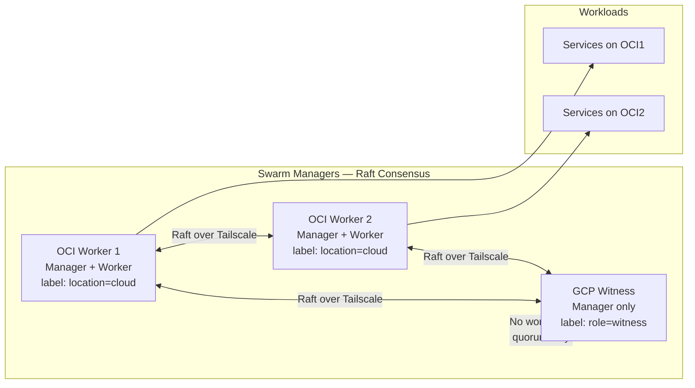
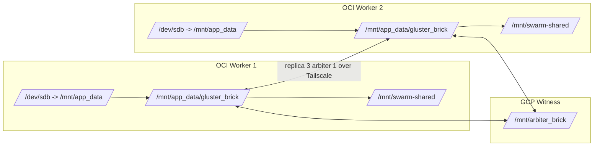

# Network Architecture

This document describes the networking layer underpinning the GoodOldMeServer environment: how nodes communicate across cloud providers, how the Docker Swarm cluster is structured, how storage replicates, and how traffic reaches services.

## Overview

```mermaid
graph TB
    subgraph Internet
        USER[Users / DNS]
    end

    subgraph OCI [Oracle Cloud — OCI]
        OCI1[app-worker-1<br/>A1.Flex · 2 OCPU · 12 GB<br/>Ubuntu]
        OCI2[app-worker-2<br/>A1.Flex · 2 OCPU · 12 GB<br/>Ubuntu]
        VCN[VCN 10.0.0.0/16<br/>DMZ Subnet 10.0.1.0/24]
        NSG[Gateway NSG<br/>TCP 80 + 443]
        BLK1[Block Vol 50 GB]
        BLK2[Block Vol 50 GB]
        OCI1 --- BLK1
        OCI2 --- BLK2
        VCN --- OCI1
        VCN --- OCI2
        NSG -.-> OCI1
        NSG -.-> OCI2
    end

    subgraph GCP [Google Cloud — GCP]
        GCP1[swarm-witness<br/>e2-micro · Debian 12<br/>IPv6 only (external)]
        GVPC[VPC hybrid-swarm-network<br/>IPv6 Subnet]
        GVPC --- GCP1
    end

    subgraph Tailscale [Tailscale Mesh — Encrypted WireGuard]
        TS1[OCI1 ↔ OCI2 ↔ GCP1]
    end

    OCI1 <-->|Tailscale| TS1
    OCI2 <-->|Tailscale| TS1
    GCP1 <-->|Tailscale| TS1

    USER -->|HTTPS :443| NSG
    NSG --> OCI1
    NSG --> OCI2

    OCI1 <-.->|GlusterFS replica-3-arbiter-1<br/>over Tailscale| OCI2
```

## Port and Protocol Matrix

| Source | Destination | Protocol/Port | Purpose | Enforcement point |
|--------|-------------|---------------|---------|-------------------|
| Internet clients | OCI workers (`app-worker-1`, `app-worker-2`) | TCP `80`, `443` | Public HTTP/HTTPS ingress to Traefik entrypoints | OCI Gateway NSG ingress rules (`gateway_http`, `gateway_https`) |
| Cloud static runner IPv4 egress | OCI workers | TCP `22` | Ansible/SSH administrative access to OCI nodes | OCI NSG SSH rule (`oci_core_network_security_group_security_rule.ssh`) driven by `TF_VAR_network_access_policy.oci_ssh.source_ranges` |
| Cloud static runner dual-stack egress | `portainer-api.<BASE_DOMAIN>` (Traefik -> Portainer service) | TCP `443` | Terraform Portainer provider calls and private webhook automation traffic | Traefik `ipAllowList` middleware (`PORTAINER_AUTOMATION_ALLOWED_CIDRS`) + rate limit middleware |
| Swarm manager nodes (all 3) | Swarm manager nodes (all 3) | TCP `2377`, TCP/UDP `7946`, UDP `4789` | Swarm control-plane, gossip, and overlay networking | Docker Swarm over Tailscale mesh; nodes are joined with Tailscale advertise addresses |
| OCI workers + GCP witness | GlusterFS peers/bricks | TCP `24007` + GlusterFS brick ports | GlusterFS peer management and replicated storage traffic | GlusterFS daemon configuration over Tailscale private network |
| LAN/Tailscale clients | Pi-hole services on OCI nodes | TCP/UDP `53` (host mode) | DNS resolution via Pi-hole pair | Host-mode port binding in `stacks/network/docker-compose.yml` + node pinning |
| Traefik service | `socket-proxy` service | TCP `2375` | Read-only Docker API access for dynamic routing discovery | Internal `socket-proxy` overlay network + docker-socket-proxy capability flags |
| Traefik service | Stack backends (Authelia, Grafana, etc.) | Internal service ports over overlay (for example `9091`, `3000`, `9093`) | Reverse proxy routing to application services | `traefik_proxy` overlay membership + explicit `traefik.enable=true` labels |

## Tailscale Mesh Networking

All 3 nodes (2 OCI workers + 1 GCP witness) are connected via a [Tailscale](https://tailscale.com/) mesh network built on WireGuard. This provides:

- **Encrypted point-to-point tunnels** between every node pair, regardless of cloud provider or network topology
- **Stable private IPs** (`100.x.x.x` range) that don't change when public IPs rotate
- **SSH over Tailscale** (`--ssh` flag) for secure node access

### How It's Provisioned

1. Ansible Phase 3 installs Tailscale on every node via the official APT repository
2. Each node authenticates with `tailscale up --authkey=$TAILSCALE_AUTH_KEY --ssh`
3. After authentication, nodes discover each other through Tailscale's coordination server
4. Direct WireGuard tunnels are established (or relayed through Tailscale DERP if direct connectivity isn't possible)

### What Uses Tailscale IPs

| Component | Why Tailscale IPs |
|-----------|-------------------|
| **Docker Swarm** | `swarm init` and `swarm join` use `--advertise-addr <tailscale_ip>` so all Raft and gossip traffic flows over encrypted tunnels |
| **GlusterFS** | Brick endpoints use Tailscale IPv4 addresses — replication traffic is encrypted without needing separate TLS configuration |

The GCP witness bootstraps Tailscale at first boot via cloud-init (Terraform-injected startup script) before Ansible connects. Ansible Phase 3 is a no-op for the witness (Tailscale already running).

## Docker Swarm Topology

The cluster runs a **3-manager Docker Swarm** — an odd number is required for Raft consensus (fault tolerance for 1 node failure).



### Why 3 Managers?

- Docker Swarm uses [Raft consensus](https://raft.github.io/) which requires a majority (quorum) of managers to be available
- With 2 managers, losing 1 = loss of quorum = cluster becomes read-only
- With 3 managers, losing 1 = still have 2/3 quorum = cluster remains fully operational
- The GCP witness is a lightweight `e2-micro` instance — it only participates in Raft voting, never runs application containers

### Node Labels

Labels are applied by the Ansible `swarm` role and used in `deploy.placement.constraints`:

| Label | Value | Applied To | Purpose |
|-------|-------|-----------|---------|
| `location` | `cloud` | OCI workers | Identifies workload-eligible nodes |
| `role` | `witness` | GCP instance | Identifies quorum-only node |
| *(built-in)* | `node.role == manager` | All 3 nodes | Manager-scoped services such as `socket-proxy` and `portainer-server` |
| *(built-in)* | `node.hostname` | Per-instance | Pi-hole pinning (`app-worker-1`, `app-worker-2`) |

Global services such as `portainer-agent`, `promtail`, and `node-exporter` do not rely on labels at all.

### Overlay Networks

Docker overlay networks span all Swarm nodes and provide encrypted service-to-service communication.

| Network | Created By | Scope | Attachable | Used By |
|---------|-----------|-------|------------|---------|
| `traefik_proxy` | Ansible `swarm` role | Global | Yes | All stacks — the primary mesh for Traefik to discover and route to services |
| `socket-proxy` | Gateway stack | Stack | No | Traefik ↔ docker-socket-proxy (isolated Docker API access) |
| `portainer_agent` | Management stack | Stack | No | Portainer server ↔ agent communication |
| `vaultwarden_internal` | Network stack | Stack | No | Vaultwarden ↔ PostgreSQL |
| `authelia_internal` | Auth stack | Stack | No | Authelia ↔ PostgreSQL (authelia-db) |
| `pihole_internal` | Network stack | Stack | No | Orbital Sync ↔ Pi-hole instances |

## GlusterFS Replication

GlusterFS provides a **replicated distributed filesystem** between the 2 OCI workers and the GCP witness arbiter, ensuring all Docker bind-mount data is available on both nodes regardless of which one a service is scheduled on, while preventing split-brain.



### Volume Configuration

| Property | Value |
|----------|-------|
| **Volume name** | `swarm_data` |
| **Type** | Replica 3 Arbiter 1 |
| **Transport** | TCP (over Tailscale) |
| **Brick locations** | `<oci1_ts_ip>:/mnt/app_data/gluster_brick` + `<oci2_ts_ip>:/mnt/app_data/gluster_brick` + `<gcp_witness_ts_ip>:/mnt/arbiter_brick` |
| **Mount point** | `/mnt/swarm-shared` (on both OCI nodes) |
| **Mount options** | `defaults,_netdev` |

### How It Works

1. The OCI block volumes (`/dev/sdb`, 50 GB each) are partitioned, formatted ext4, and mounted at `/mnt/app_data` by the Ansible `storage` role
2. GlusterFS creates a "brick" directory at `/mnt/app_data/gluster_brick` on each OCI node, and an "arbiter brick" at `/mnt/arbiter_brick` on the GCP witness.
3. The `swarm_data` volume is created as `replica 3 arbiter 1` — every write to either OCI brick is synchronously replicated to the other, while the arbiter node only stores metadata to break ties.
4. Both OCI nodes mount the GlusterFS volume at `/mnt/swarm-shared` via localhost
5. Docker services bind-mount subdirectories of `/mnt/swarm-shared` for persistent data

### Split-Brain Considerations

With the `replica 3 arbiter 1` configuration, the GCP witness node acts as a tie-breaker. This prevents the **split-brain** state that can occur in a simple two-node setup if both nodes write conflicting data during a network partition.

- The arbiter brick does not store file data, making it lightweight and suitable for the e2-micro instance.
- Swarm typically schedules each service on one node at a time (`replicas: 1`) — concurrent writes are rare
- Services that are especially sensitive (Vaultwarden) use PostgreSQL instead of direct file storage to avoid GlusterFS consistency issues
- If an issue occurs, manual resolution can be checked with: `gluster volume heal swarm_data info`


> **Important:** GlusterFS replica-3-arbiter-1 provides **redundancy** (data replicated across both OCI nodes with GCP arbiter for quorum), not **backup** (point-in-time recovery). For backups, see [Backup Strategy](backup-strategy.md).

## DNS & Ingress Flow

### CI Runner Egress Requirements

The `dagger-pipeline` job in `orchestrator.yml` runs on `ubuntu-latest` with the Tailscale action connected to the tailnet. The Dagger pipeline phases require the following outbound connectivity from the GHA runner:

| Destination | Protocol/Port | Purpose |
|-------------|---------------|---------|
| `api.ipify.org` | HTTPS (443) | Detect runner public IPv4 for network policy validation |
| All inventory hosts (OCI workers + GCP witness via Tailscale MagicDNS) | TCP 22 | SSH reachability preflight |
| `portainer-api.<BASE_DOMAIN>` | HTTPS (443) | Portainer API preflight (in portainer stage) |

If the self-hosted runner has egress restrictions (firewall, security group, etc.), these destinations **must** be allow-listed. IP detection uses `curl --retry 3 --retry-delay 1 --max-time 10` and will fail the pipeline if the external APIs are unreachable.

### External Traffic

```mermaid
flowchart TD
    DNS[DNS: *.example.com → OCI Public IPs] --> FW[OCI Gateway NSG<br/>Allow TCP 80, 443]
    FW --> T[Traefik :80 / :443<br/>host-mode ports on OCI workers]
    T -->|HTTP→HTTPS redirect| T443[Traefik :443 TLS termination]
    T443 -->|Host header match| R{Router}
    R -->|auth.domain| AUTH[Authelia :9091]
    R -->|home.domain| HOM[Homarr :7575]
    R -->|vault.domain| VW[Vaultwarden :80]
    R -->|status.domain| UK[Uptime Kuma :3001]
    R -->|grafana.domain| GF[Grafana :3000]
    R -->|ai.domain| OW[Open WebUI :8080]
    R -->|files.domain| FB[Filebrowser :80]

    HOM -.->|Forward Auth| AUTH
    UK -.->|Forward Auth| AUTH
    FB -.->|Forward Auth| AUTH
```



### DNS Traffic (Pi-hole)

Pi-hole instances use **host-mode** port 53 (UDP/TCP) to bypass Docker Swarm's ingress mesh:

- Docker Swarm's IPVS-based load balancing adds connection tracking overhead that is unreliable for high-frequency, short-lived DNS queries
- Host-mode publishes ports directly on the node's network interface, bypassing IPVS entirely
- Each Pi-hole is pinned to a specific node (`app-worker-1`, `app-worker-2`) for deterministic DNS resolution
- Clients configure both node IPs as DNS servers for failover

### Traefik Routing Details

| Feature | Configuration |
|---------|--------------|
| **Docker provider** | Connects to `docker-socket-proxy` at `tcp://socket-proxy:2375` instead of mounting Docker socket directly |
| **Swarm mode** | `--providers.docker.swarmMode=true` — reads labels from service definitions |
| **Default exposure** | `exposedbydefault=false` — services must opt in with `traefik.enable=true` |
| **Entrypoints** | `web` (:80) and `websecure` (:443) |
| **Port mode** | Both entrypoints use `mode: host` — no Swarm ingress mesh for HTTP traffic |
| **Forward auth** | Services reference `authelia@docker` middleware for SSO enforcement |

## Network Policy Sync — Idempotent Mutation Contract

The network-policy-sync stage in the `dagger-pipeline` preflight phase (`ci_pipeline/phases/preflight.py`) writes to two external systems before the main pipeline stages execute:

1. **TFC variable sets** — the runner's current public IPv4 is written to Terraform Cloud as `TF_VAR_network_access_policy`, which controls OCI NSG SSH rules.
2. **Infisical allowlists** — the runner's CIDR is written to Infisical as `PORTAINER_AUTOMATION_ALLOWED_CIDRS`, which Traefik's `ipAllowList` middleware enforces for Portainer API traffic.

### Why mutations that persist through failure are safe here

These writes are **idempotent** for two reasons:

- **Derived from stable inputs**: the policy value is computed from the runner's current egress IPv4 (fetched via `api.ipify.org`) and the static network architecture. The same runner always produces the same value.
- **Re-sync on next run**: if downstream stages fail after the policy sync succeeds, the next pipeline run re-executes `network-policy-sync` and writes identical values — there is no drift.

Because the policy describes *who is allowed to connect*, leaving a stale-but-correct value in place between runs has no adverse effect. The worst-case scenario (runner IP changes between runs) is resolved on the next sync, not by a rollback.
