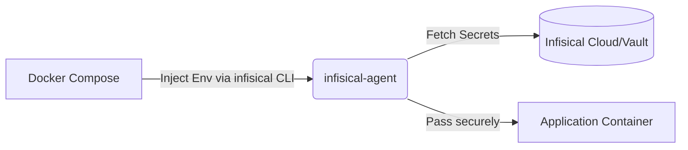

# Workloads & Stacks

This document outlines the containerized applications and services managed within the `stacks/` directory.

## Core Components

- **`infisical-agent.yaml`**: Standard configuration to manage and deploy securely injected environment variables and secrets using Infisical into the respective Docker containers.



## Architectural Flows

### Traffic Ingress
Handling incoming user requests through a unified Gateway and Authentication layer before routing into distinct microservices.
```mermaid
flowchart TD
    User-->Gateway[Gateway (Reverse Proxy)]
    Gateway-->Auth[Auth (SSO / OIDC)]
    Auth--Token Valid-->Gateway
    Gateway-->Media[Media / AI Interface]
```

### Media Network Isolation
The `media-arr` tools are deliberately segmented so external outbound traffic occurs via a Gluetun VPN container for privacy.
```mermaid
flowchart LR
    subgraph Host Network
        D[Docker Network]
    end
    D -->|Internal routing| M[Media Arrays (Radarr, Sonarr)]
    M -->|Network Namespace| G[Gluetun VPN]
    G -->|Custom OVPN| I((Internet))
```

## Application Stacks

### Auth
Handles authentication services (e.g., SSO, Identity Providers, or Auth gateways).
- *Path: `stacks/auth/`*

### Gateway
The entry point and reverse proxy configurations for routing traffic to internal services securely.
- *Path: `stacks/gateway/`*

### Media
Contains media processing, organization, and interaction applications.
- **AI Interface** (`stacks/media/ai-interface/`): Services governing the deployment of AI interfaces like OpenWebUI and OpenClaw configurations. Uses Docker Compose.
- **Media-Arr** (`stacks/media/media-arr/`): Configurations for the "Arr" media organization suite, including VPN setups through Gluetun (OpenVPN files stored in `gluetun/custom-ovpn-files/`). Uses Docker Compose.

## Execution

Deployment is typically done per stack using standard Docker commands:
```bash
docker-compose -f stacks/media/media-arr/docker-compose.yml up -d
```
